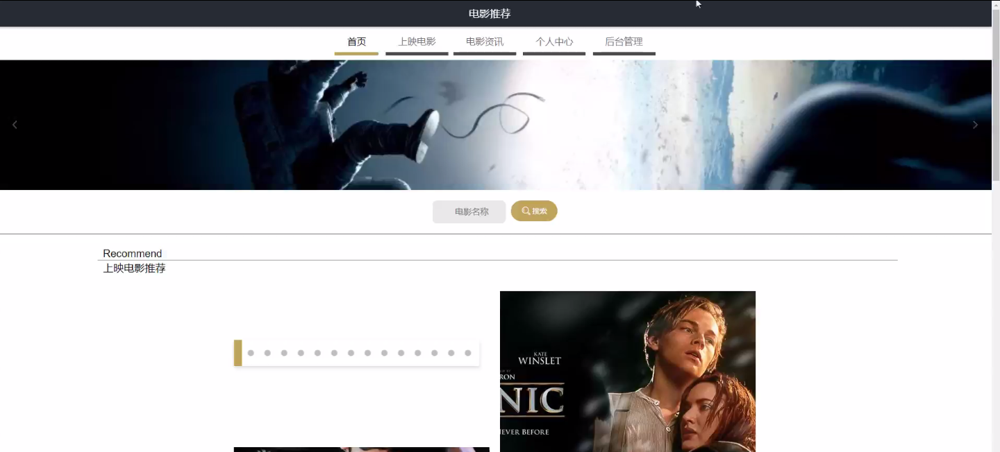

****本项目包含程序+源码+数据库+LW+调试部署环境，文末可获取一份本项目的java源码和数据库参考。****

## ******开题报告******

研究背景：
随着互联网的普及和发展，电影作为一种重要的文化娱乐形式，已经成为人们生活中不可或缺的一部分。然而，随着电影数量的增加和多样性的提升，用户在选择电影时面临了越来越大的困扰。如何从众多的电影中找到符合自己口味和需求的作品，成为了一个迫切需要解决的问题。因此，通过研究开发一套电影推荐系统，能够帮助用户更加方便、快捷地找到适合自己的电影，具有重要的现实意义。

研究意义：
电影推荐系统的研究与应用，可以为用户提供个性化、精准的电影推荐服务，使用户能够更好地满足其观影需求。同时，电影推荐系统也可以促进电影产业的发展，通过向用户推荐优质的电影作品，提高观影体验，增加用户对电影的兴趣和消费欲望，从而推动电影市场的繁荣。此外，电影推荐系统还可以为电影制片方和发行方提供市场分析和用户反馈，帮助他们更好地了解观众的需求和喜好，优化电影的制作和推广策略。

研究目的：
本研究旨在开发一套基于用户、电影类型、上映电影和电影评分等系统功能的电影推荐系统，通过深入挖掘用户的个人兴趣和偏好，结合电影的特征和评价信息，为用户提供个性化、精准的电影推荐服务。具体来说，研究目的包括：1）构建一个全面、准确的电影数据库，收集和整理大量的电影信息；2）分析用户的观影行为和偏好，建立用户画像；3）设计和实现一套有效的推荐算法，能够根据用户的画像和电影的特征进行匹配和推荐；4）评估和优化推荐系统的性能，提高推荐的准确性和用户满意度。

研究内容： 本研究的主要内容包括以下几个方面：

  1. 用户数据收集与分析：通过调查问卷、用户注册和观影记录等方式，收集用户的个人信息、观影偏好和评价反馈等数据，并对这些数据进行统计和分析，以了解用户的观影习惯和喜好。

  2. 电影数据整理与建模：收集和整理大量的电影信息，包括电影类型、演员阵容、上映时间、评分等，并构建电影数据库。同时，通过对电影特征的提取和建模，为推荐算法提供基础数据。

  3. 用户画像构建：根据用户的个人信息和观影行为数据，利用机器学习和数据挖掘技术构建用户画像，包括用户的兴趣偏好、观影习惯等。

  4. 推荐算法设计与实现：基于用户画像和电影特征，设计和实现一套有效的推荐算法，能够根据用户的需求和电影的特点进行匹配和推荐。

  5. 推荐系统性能评估与优化：通过用户调查、推荐结果的准确性和用户满意度等指标，对推荐系统的性能进行评估和优化，提高推荐的效果和用户体验。

预期成果：
通过本研究，预期可以开发出一套功能完善、性能优良的电影推荐系统，能够为用户提供个性化、精准的电影推荐服务。同时，该系统还能为电影产业提供市场分析和用户反馈，促进电影市场的繁荣和发展。预计该系统能够提高用户观影体验，提高电影的推广效果和市场竞争力。

进度安排：

2022年9月至10月：需求分析和规划，明确系统功能和目标，制定项目计划。

2022年11月至2023年1月：系统设计和编码，完成详细的系统设计并开始编写代码。

2023年2月至3月：用户界面开发和数据库开发，开发用户友好的界面和设计数据库结构。

2023年4月至5月：功能测试、文档编写和上线部署，对系统进行全面的功能测试并编写用户手册。

2023年5月：维护和升级，定期对系统进行维护和升级，修复bug和添加新功能。

参考文献：

[1]邱小群,邓丽艳,陈海潮.基于B/S的信息管理系统设计和实现[J].信息与电脑(理论版),2022,(20):146-148.

[2]谢霜.基于Java技术的网络管理体系结构的应用[J].网络安全技术与应用,2022,(10):14-15.

[3]宋锦华.高职院校Java程序设计课程改革研究[J].科技视界,2022,(20):133-135.

[4]曹嵩彭,王鹏宇.浅析Java语言在软件开发中的应用[J].信息记录材料,2022,(03):114-116.

[5]朱澈,余俊达.武汉东湖学院.基于Java的软硬件信息管理系统V1.0[Z].项目立项编号.鉴定单位.鉴定日期:

****以上是本项目程序开发之前开题报告内容，最终成品以下面界面为准，大家可以酌情参考使用。要源码参考请在文末进行获取！！****

## ******本项目的界面展示******

