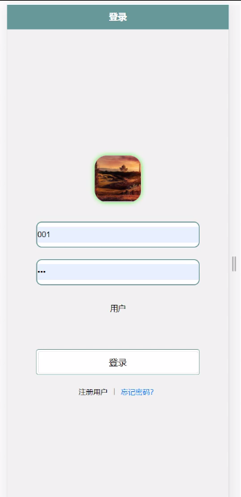
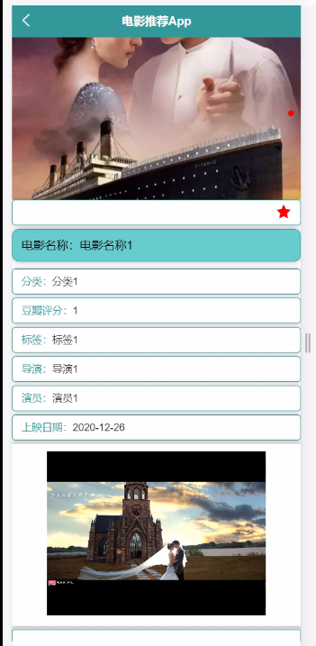
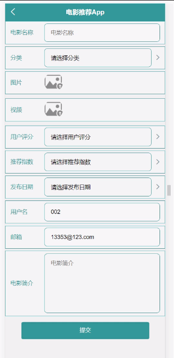
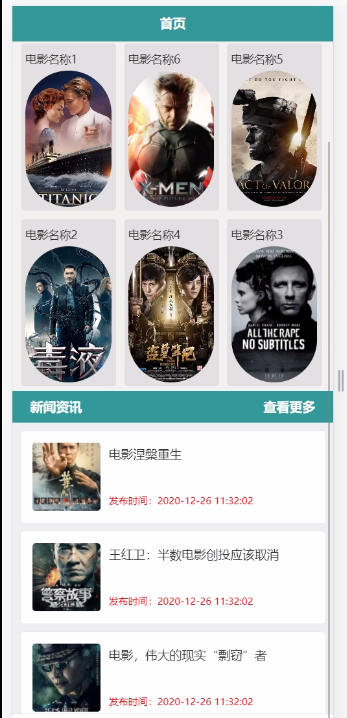
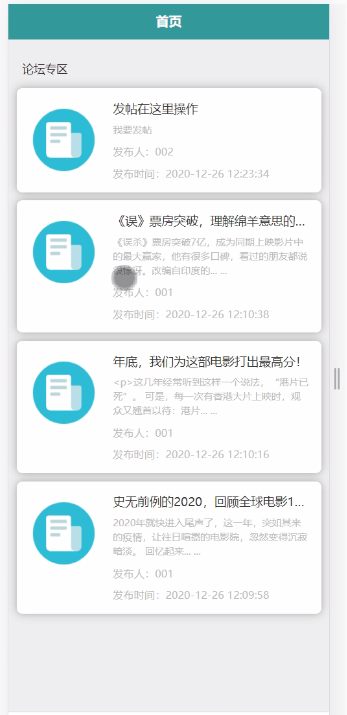

****本项目包含程序+源码+数据库+LW+调试部署环境，文末可获取一份本项目的java源码和数据库参考。****

## ******开题报告******

研究背景：
随着社会的发展和科技的进步，电影已经成为人们生活中不可或缺的一部分。越来越多的人开始关注电影，并通过各种渠道获取电影信息。然而，在众多电影作品中选择一部适合自己的电影却变得越来越困难。传统的电影推荐方式往往只依靠用户的个人喜好或者是简单的评分系统，无法真正满足用户的需求。因此，研究如何利用系统功能提供更加准确、个性化的电影推荐服务具有重要意义。

研究意义：
本研究旨在探索如何通过系统功能来提供更加准确、个性化的电影推荐服务。通过对用户的公告信息、电影分类、热门电影以及用户分享等系统功能进行综合分析，可以更好地理解用户的兴趣和偏好，从而为用户提供更加精准的电影推荐。这将极大地提高用户的电影观影体验，节省用户的时间和精力，同时也有助于电影产业的发展。

研究目的：
本研究的目的是构建一个基于系统功能的电影推荐模型，通过分析用户的公告信息、电影分类、热门电影和用户分享等功能，为用户提供个性化、准确的电影推荐。通过该模型，用户可以更加方便地找到符合自己兴趣和偏好的电影，提高观影体验。

研究内容： 本研究的主要内容包括以下系统功能的综合分析和利用：

  1. 公告信息：通过分析用户的公告信息，了解用户的个人背景、喜好和需求，从而为用户提供更加精准的电影推荐。

  2. 电影分类：通过对电影进行分类，建立电影的标签体系，帮助用户更好地理解电影的类型和内容，并根据用户的喜好进行推荐。

  3. 热门电影：通过分析热门电影的观影数据和用户评价，挖掘出受欢迎的电影特点，为用户提供与其喜好相似的电影推荐。

  4. 用户分享：通过分析用户的分享行为和评论，了解用户对电影的喜好和评价，从而为用户提供更加个性化的电影推荐。

拟解决的主要问题：
在传统的电影推荐方式中，往往只依靠用户的个人喜好或者简单的评分系统，无法真正满足用户的需求。本研究旨在通过综合分析系统功能，解决以下问题：

  1. 如何利用公告信息来更好地了解用户的兴趣和需求，从而提供个性化的电影推荐？

  2. 如何通过电影分类建立准确的标签体系，帮助用户更好地理解电影类型和内容，并根据用户的喜好进行推荐？

  3. 如何通过分析热门电影的观影数据和用户评价，挖掘出受欢迎的电影特点，为用户提供与其喜好相似的电影推荐？

  4. 如何通过分析用户的分享行为和评论，了解用户对电影的喜好和评价，从而为用户提供更加个性化的电影推荐？

研究方案和预期成果： 本研究将采用数据分析和机器学习等方法，通过对系统功能的综合分析，构建一个基于系统功能的电影推荐模型。预期成果包括：

  1. 构建一个准确、个性化的电影推荐模型，能够根据用户的公告信息、电影分类、热门电影和用户分享等功能，为用户提供精准的电影推荐。

  2. 提高用户的电影观影体验，节省用户的时间和精力，帮助用户更好地找到符合自己兴趣和偏好的电影。

  3. 促进电影产业的发展，通过提供个性化的电影推荐服务，增加用户对电影的关注和消费，推动电影市场的繁荣。

进度安排：

2022年9月至10月：需求分析和规划，进行用户需求调研和分析，确定系统功能和目标。

2022年11月至2023年1月：系统设计和开发，完成系统架构设计和技术选型，并开始编写代码。

2023年2月至3月：测试和优化，进行单元测试和集成测试，修复问题并优化系统性能。

2023年4月至5月：文档编写和培训，编写用户手册和系统文档，并进行相关人员的培训。

2023年5月：上线部署和维护，将系统部署到生产环境中，并定期进行维护和升级。

参考文献：

[1]王振华.SpringBoot在教学效果评估系统中的应用[J].电子技术,2023,(05):67-69.

[2]王明泉.基于SpringBoot远程热部署的探索和应用[J].信息与电脑(理论版),2023,(07):1-4.

[3]王亚东,李晓霞,陈强强,剡美娜.基于SpringBoot的需求发布平台设计[J].信息与电脑(理论版),2023,(01):105-107.

[4]陈新府豪.基于SpringBoot和Vue框架的创新方法推理系统的设计与实现[D].导师：黄静.浙江理工大学,2022.

[5]霍福华,韩慧.基于SpringBoot微服务架构下前后端分离的MVVM模型[J].电子技术与软件工程,2022,(01):73-76.

[6]韩策,张娜,王松亭,张凯,何方,袁峰.SpringBoot OPC客户端设计与研究[J].电子世界,2021,(19):25-26.

****以上是本项目程序开发之前开题报告内容，最终成品以下面界面为准，大家可以酌情参考使用。要源码参考请在文末进行获取！！****

## ******本项目的界面展示******

