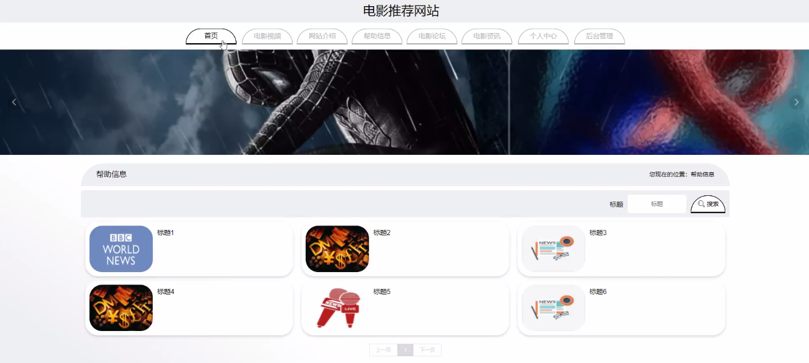
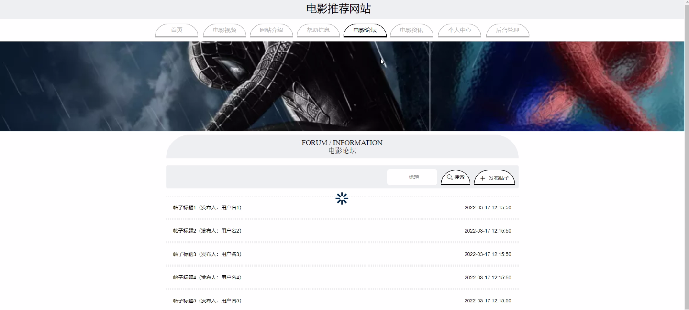
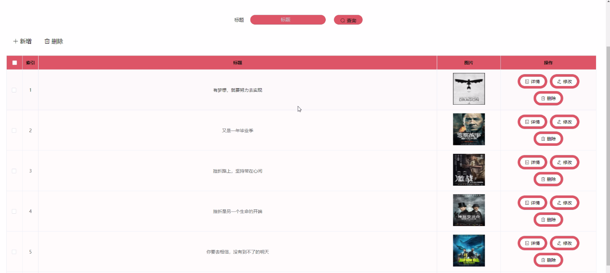
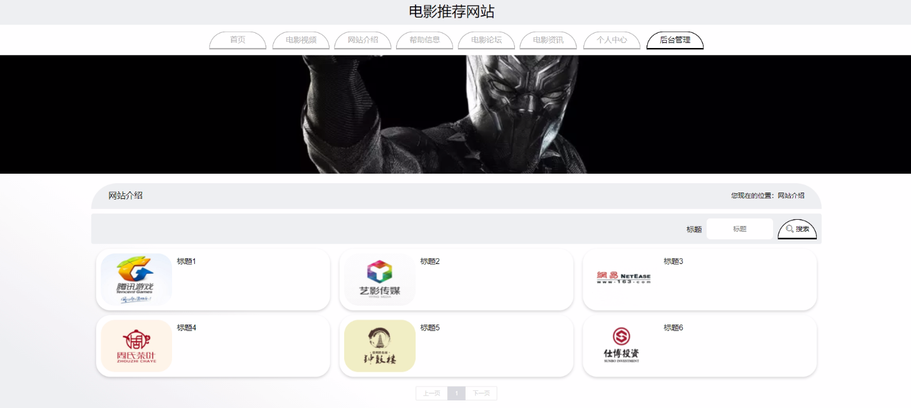

****本项目包含程序+源码+数据库+LW+调试部署环境，文末可获取一份本项目的java源码和数据库参考。****

## ******开题报告******

研究背景：
随着互联网的快速发展和普及，人们对于电影的需求也越来越高。然而，在众多电影作品中选择一部适合自己的电影却变得越来越困难。传统的电影推荐方式往往只是根据电影类型或者口碑评分进行推荐，无法满足用户个性化的需求。因此，开发一个能够根据用户的喜好和偏好进行个性化推荐的电影推荐网站具有重要的研究意义。

研究意义：
通过构建一个电影推荐网站，可以为用户提供更加准确、个性化的电影推荐服务，从而提高用户的观影体验。同时，该网站还可以帮助电影制片方了解用户的喜好和需求，为他们提供更精准的市场定位和推广策略。此外，通过对用户的观影行为和评分数据进行分析，可以挖掘出潜在的用户兴趣和电影关联性，为电影产业的发展提供参考。

研究目的：
本研究旨在开发一个基于用户个性化需求的电影推荐网站，通过分析用户的观影历史、评分记录以及其他相关信息，建立用户画像，并利用推荐算法为用户提供个性化的电影推荐。同时，通过对电影类型、电影视频、电影评分等系统功能进行研究和开发，构建一个全面、实用的电影推荐网站，提高用户的观影选择效率和满意度。

研究内容： 本研究的主要内容包括以下几个方面：

  1. 用户：通过收集用户的个人信息、观影历史、评分记录等数据，建立用户画像，了解用户的兴趣和偏好，为其提供个性化的电影推荐服务。

  2. 电影类型：对电影进行分类和标签化，建立电影类型库，使用户可以根据自己的喜好选择感兴趣的电影类型。

  3. 电影视频：为每部电影提供相关的视频预览，让用户可以在观看预告片或片段后更好地了解电影内容，从而做出更明智的选择。

  4. 电影评分：收集用户对电影的评分数据，结合其他用户的评分和评论，为用户提供参考，帮助他们做出决策。

  5. 网站介绍：提供详细的网站介绍和功能说明，让用户能够快速了解和使用该电影推荐网站。

  6. 帮助信息：提供用户常见问题的解答和使用指南，帮助用户更好地利用该网站进行电影选择和观影。

拟解决的主要问题：
本研究旨在解决传统电影推荐方式存在的一些问题，如无法准确捕捉用户个性化需求、推荐结果缺乏多样性等。通过建立用户画像和应用推荐算法，可以提供更加准确、个性化的电影推荐结果，满足用户多样化的观影需求。

研究方案和预期成果：
本研究将采用数据挖掘和机器学习的方法，通过分析用户的观影行为和评分记录，构建用户画像，并应用推荐算法进行个性化推荐。预期成果是开发一个功能完善、用户友好的电影推荐网站，能够根据用户的个性化需求，为其提供准确、多样化的电影推荐结果，提高用户的观影体验和满意度。

进度安排：

2022年9月至10月：开题报告编写和提交，完成开题报告的撰写并提交给指导教师进行审核。

2022年11月至2023年1月：系统设计和开发，根据开题报告的要求，进行系统设计和编码工作。

2023年2月至3月：论文撰写和初稿完成，开始撰写论文，并在这个阶段完成论文的初稿。

2023年4月至5月：论文修改和最终定稿，根据指导教师的意见对论文进行修改，并完成最终的定稿。

2023年5月：论文答辩和提交，参加论文答辩并根据答辩结果进行修改，最后将论文提交给学院或学校。

参考文献：

[1]喻佳,吴丹新.基于SpringBoot的Web快速开发框架[J].电脑编程技巧与维护,2021,(09):31-33.

[2]李鹏.基于SpringBoot快速开发平台的实现[J].电子技术与软件工程,2021,(12):36-37.

[3]叶开平,蔡维晟,陈家敏,邓斯妮.基于SpringBoot的综测可视化管理系统的研究与设计[J].电脑知识与技术,2021,(12):100-104.

[4]江健锋,徐振平.Springboot最小系统的设计与实现[J].电脑知识与技术,2021,(04):62-63.

[5]赵炯,司圣杰,周奇才,熊肖磊.通用信息获取系统设计与实现[J].起重运输机械,2020,(16):89-97.

[6]吴英宾.一种内外网数据交互系统的设计与实现[J].软件工程,2020,(08):25-27.

****以上是本项目程序开发之前开题报告内容，最终成品以下面界面为准，大家可以酌情参考使用。要源码参考请在文末进行获取！！****

## ******本项目的界面展示******

