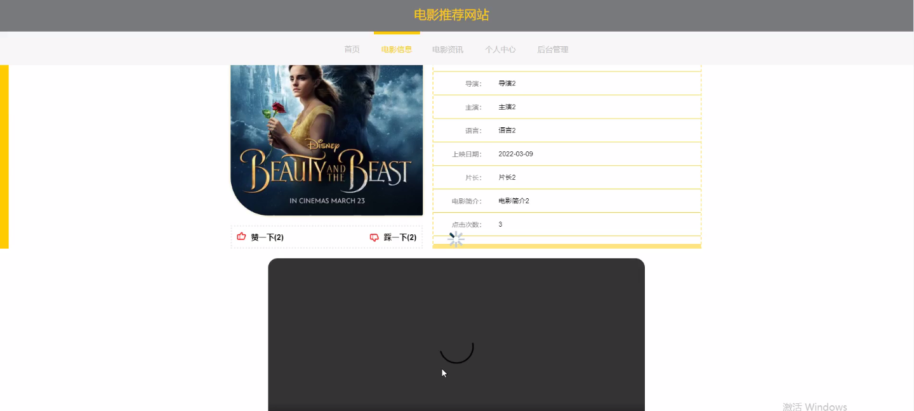
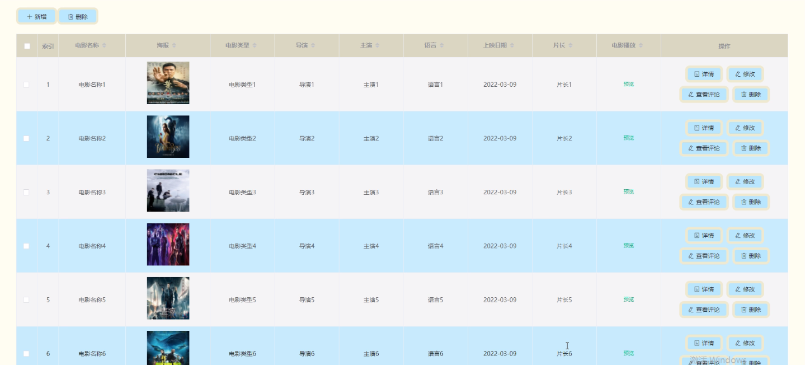

****本项目包含程序+源码+数据库+LW+调试部署环境，文末可获取一份本项目的java源码和数据库参考。****

## ******开题报告******

研究背景：
随着互联网的快速发展和智能设备的普及，人们对于电影的需求日益增长。然而，由于电影数量庞大、类型繁多，用户很难找到自己喜欢的电影。传统的电影推荐方式往往只是基于用户的历史观影记录或简单的标签匹配，无法准确地满足用户的个性化需求。因此，建立一个高效、准确的电影推荐系统具有重要的研究意义和实际应用价值。

研究意义：
通过构建一个优秀的电影推荐网站，可以帮助用户更好地发现适合自己口味的电影，提升用户的观影体验。同时，对于电影行业来说，精准的推荐系统可以促进电影的传播和推广，提高电影的收益和知名度。此外，通过分析用户的观影偏好和行为习惯，还可以为电影制片方提供有价值的市场调研数据，帮助他们更好地了解观众需求，优化电影制作和宣传策略。

研究目的：
本研究旨在构建一个基于用户个性化需求的电影推荐网站，通过分析用户的观影历史、兴趣爱好和社交网络等信息，为用户提供准确、个性化的电影推荐服务。具体目标包括：提高电影推荐的准确度和效果，满足用户的个性化需求；促进电影行业的发展和电影作品的传播；为电影制片方提供市场调研数据，优化电影制作和宣传策略。

研究内容： 本研究的主要内容包括以下三个系统功能：

  1. 用户功能：通过用户注册和登录，收集用户的个人信息、观影历史和兴趣爱好等数据，建立用户画像。同时，还可以通过用户反馈和评价等方式获取用户对电影的喜好和意见，用于推荐算法的优化。

  2. 电影类型功能：根据电影的不同类型进行分类和标注，构建电影类型库。通过分析用户的观影历史和兴趣爱好，结合电影类型库，为用户推荐符合其口味的电影。

  3. 电影信息功能：收集和整理电影的基本信息，包括导演、演员、剧情简介、评分等。通过对电影信息的分析和挖掘，结合用户的偏好和行为习惯，提供个性化的电影推荐。

拟解决的主要问题： 本研究将重点解决以下几个问题：

  1. 用户个性化需求的准确捕捉：如何通过用户的观影历史、兴趣爱好等信息，准确地捕捉用户的个性化需求，为其提供符合口味的电影推荐。

  2. 推荐算法的优化：如何通过分析用户的观影偏好和行为习惯，结合电影类型和基本信息，构建有效的推荐算法，提高推荐的准确度和效果。

  3. 电影信息的全面和准确：如何收集和整理电影的基本信息，包括导演、演员、剧情简介、评分等，以及如何保证这些信息的准确性和更新及时性。

研究方案和预期成果：
本研究将采用数据挖掘和机器学习等技术，结合用户画像、电影类型库和电影信息，构建一个基于用户个性化需求的电影推荐系统。通过大量的实验和评估，优化推荐算法，提高推荐的准确度和效果。预期成果包括一个功能完善、准确度较高的电影推荐网站，能够为用户提供个性化、精准的电影推荐服务，促进电影行业的发展和电影作品的传播。

进度安排：

2022年9月至10月：需求分析和规划，明确系统功能和目标，制定项目计划。

2022年11月至2023年1月：系统设计和编码，完成详细的系统设计并开始编写代码。

2023年2月至3月：用户界面开发和数据库开发，开发用户友好的界面和设计数据库结构。

2023年4月至5月：功能测试、文档编写和上线部署，对系统进行全面的功能测试并编写用户手册。

2023年5月：维护和升级，定期对系统进行维护和升级，修复bug和添加新功能。

参考文献：

[1]邱小群,邓丽艳,陈海潮.基于B/S的信息管理系统设计和实现[J].信息与电脑(理论版),2022,(20):146-148.

[2]谢霜.基于Java技术的网络管理体系结构的应用[J].网络安全技术与应用,2022,(10):14-15.

[3]宋锦华.高职院校Java程序设计课程改革研究[J].科技视界,2022,(20):133-135.

[4]曹嵩彭,王鹏宇.浅析Java语言在软件开发中的应用[J].信息记录材料,2022,(03):114-116.

[5]朱澈,余俊达.武汉东湖学院.基于Java的软硬件信息管理系统V1.0[Z].项目立项编号.鉴定单位.鉴定日期:

****以上是本项目程序开发之前开题报告内容，最终成品以下面界面为准，大家可以酌情参考使用。要源码参考请在文末进行获取！！****

## ******本项目的界面展示******

