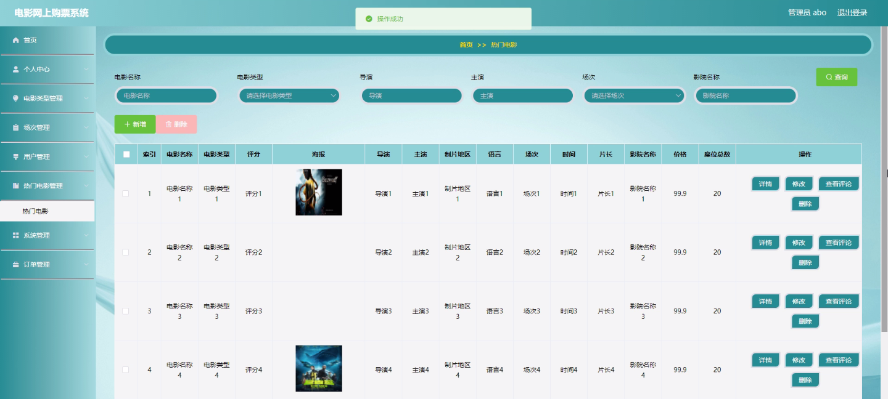

****本项目包含程序+源码+数据库+LW+调试部署环境，文末可获取一份本项目的java源码和数据库参考。****

## ******开题报告******

研究背景：
随着互联网的快速发展，电影行业也逐渐向线上转型。传统的电影票务方式存在诸多问题，如排队购票不便、售票信息不透明等。因此，开发一种方便快捷的电影网上购票系统具有重要意义。

研究意义：
电影网上购票系统的推出将极大地提升用户购票体验，为用户提供更加便捷、高效的购票服务。同时，该系统还能够为电影院提供更好的管理和运营方式，实现票务信息的集中管理和精确控制。因此，研究开发电影网上购票系统具有重要的实际应用价值和经济效益。

研究目的：
本研究旨在设计和开发一种基于互联网的电影网上购票系统，通过引入先进的技术手段，提供用户友好的界面和丰富的功能，实现在线选座、在线支付、订单管理等一系列操作，以满足用户的购票需求，并提升整个电影票务系统的效率和服务质量。

研究内容： 本研究的主要内容包括以下几个方面：

  1. 用户管理：设计并实现用户注册、登录、个人信息管理等功能，为用户提供个性化的购票服务。

  2. 电影类型管理：建立电影分类体系，对电影进行分类管理，方便用户根据自己的喜好选择观影内容。

  3. 热门电影推荐：通过分析用户的观影历史和偏好，利用推荐算法向用户推荐热门电影，提高用户的观影体验。

  4. 场次管理：实现电影场次的发布、更新和删除等功能，确保用户能够及时获取到最新的场次信息。

  5. 订单管理：设计并实现订单生成、支付、退票等功能，为用户提供便捷的购票流程，并确保订单信息的准确性和安全性。

拟解决的主要问题：
本研究旨在解决传统电影票务方式存在的排队购票不便、售票信息不透明等问题。通过引入电影网上购票系统，用户可以随时随地通过互联网进行电影票的购买，避免了排队等候的麻烦，同时也提供了更加透明和便捷的购票流程。

研究方案和预期成果：
本研究将采用软件工程的开发方法，结合用户需求和技术实现的可行性，设计并开发一套完整的电影网上购票系统。预期成果包括一个稳定可靠、功能完善的系统，能够满足用户的购票需求，并提供良好的用户体验。通过该系统的推广和应用，预计能够提升电影票务行业的效率和服务质量，为用户和电影院带来实际的经济效益。

进度安排：

2022年9月至10月：开题报告编写和提交，完成开题报告的撰写并提交给指导教师进行审核。

2022年11月至2023年1月：系统设计和开发，根据开题报告的要求，进行系统设计和编码工作。

2023年2月至3月：论文撰写和初稿完成，开始撰写论文，并在这个阶段完成论文的初稿。

2023年4月至5月：论文修改和最终定稿，根据指导教师的意见对论文进行修改，并完成最终的定稿。

2023年5月：论文答辩和提交，参加论文答辩并根据答辩结果进行修改，最后将论文提交给学院或学校。

参考文献：

[1]喻佳,吴丹新.基于SpringBoot的Web快速开发框架[J].电脑编程技巧与维护,2021,(09):31-33.

[2]李鹏.基于SpringBoot快速开发平台的实现[J].电子技术与软件工程,2021,(12):36-37.

[3]叶开平,蔡维晟,陈家敏,邓斯妮.基于SpringBoot的综测可视化管理系统的研究与设计[J].电脑知识与技术,2021,(12):100-104.

[4]江健锋,徐振平.Springboot最小系统的设计与实现[J].电脑知识与技术,2021,(04):62-63.

[5]赵炯,司圣杰,周奇才,熊肖磊.通用信息获取系统设计与实现[J].起重运输机械,2020,(16):89-97.

[6]吴英宾.一种内外网数据交互系统的设计与实现[J].软件工程,2020,(08):25-27.

****以上是本项目程序开发之前开题报告内容，最终成品以下面界面为准，大家可以酌情参考使用。要源码参考请在文末进行获取！！****

## ******本项目的界面展示******

