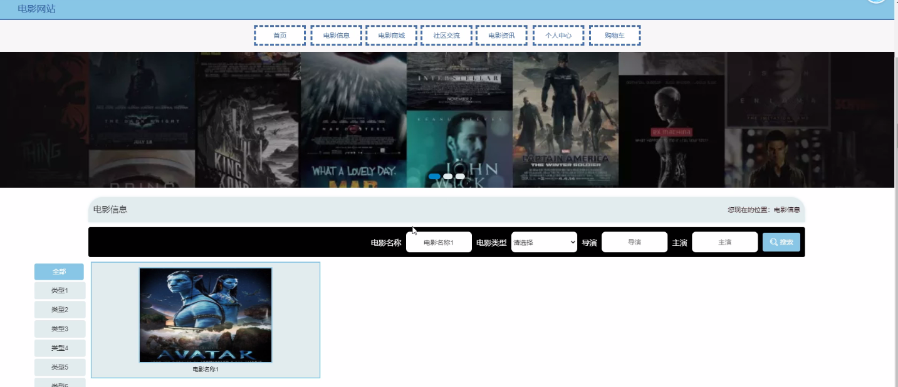
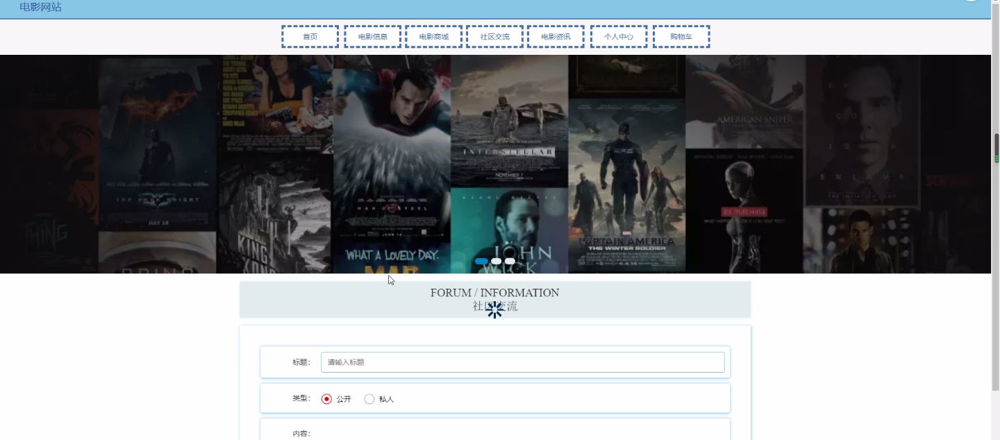
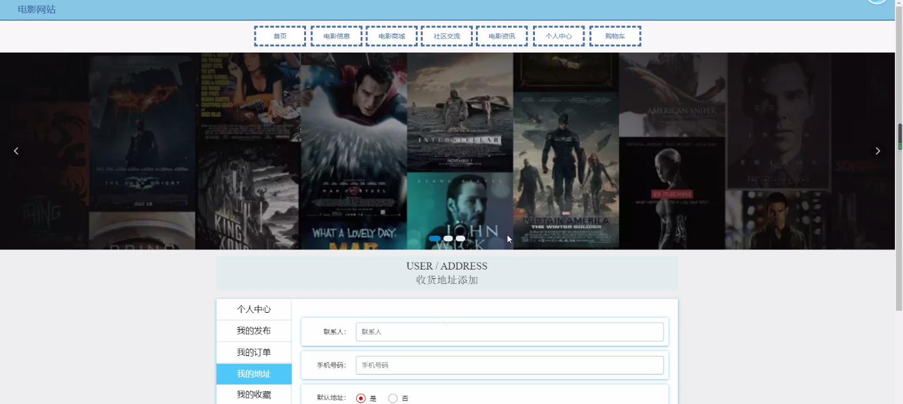
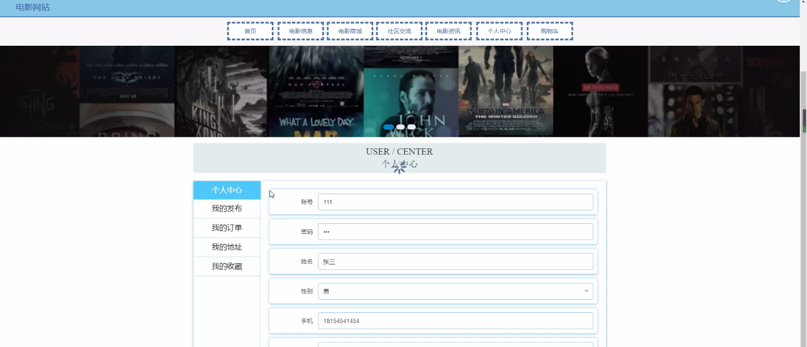

****本项目包含程序+源码+数据库+LW+调试部署环境，文末可获取一份本项目的java源码和数据库参考。****

## ******开题报告******

研究背景：
随着互联网的迅速发展，电影行业也逐渐向线上转型。电影网站作为电影信息传播和观影服务的重要平台，扮演着不可忽视的角色。然而，目前存在着一些问题，如用户体验不佳、电影信息不全面、电影分类不准确等，这些问题制约了用户对电影网站的使用和满意度。因此，有必要对电影网站进行深入研究，以提升用户体验和电影信息服务质量。

研究意义：
本研究旨在通过对电影网站的研究，解决当前存在的问题，提升用户体验和电影信息服务质量。通过改进电影网站的功能和设计，可以吸引更多用户访问并提高用户留存率。同时，提供准确、全面的电影信息和分类，可以帮助用户更好地找到自己感兴趣的电影，并提供相关推荐，增加用户的观影选择和满意度。

研究目的：
本研究的目的是通过对电影网站的研究，优化系统功能，提升用户体验和电影信息服务质量。具体目标包括：改进用户界面设计，使其更加直观、友好；完善电影信息的收集和整理，提供准确、全面的电影信息；优化电影分类系统，提供更精准的分类标准；建设电影商城功能，提供便捷的购票和商品购买服务。

研究内容： 本研究将主要围绕以下系统功能展开研究：

  1. 用户功能：研究用户在电影网站上的行为特征和需求，分析用户对电影网站的满意度和改进意见，以提升用户体验和留存率。

  2. 电影信息功能：研究电影信息的收集和整理方式，提高电影信息的准确性和全面性。通过与相关机构合作或引入大数据技术，实现电影信息的及时更新和丰富多样化。

  3. 电影分类功能：研究电影分类的标准和方法，提供更精准的电影分类，方便用户查找感兴趣的电影。可以考虑引入人工智能算法，根据电影内容和用户评价等因素进行分类。

  4. 电影商城功能：研究建设电影商城的方式和运营模式，提供便捷的购票和商品购买服务。可以考虑与电影院、电商平台等合作，提供优惠活动和套餐服务，增加用户的购买欲望。

拟解决的主要问题：

  1. 用户体验不佳：通过改进用户界面设计、提供个性化推荐等方式，提升用户体验和满意度。
  2. 电影信息不全面：通过与相关机构合作或引入大数据技术，实现电影信息的及时更新和丰富多样化。
  3. 电影分类不准确：通过研究电影分类标准和方法，提供更精准的电影分类，方便用户查找感兴趣的电影。
  4. 缺乏电影商城功能：通过建设电影商城，提供便捷的购票和商品购买服务，增加用户的购买欲望。

研究方案和预期成果：
本研究将采用文献调研、用户调研、数据分析等方法，对电影网站进行深入研究。通过对系统功能的改进和优化，预期可以提升用户体验和电影信息服务质量。具体成果包括：改进的用户界面设计、准确、全面的电影信息、精准的电影分类标准、完善的电影商城功能等。这些成果有望吸引更多用户访问电影网站，并提高用户的满意度和留存率。

进度安排：

2022年9月至10月：需求分析和规划，明确系统功能和目标，制定项目计划。

2022年11月至2023年1月：系统设计和编码，完成详细的系统设计并开始编写代码。

2023年2月至3月：用户界面开发和数据库开发，开发用户友好的界面和设计数据库结构。

2023年4月至5月：功能测试、文档编写和上线部署，对系统进行全面的功能测试并编写用户手册。

2023年5月：维护和升级，定期对系统进行维护和升级，修复bug和添加新功能。

参考文献：

[1]邱小群,邓丽艳,陈海潮.基于B/S的信息管理系统设计和实现[J].信息与电脑(理论版),2022,(20):146-148.

[2]谢霜.基于Java技术的网络管理体系结构的应用[J].网络安全技术与应用,2022,(10):14-15.

[3]宋锦华.高职院校Java程序设计课程改革研究[J].科技视界,2022,(20):133-135.

[4]曹嵩彭,王鹏宇.浅析Java语言在软件开发中的应用[J].信息记录材料,2022,(03):114-116.

[5]朱澈,余俊达.武汉东湖学院.基于Java的软硬件信息管理系统V1.0[Z].项目立项编号.鉴定单位.鉴定日期:

****以上是本项目程序开发之前开题报告内容，最终成品以下面界面为准，大家可以酌情参考使用。要源码参考请在文末进行获取！！****

## ******本项目的界面展示******

