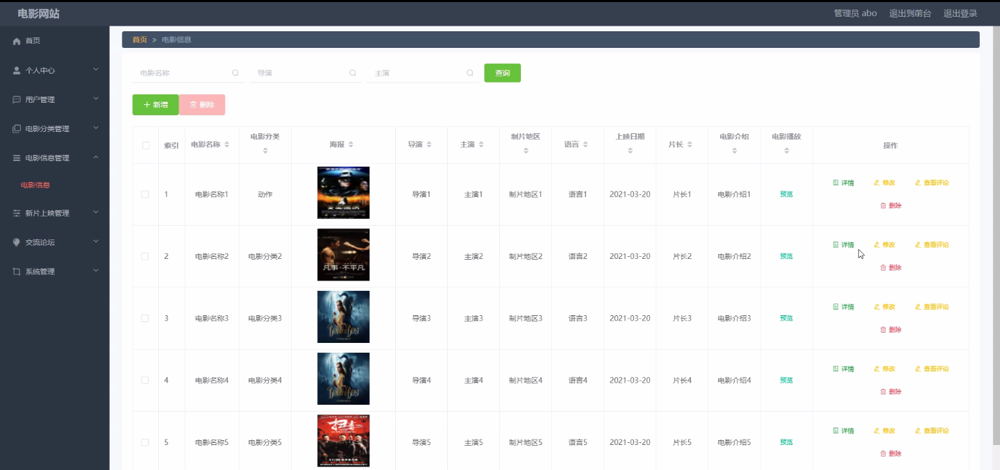

****本项目包含程序+源码+数据库+LW+调试部署环境，文末可获取一份本项目的java源码和数据库参考。****

## ******开题报告******

研究背景、意义和目的：

在当今数字化时代，电影已经成为人们娱乐和文化消费的重要组成部分。随着互联网技术的快速发展，电影网站作为一个重要的电影信息平台，扮演着连接观众和电影资源的桥梁角色。然而，当前存在的一些问题限制了电影网站的发展和用户体验，例如信息不准确、搜索功能不便利、推荐算法不精准等。因此，本研究旨在通过对电影网站进行深入研究，探索如何提升电影网站的用户体验和服务质量。

本研究的主要目的是改进电影网站的功能和性能，提供更好的用户体验和满足用户需求。通过对电影网站的研究，我们可以深入了解用户对电影网站的期望和需求，从而优化系统功能和设计，提供更加便捷、准确和个性化的电影信息服务。同时，通过研究电影网站的运营模式和商业价值，可以为电影产业的发展提供参考和支持。

研究内容：

本研究将围绕电影网站的四个主要系统功能展开研究，包括用户、电影分类、电影信息和新片上映。具体内容如下：

  1. 用户：研究用户在电影网站上的行为和需求，分析用户喜好、观影习惯以及对电影网站功能的评价。通过调查问卷、用户访谈等方法收集数据，并运用统计分析和用户行为模型构建等技术，深入了解用户需求和行为特征。

  2. 电影分类：研究电影网站的电影分类系统，探索如何更加准确地对电影进行分类和标签化。通过文本挖掘、机器学习等技术，提取电影的关键信息和特征，建立更精准的分类模型，从而提供更准确的电影推荐和搜索结果。

  3. 电影信息：研究电影网站的电影信息管理和展示方式，优化电影信息的准确性和完整性。通过与电影制作公司、发行商等合作，获取最新的电影信息，并设计合理的信息展示界面，提供详尽、全面的电影介绍和相关资料。

  4. 新片上映：研究电影网站的新片上映功能，改进新片推荐算法和上映时间预测模型。通过分析观众对新片的兴趣和评价，优化推荐算法，提供个性化的新片推荐服务。同时，通过分析电影市场数据和观众行为，预测新片的上映时间和票房表现。

拟解决的主要问题：

  1. 电影网站信息不准确的问题；
  2. 电影网站搜索功能不便利的问题；
  3. 电影网站推荐算法不精准的问题；
  4. 电影网站新片上映功能不完善的问题。

研究方案和预期成果：

本研究将采用定量和定性研究方法，结合实证分析和理论探讨，以及技术开发和系统设计等手段，对电影网站进行深入研究和改进。预期成果包括但不限于：

  1. 提出改进电影网站功能和性能的具体方案和策略；
  2. 设计和实现优化的电影分类、搜索和推荐算法模型；
  3. 开发新的电影信息管理和展示系统；
  4. 提供更准确、全面和个性化的电影信息服

进度安排：

2022年9月至10月：需求分析和规划，进行用户需求调研和分析，确定系统功能和目标。

2022年11月至2023年1月：系统设计和开发，完成系统架构设计和技术选型，并开始编写代码。

2023年2月至3月：测试和优化，进行单元测试和集成测试，修复问题并优化系统性能。

2023年4月至5月：文档编写和培训，编写用户手册和系统文档，并进行相关人员的培训。

2023年5月：上线部署和维护，将系统部署到生产环境中，并定期进行维护和升级。

参考文献：

[1]王振华.SpringBoot在教学效果评估系统中的应用[J].电子技术,2023,(05):67-69.

[2]王明泉.基于SpringBoot远程热部署的探索和应用[J].信息与电脑(理论版),2023,(07):1-4.

[3]王亚东,李晓霞,陈强强,剡美娜.基于SpringBoot的需求发布平台设计[J].信息与电脑(理论版),2023,(01):105-107.

[4]陈新府豪.基于SpringBoot和Vue框架的创新方法推理系统的设计与实现[D].导师：黄静.浙江理工大学,2022.

[5]霍福华,韩慧.基于SpringBoot微服务架构下前后端分离的MVVM模型[J].电子技术与软件工程,2022,(01):73-76.

[6]韩策,张娜,王松亭,张凯,何方,袁峰.SpringBoot OPC客户端设计与研究[J].电子世界,2021,(19):25-26.

****以上是本项目程序开发之前开题报告内容，最终成品以下面界面为准，大家可以酌情参考使用。要源码参考请在文末进行获取！！****

## ******本项目的界面展示******

