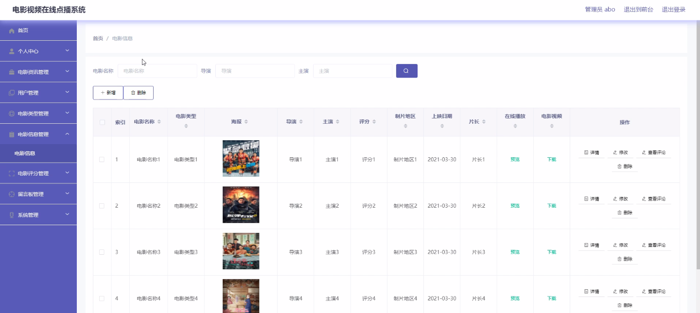
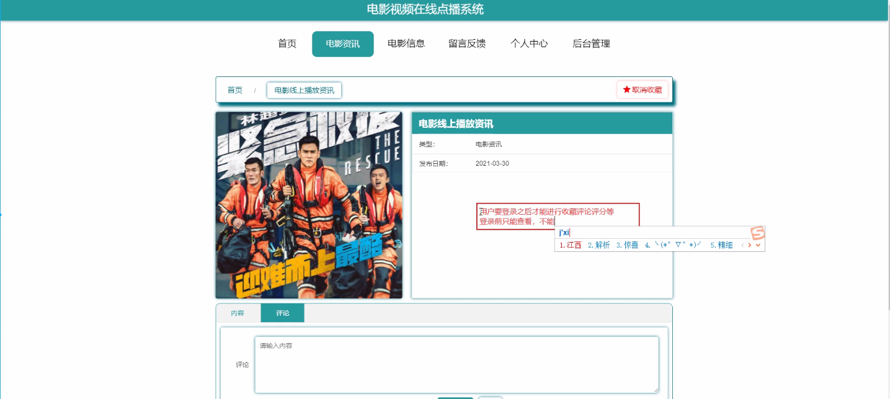

****本项目包含程序+源码+数据库+LW+调试部署环境，文末可获取一份本项目的java源码和数据库参考。****

## ******开题报告******

研究背景：
随着互联网的快速发展和智能设备的普及，电影视频在线点播系统成为了人们获取电影资源的主要途径之一。传统的电影观影方式受到了很大的冲击，用户对于电影的需求也发生了巨大的变化。因此，建立一个高效、便捷、个性化的电影视频在线点播系统对于满足用户需求、提升用户体验具有重要意义。

研究意义：
电影视频在线点播系统的建立可以为用户提供丰富多样的电影资源，并通过智能推荐算法将用户感兴趣的电影推送给他们，从而提升用户的观影体验。同时，该系统还可以为电影制作方提供一个更广阔的宣传渠道，增加电影的曝光度和收益。此外，通过对用户行为数据的分析，还可以为电影产业提供市场调研和数据支持，帮助制定更科学的营销策略。

研究目的：
本研究旨在构建一个基于电影视频在线点播系统的智能化平台，通过对用户需求和行为的深入分析，实现精准推荐和个性化服务，提升用户的观影体验。同时，通过对电影资讯、电影类型、电影信息、用户和电影评分等系统功能的研究，探索如何优化系统的性能和用户体验，为用户提供更好的服务。

研究内容： 本研究的主要内容包括以下几个方面：

  1. 电影资讯：收集和整理电影相关的新闻、活动、发布会等信息，为用户提供最新的电影资讯。

  2. 电影类型：对电影进行分类和标签化，建立起完善的电影分类体系，方便用户根据自己的兴趣选择观看。

  3. 电影信息：建立电影数据库，包括电影的基本信息、演员表、剧情介绍、上映时间等，为用户提供详尽的电影信息。

  4. 用户管理：建立用户管理系统，包括用户注册、登录、个人信息管理等功能，为用户提供个性化的推荐和服务。

  5. 电影评分：引入用户评分机制，收集用户对于电影的评价和意见，为其他用户提供参考，并为系统的智能推荐算法提供数据支持。

拟解决的主要问题： 在构建电影视频在线点播系统的过程中，我们将重点解决以下问题：

  1. 如何准确获取和更新电影资讯，确保用户获取到最新的电影动态。

  2. 如何对电影进行准确分类和标签化，提高推荐算法的精准度和效果。

  3. 如何建立完善的电影数据库，提供详尽的电影信息，满足用户的需求。

  4. 如何设计用户管理系统，实现个性化的推荐和服务，提升用户体验。

  5. 如何引入有效的电影评分机制，收集用户反馈并为其他用户提供参考。

研究方案和预期成果：
本研究将采用数据挖掘、机器学习和推荐算法等技术手段，结合用户行为数据和电影相关信息，构建一个智能化的电影视频在线点播系统。通过对用户需求和行为的深入分析，优化系统的推荐算法和个性化服务，提升用户的观影体验。预期成果包括：高效准确的电影资讯获取系统、精准的电影分类和标签化系统、完善的电影数据库、个性化的用户管理系统和有效的电影评分机制。这些成果将为用户提供更好的观影体验，为电影产业的发展提供有力支持。

进度安排：

2022年9月至10月：需求分析和规划，进行用户需求调研和分析，确定系统功能和目标。

2022年11月至2023年1月：系统设计和开发，完成系统架构设计和技术选型，并开始编写代码。

2023年2月至3月：测试和优化，进行单元测试和集成测试，修复问题并优化系统性能。

2023年4月至5月：文档编写和培训，编写用户手册和系统文档，并进行相关人员的培训。

2023年5月：上线部署和维护，将系统部署到生产环境中，并定期进行维护和升级。

参考文献：

[1]王振华.SpringBoot在教学效果评估系统中的应用[J].电子技术,2023,(05):67-69.

[2]王明泉.基于SpringBoot远程热部署的探索和应用[J].信息与电脑(理论版),2023,(07):1-4.

[3]王亚东,李晓霞,陈强强,剡美娜.基于SpringBoot的需求发布平台设计[J].信息与电脑(理论版),2023,(01):105-107.

[4]陈新府豪.基于SpringBoot和Vue框架的创新方法推理系统的设计与实现[D].导师：黄静.浙江理工大学,2022.

[5]霍福华,韩慧.基于SpringBoot微服务架构下前后端分离的MVVM模型[J].电子技术与软件工程,2022,(01):73-76.

[6]韩策,张娜,王松亭,张凯,何方,袁峰.SpringBoot OPC客户端设计与研究[J].电子世界,2021,(19):25-26.

****以上是本项目程序开发之前开题报告内容，最终成品以下面界面为准，大家可以酌情参考使用。要源码参考请在文末进行获取！！****

## ******本项目的界面展示******

