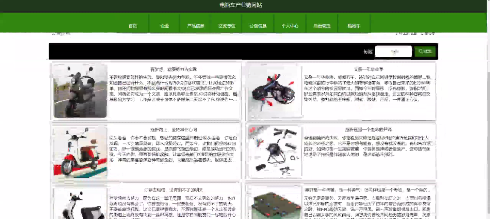
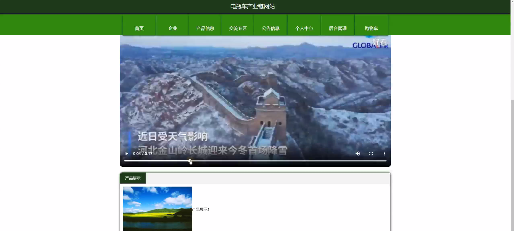
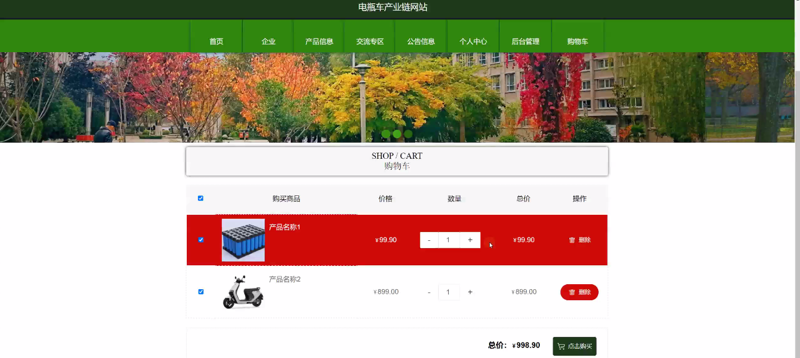
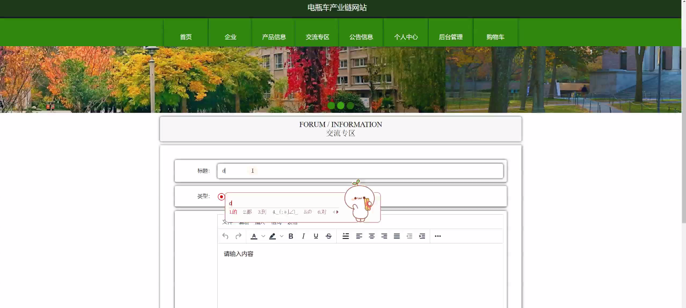
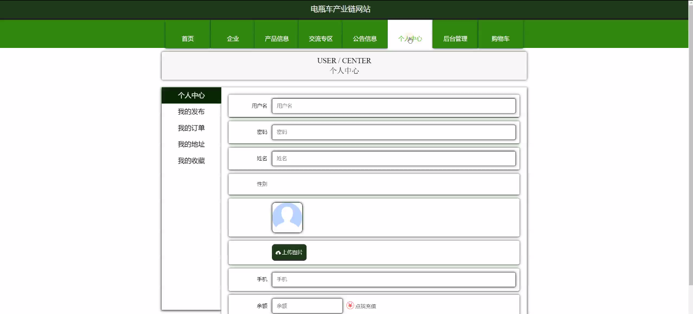
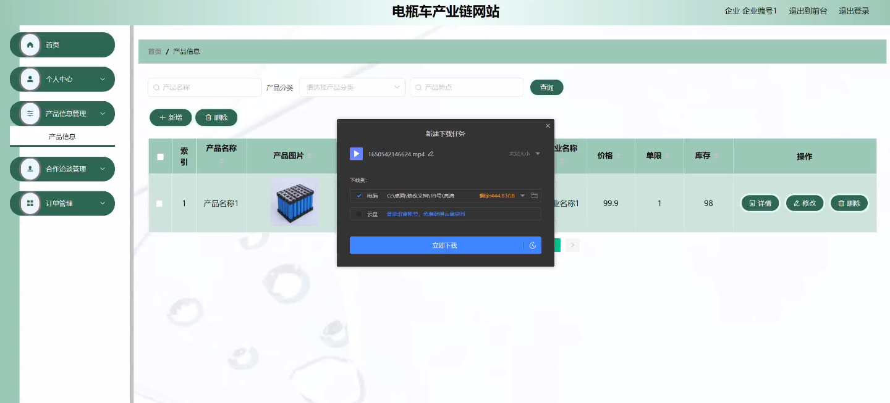
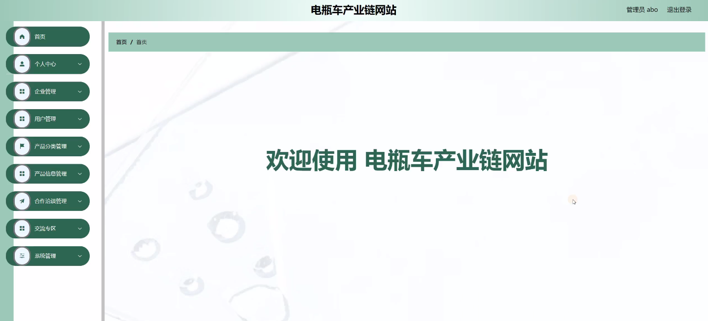
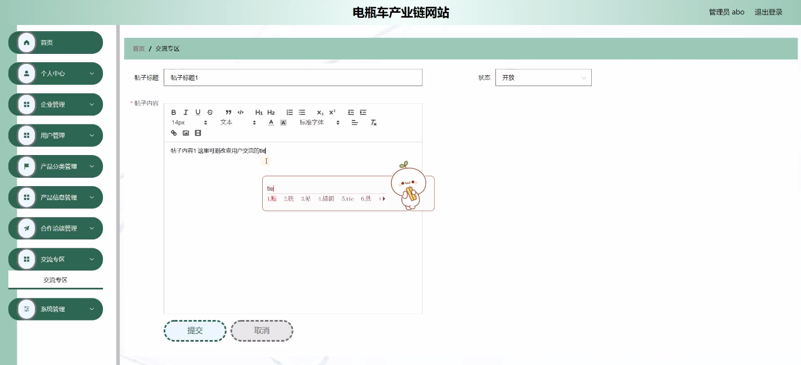

****本项目包含程序+源码+数据库+LW+调试部署环境，文末可获取一份本项目的java源码和数据库参考。****

## ******开题报告******

研究背景：
随着环境保护意识的提高和新能源汽车市场的快速发展，电瓶车产业链成为了当前研究的热点之一。电瓶车作为一种环保、低碳的交通工具，具有很大的市场潜力和发展前景。然而，电瓶车产业链的发展面临着许多挑战和问题，如供应链管理、产品质量控制、市场竞争等。因此，深入研究电瓶车产业链的相关问题，对于推动电瓶车产业的健康发展具有重要意义。

研究意义：
电瓶车产业链是一个复杂的系统，涉及到企业、用户、产品分类、产品信息、合作洽谈等多个功能模块。通过对电瓶车产业链进行深入研究，可以帮助企业更好地了解市场需求，优化产品结构，提升产品质量，增强市场竞争力。同时，研究还可以促进产业链各个环节的协同发展，推动电瓶车产业的整体提升，实现可持续发展。

研究目的：
本研究的目的是通过对电瓶车产业链的系统功能进行分析和研究，探索如何优化电瓶车产业链的运作效率和产品质量，解决当前面临的主要问题。通过研究，旨在为电瓶车企业提供科学的决策依据，推动电瓶车产业的健康发展。

研究内容： 本研究将围绕电瓶车产业链的企业、用户、产品分类、产品信息、合作洽谈等系统功能展开研究。具体包括以下几个方面：

  1. 企业：研究电瓶车产业链中各个环节的企业组织形式、经营模式、管理体系等，分析企业间的竞争关系和合作机制，探讨如何提升企业的核心竞争力。

  2. 用户：调查用户对电瓶车的需求和购买行为，分析用户的消费心理和购买决策因素，为企业提供市场定位和产品设计的参考依据。

  3. 产品分类：对电瓶车产品进行分类研究，包括不同类型、不同功率、不同价格等方面的分类，分析市场需求和产品差异化策略。

  4. 产品信息：研究电瓶车产品的信息管理和传递方式，包括产品参数、技术规格、售后服务等信息的发布和更新机制，提升用户对产品的了解和信任度。

  5. 合作洽谈：探讨电瓶车产业链中合作伙伴之间的洽谈和合作模式，研究合作关系的建立和维护机制，促进产业链各个环节的协同发展。

拟解决的主要问题： 在研究过程中，我们将重点解决以下几个主要问题：

  1. 如何优化电瓶车产业链中的供应链管理，提高物流效率和产品交付速度？

  2. 如何加强电瓶车产品的质量控制，提升产品的可靠性和安全性？

  3. 如何挖掘用户需求，推出符合市场需求的创新产品？

  4. 如何建立完善的产品信息管理系统，提升用户对产品的了解和信任度？

  5. 如何促进电瓶车产业链各个环节的协同发展，实现资源共享和互利共赢？

研究方案和预期成果： 本研究将采用文献研究、案例分析、问卷调查等方法，结合实地调研和专家访谈，全面深入地研究电瓶车产业链的相关问题。预期成果包括：

  1. 提出一套科学有效的电瓶车产业链优化方案，为企业决策提供参考。

  2. 探索电瓶车产业链中的关键成功因素和发展趋势，为产业发展规划提供依据。

  3. 提出改进电瓶车产品质量控制的方法和措施，提升产品的市场竞争力。

  4. 建立电瓶车产品信息管理系统，提升用户对产品的了解和信任度。

  5. 推动电瓶车产业链各个环节的协同发展，促进产业链的整体提升和可持续发展。

进度安排：

2022年9月至10月：开题报告编写和提交，完成开题报告的撰写并提交给指导教师进行审核。

2022年11月至2023年1月：系统设计和开发，根据开题报告的要求，进行系统设计和编码工作。

2023年2月至3月：论文撰写和初稿完成，开始撰写论文，并在这个阶段完成论文的初稿。

2023年4月至5月：论文修改和最终定稿，根据指导教师的意见对论文进行修改，并完成最终的定稿。

2023年5月：论文答辩和提交，参加论文答辩并根据答辩结果进行修改，最后将论文提交给学院或学校。

参考文献：

[1]喻佳,吴丹新.基于SpringBoot的Web快速开发框架[J].电脑编程技巧与维护,2021,(09):31-33.

[2]李鹏.基于SpringBoot快速开发平台的实现[J].电子技术与软件工程,2021,(12):36-37.

[3]叶开平,蔡维晟,陈家敏,邓斯妮.基于SpringBoot的综测可视化管理系统的研究与设计[J].电脑知识与技术,2021,(12):100-104.

[4]江健锋,徐振平.Springboot最小系统的设计与实现[J].电脑知识与技术,2021,(04):62-63.

[5]赵炯,司圣杰,周奇才,熊肖磊.通用信息获取系统设计与实现[J].起重运输机械,2020,(16):89-97.

[6]吴英宾.一种内外网数据交互系统的设计与实现[J].软件工程,2020,(08):25-27.

****以上是本项目程序开发之前开题报告内容，最终成品以下面界面为准，大家可以酌情参考使用。要源码参考请在文末进行获取！！****

## ******本项目的界面展示******

