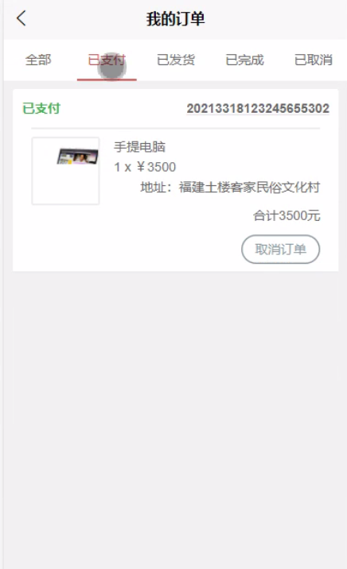

****本项目包含程序+源码+数据库+LW+调试部署环境，文末可获取一份本项目的java源码和数据库参考。****

## ******开题报告******

研究背景：
随着科技的不断发展和人们对电脑外设需求的增加，电脑外设销售系统成为了一个重要的商业领域。传统的销售方式已经无法满足用户的需求，因此需要开发一种高效、智能的电脑外设销售系统来提升用户体验并提高销售效率。

研究意义：
通过研究电脑外设销售系统，可以帮助企业更好地理解用户需求，提供个性化的产品推荐和购买建议，从而提高用户满意度和忠诚度。同时，这也有助于优化企业的销售流程，提高销售效率和利润。

研究目的：
本研究旨在设计和开发一种电脑外设销售系统，以满足用户个性化需求，提供精准的产品推荐和购买指导。通过深入分析用户行为和偏好，系统能够根据用户的特定需求和喜好，为其推荐最合适的电脑外设产品，提高用户购买的成功率和满意度。

研究内容： 本研究的主要内容包括以下系统功能：

  1. 用户管理：设计用户注册、登录和个人信息管理功能，通过用户的个人信息了解其购买偏好和历史行为，为其提供个性化的服务。

  2. 商品分类：建立完善的商品分类体系，将电脑外设按照不同的特性和用途进行分类，方便用户浏览和筛选。

  3. 商品信息：收集和整理电脑外设的详细信息，包括品牌、型号、规格、价格等，为用户提供准确、全面的产品信息。

  4. 个性化推荐：基于用户的历史购买记录、浏览行为和偏好分析，利用推荐算法为用户推荐最符合其需求的电脑外设产品。

  5. 购买指导：为用户提供购买建议和指导，包括产品比较、评价和评论等，帮助用户做出明智的购买决策。

拟解决的主要问题：

  1. 如何准确地获取用户的购买偏好和需求？
  2. 如何设计有效的个性化推荐算法，提高推荐的准确性和精度？
  3. 如何提供全面、准确的产品信息，满足用户对产品的详细了解需求？
  4. 如何优化用户购买流程，提高用户的购买成功率和满意度？
  5. 如何建立用户信任和忠诚度，提高用户的再次购买率和口碑传播？

研究方案和预期成果：
本研究将采用数据分析、机器学习和推荐算法等方法，设计和开发一种智能电脑外设销售系统。预期成果包括：准确获取用户需求和偏好的能力、个性化推荐算法的优化、完善的商品信息数据库、用户购买流程的优化等。通过实验和评估，验证系统的有效性和可行性，为企业提供更好的销售解决方案。

进度安排：

2022年9月至10月：需求分析和规划，进行用户需求调研和分析，确定系统功能和目标。

2022年11月至2023年1月：系统设计和开发，完成系统架构设计和技术选型，并开始编写代码。

2023年2月至3月：测试和优化，进行单元测试和集成测试，修复问题并优化系统性能。

2023年4月至5月：文档编写和培训，编写用户手册和系统文档，并进行相关人员的培训。

2023年5月：上线部署和维护，将系统部署到生产环境中，并定期进行维护和升级。

参考文献：

[1]王振华.SpringBoot在教学效果评估系统中的应用[J].电子技术,2023,(05):67-69.

[2]王明泉.基于SpringBoot远程热部署的探索和应用[J].信息与电脑(理论版),2023,(07):1-4.

[3]王亚东,李晓霞,陈强强,剡美娜.基于SpringBoot的需求发布平台设计[J].信息与电脑(理论版),2023,(01):105-107.

[4]陈新府豪.基于SpringBoot和Vue框架的创新方法推理系统的设计与实现[D].导师：黄静.浙江理工大学,2022.

[5]霍福华,韩慧.基于SpringBoot微服务架构下前后端分离的MVVM模型[J].电子技术与软件工程,2022,(01):73-76.

[6]韩策,张娜,王松亭,张凯,何方,袁峰.SpringBoot OPC客户端设计与研究[J].电子世界,2021,(19):25-26.

****以上是本项目程序开发之前开题报告内容，最终成品以下面界面为准，大家可以酌情参考使用。要源码参考请在文末进行获取！！****

## ******本项目的界面展示******

