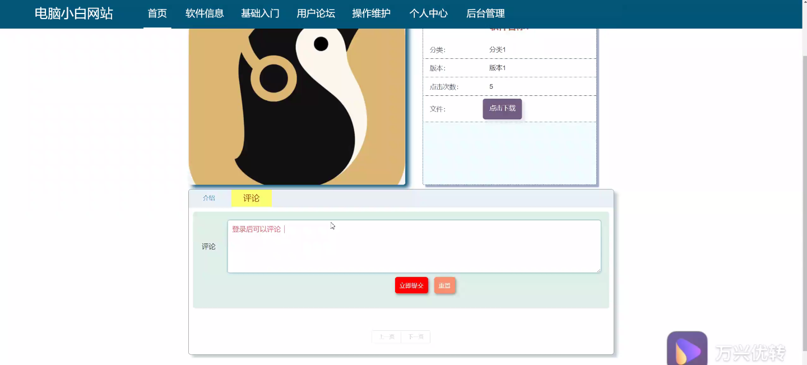

****本项目包含程序+源码+数据库+LW+调试部署环境，文末可获取一份本项目的java源码和数据库参考。****

## ******开题报告******

研究背景：
随着信息技术的快速发展，计算机已经成为现代社会不可或缺的一部分。然而，对于电脑小白来说，面对庞大的软件分类和海量的软件信息，往往感到困惑和无从下手。此外，对于初学者来说，基础入门知识也是必不可少的。因此，开发一个电脑小白网站，旨在为电脑小白提供全面、系统的软件分类、软件信息和基础入门知识，帮助他们更好地理解和使用计算机。

研究意义：
该电脑小白网站的建设具有重要的实际意义。首先，它将帮助电脑小白更快地了解各种软件的分类和功能，避免他们在选择软件时盲目跟风或迷失方向。其次，通过提供详细的软件信息，用户可以更加全面地了解软件的特点和适用范围，从而能够更好地满足自己的需求。此外，基础入门知识的提供将帮助电脑小白快速上手，减少学习曲线，提高使用效率。

研究目的：
本研究旨在开发一个电脑小白网站，通过提供软件分类、软件信息和基础入门知识等系统功能，帮助电脑小白更好地理解和使用计算机。具体目标包括：1.建立全面、准确的软件分类体系，使用户能够快速了解各类软件的特点和用途；2.提供详细的软件信息，包括软件的功能、版本、厂商等，以便用户进行选择和比较；3.提供基础入门知识，包括计算机基础概念、操作技巧等，帮助用户快速上手。

研究内容： 根据系统功能，本研究将主要涉及以下内容：

  1. 软件分类：建立一个完善的软件分类体系，将软件按照不同的功能和用途进行分类，方便用户查找和选择合适的软件。

  2. 软件信息：收集和整理各类软件的详细信息，包括软件的功能、版本、厂商等，为用户提供全面的软件参考资料。

  3. 基础入门：编写基础入门教程，包括计算机基础概念、操作技巧等，帮助电脑小白快速掌握基本的计算机使用技能。

拟解决的主要问题：
本研究旨在解决电脑小白在软件选择、软件了解和基础入门方面的问题。具体包括：1.电脑小白在面对众多软件分类时的困惑和迷茫；2.缺乏全面、准确的软件信息，导致用户无法做出明智的选择；3.初学者对于计算机基础知识的不了解，影响其快速上手和使用效率。

研究方案和预期成果：
本研究将采用以下方案进行实施：1.收集和整理各类软件的相关信息，并建立完善的软件分类体系；2.编写详细的软件信息介绍和基础入门教程；3.开发一个电脑小白网站，将以上内容整合并提供给用户。

预期成果包括：1.一个全面、准确的软件分类体系，帮助用户更好地了解各类软件；2.详细的软件信息介绍，使用户能够做出明智的选择；3.基础入门教程，帮助电脑小白快速上手；4.一个功能完善的电脑小白网站，为用户提供全面、系统的计算机知识和软件信息。

进度安排：

2022年9月至10月：需求分析和规划，进行用户需求调研和分析，确定系统功能和目标。

2022年11月至2023年1月：系统设计和开发，完成系统架构设计和技术选型，并开始编写代码。

2023年2月至3月：测试和优化，进行单元测试和集成测试，修复问题并优化系统性能。

2023年4月至5月：文档编写和培训，编写用户手册和系统文档，并进行相关人员的培训。

2023年5月：上线部署和维护，将系统部署到生产环境中，并定期进行维护和升级。

参考文献：

[1]王振华.SpringBoot在教学效果评估系统中的应用[J].电子技术,2023,(05):67-69.

[2]王明泉.基于SpringBoot远程热部署的探索和应用[J].信息与电脑(理论版),2023,(07):1-4.

[3]王亚东,李晓霞,陈强强,剡美娜.基于SpringBoot的需求发布平台设计[J].信息与电脑(理论版),2023,(01):105-107.

[4]陈新府豪.基于SpringBoot和Vue框架的创新方法推理系统的设计与实现[D].导师：黄静.浙江理工大学,2022.

[5]霍福华,韩慧.基于SpringBoot微服务架构下前后端分离的MVVM模型[J].电子技术与软件工程,2022,(01):73-76.

[6]韩策,张娜,王松亭,张凯,何方,袁峰.SpringBoot OPC客户端设计与研究[J].电子世界,2021,(19):25-26.

****以上是本项目程序开发之前开题报告内容，最终成品以下面界面为准，大家可以酌情参考使用。要源码参考请在文末进行获取！！****

## ******本项目的界面展示******

