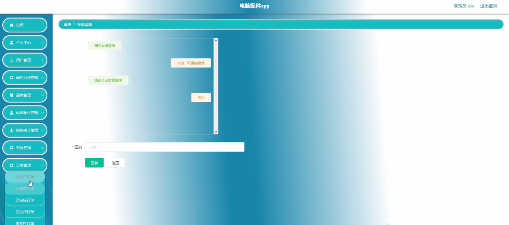

****本项目包含程序+源码+数据库+LW+调试部署环境，文末可获取一份本项目的java源码和数据库参考。****

## ******开题报告******

研究背景：
随着信息技术的快速发展，电脑已经成为人们生活和工作中不可或缺的一部分。而电脑的性能和功能主要由其配件决定。因此，对电脑配件进行深入研究具有重要的意义。

研究意义：
首先，研究电脑配件可以帮助我们了解各种配件的特点和功能，从而更好地选择适合自己需求的配件，提升电脑的性能和使用体验。其次，对于电脑制造商和销售商来说，了解市场上各种配件的需求和趋势，可以帮助他们进行产品开发和销售策略的制定。最后，研究电脑配件还可以促进电脑行业的创新和发展，推动科技进步。

研究目的：
本研究旨在全面探索电脑配件领域的相关知识，包括不同类型的配件、品牌以及销售统计等内容。通过深入研究电脑配件的功能和特点，我们希望能够为用户提供更准确、全面的选购建议，同时也为电脑制造商和销售商提供市场分析和决策支持。

研究内容： 本研究将围绕以下系统功能展开研究：

  1. 用户：调查用户对电脑配件的需求和偏好，了解他们在选购过程中的关注点和考虑因素。

  2. 配件分类：对不同类型的电脑配件进行分类整理，包括处理器、内存、硬盘、显卡等，以便更好地了解各种配件的特点和适用范围。

  3. 电脑配件：深入研究各种电脑配件的功能、性能指标和技术发展趋势，比较不同品牌和型号之间的差异，为用户提供选购参考。

  4. 品牌：分析不同品牌的电脑配件在市场上的竞争优势和用户口碑，评估其质量和可靠性。

  5. 销售统计：收集和分析电脑配件的销售数据，探索市场需求和趋势，为制造商和销售商提供市场预测和决策支持。

拟解决的主要问题：

  1. 不同类型的电脑配件有哪些特点和功能？
  2. 用户在选购电脑配件时应该注意哪些因素？
  3. 不同品牌的电脑配件有何区别和优势？
  4. 电脑配件市场的销售趋势和需求如何？
  5. 如何根据用户需求和预算选择合适的电脑配件？

研究方案和预期成果：
本研究将采用文献研究、调查问卷、数据分析等方法，收集和整理相关数据和信息。预计通过对电脑配件的深入研究，能够为用户提供更准确、全面的选购建议，为制造商和销售商提供市场分析和决策支持，推动电脑配件行业的创新和发展。

进度安排：

2022年9月至10月：开题报告编写和提交，完成开题报告的撰写并提交给指导教师进行审核。

2022年11月至2023年1月：系统设计和开发，根据开题报告的要求，进行系统设计和编码工作。

2023年2月至3月：论文撰写和初稿完成，开始撰写论文，并在这个阶段完成论文的初稿。

2023年4月至5月：论文修改和最终定稿，根据指导教师的意见对论文进行修改，并完成最终的定稿。

2023年5月：论文答辩和提交，参加论文答辩并根据答辩结果进行修改，最后将论文提交给学院或学校。

参考文献：

[1]喻佳,吴丹新.基于SpringBoot的Web快速开发框架[J].电脑编程技巧与维护,2021,(09):31-33.

[2]李鹏.基于SpringBoot快速开发平台的实现[J].电子技术与软件工程,2021,(12):36-37.

[3]叶开平,蔡维晟,陈家敏,邓斯妮.基于SpringBoot的综测可视化管理系统的研究与设计[J].电脑知识与技术,2021,(12):100-104.

[4]江健锋,徐振平.Springboot最小系统的设计与实现[J].电脑知识与技术,2021,(04):62-63.

[5]赵炯,司圣杰,周奇才,熊肖磊.通用信息获取系统设计与实现[J].起重运输机械,2020,(16):89-97.

[6]吴英宾.一种内外网数据交互系统的设计与实现[J].软件工程,2020,(08):25-27.

****以上是本项目程序开发之前开题报告内容，最终成品以下面界面为准，大家可以酌情参考使用。要源码参考请在文末进行获取！！****

## ******本项目的界面展示******

