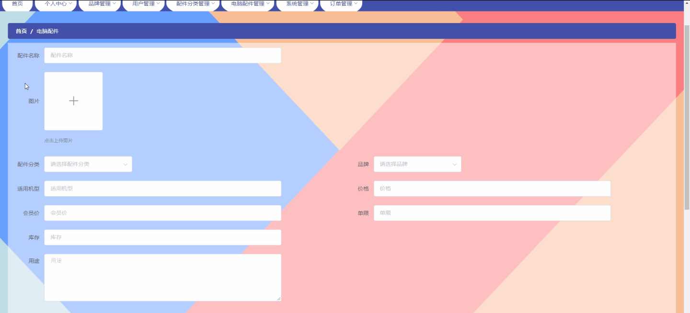

****本项目包含程序+源码+数据库+LW+调试部署环境，文末可获取一份本项目的java源码和数据库参考。****

## ******开题报告******

研究背景：
随着科技的不断进步和人们对电脑性能需求的提高，电脑配件的购物已经成为现代社会中一个重要的消费行为。随之而来的是市场上电脑配件种类繁多、品牌众多的情况，给消费者选择带来了一定的困扰。因此，对电脑配件购物进行研究，探索如何更好地满足消费者的需求，具有重要的理论和实践意义。

研究意义：
电脑配件购物的研究对于消费者、电子产品制造商和电商平台都具有重要的意义。首先，对于消费者来说，通过深入研究电脑配件购物，可以帮助他们更好地了解各类配件的特点、性能和适用范围，从而更准确地选择适合自己需求的产品。其次，对于电子产品制造商来说，了解消费者在购物过程中的需求和偏好，可以帮助他们更好地设计和生产符合市场需求的电脑配件。最后，对于电商平台来说，研究电脑配件购物可以帮助他们优化用户体验，提高销售转化率，从而实现更好的商业效益。

研究目的：
本研究旨在深入探讨电脑配件购物的相关问题，通过对用户、配件分类、电脑配件和品牌等系统功能进行分析，以期为消费者提供更好的购物体验和选择指导。具体目标包括：了解用户在电脑配件购物中的需求和偏好；建立合理的配件分类体系，方便消费者快速准确地找到所需产品；对常见的电脑配件进行性能评估和比较，为消费者提供参考；调查不同品牌的电脑配件在市场上的口碑和用户评价，帮助消费者做出明智的购买决策。

研究内容： 本研究将围绕用户、配件分类、电脑配件和品牌等系统功能展开研究。具体内容包括但不限于以下几个方面：

  1. 用户需求分析：通过问卷调查、访谈等方式，了解用户在电脑配件购物中的需求和偏好，包括性能要求、价格敏感度、品牌偏好等。
  2. 配件分类体系建立：根据电脑配件的功能和特点，建立合理的分类体系，方便消费者快速准确地找到所需产品。
  3. 电脑配件性能评估：对常见的电脑配件进行性能评估和比较，包括处理器、显卡、内存等，为消费者提供参考依据。
  4. 品牌口碑调查：调查不同品牌的电脑配件在市场上的口碑和用户评价，帮助消费者了解各个品牌的优劣势，做出明智的购买决策。

拟解决的主要问题： 本研究旨在解决以下主要问题：

  1. 消费者在电脑配件购物中面临的信息不对称问题，如何提供准确、全面的产品信息？
  2. 电脑配件种类繁多，如何建立科学合理的配件分类体系，方便消费者选择？
  3. 不同品牌的电脑配件在市场上的口碑和用户评价如何？如何帮助消费者做出明智的购买决策？
  4. 如何通过性能评估和比较，为消费者提供更准确的产品选择指导？

研究方案和预期成果：
本研究将采用定量和定性相结合的方法，包括问卷调查、访谈、数据分析等。通过收集和分析大量的用户需求数据、产品信息和用户评价，建立电脑配件购物的相关模型和指标体系。预期成果包括：建立科学合理的配件分类体系；提供准确全面的产品信息；评估不同品牌电脑配件的口碑和性能；为消费者提供购买决策参考等。以上研究内容和成果将有助于优化电脑配件购物体验，提高消费者满意度和购买效率。

进度安排：

2022年9月至10月：需求分析和规划，明确系统功能和目标，制定项目计划。

2022年11月至2023年1月：系统设计和编码，完成详细的系统设计并开始编写代码。

2023年2月至3月：用户界面开发和数据库开发，开发用户友好的界面和设计数据库结构。

2023年4月至5月：功能测试、文档编写和上线部署，对系统进行全面的功能测试并编写用户手册。

2023年5月：维护和升级，定期对系统进行维护和升级，修复bug和添加新功能。

参考文献：

[1]邱小群,邓丽艳,陈海潮.基于B/S的信息管理系统设计和实现[J].信息与电脑(理论版),2022,(20):146-148.

[2]谢霜.基于Java技术的网络管理体系结构的应用[J].网络安全技术与应用,2022,(10):14-15.

[3]宋锦华.高职院校Java程序设计课程改革研究[J].科技视界,2022,(20):133-135.

[4]曹嵩彭,王鹏宇.浅析Java语言在软件开发中的应用[J].信息记录材料,2022,(03):114-116.

[5]朱澈,余俊达.武汉东湖学院.基于Java的软硬件信息管理系统V1.0[Z].项目立项编号.鉴定单位.鉴定日期:

****以上是本项目程序开发之前开题报告内容，最终成品以下面界面为准，大家可以酌情参考使用。要源码参考请在文末进行获取！！****

## ******本项目的界面展示******

