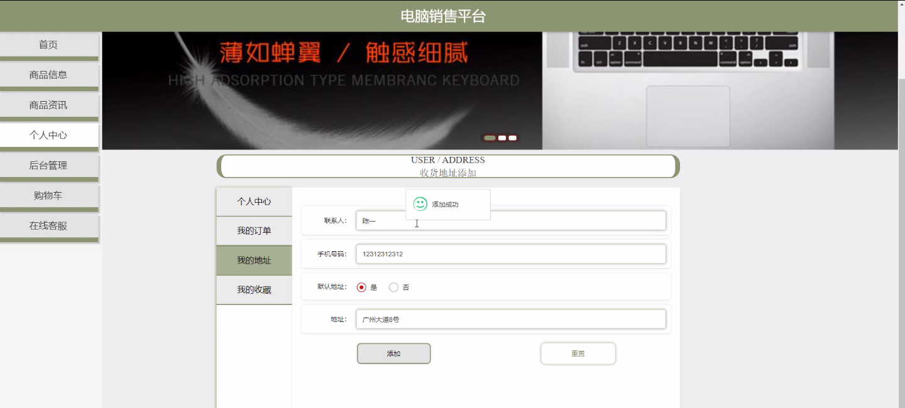
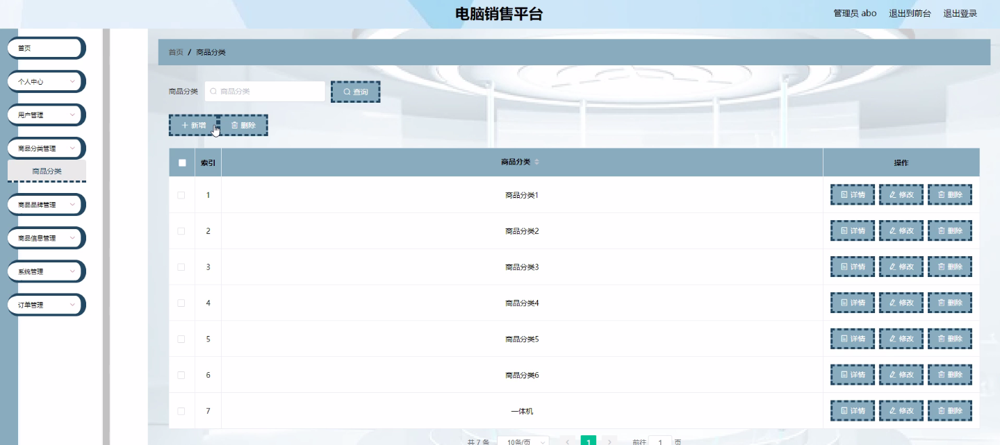
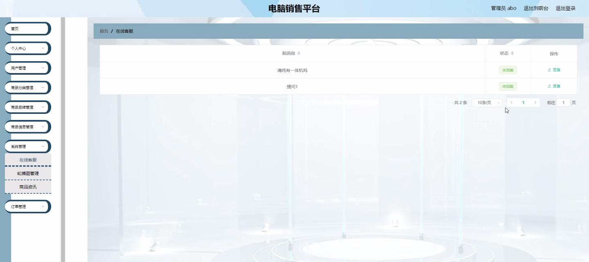
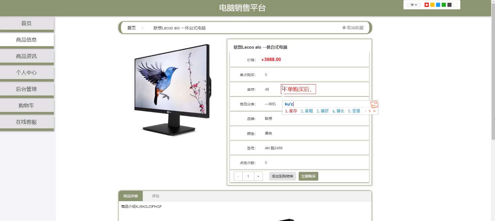
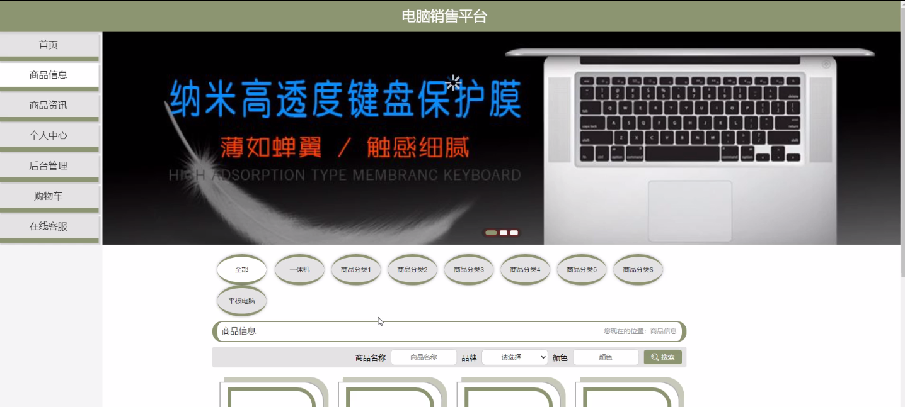

****本项目包含程序+源码+数据库+LW+调试部署环境，文末可获取一份本项目的java源码和数据库参考。****

## ******开题报告******

研究背景：
随着互联网的快速发展和普及，电子商务已经成为人们购物的主要方式之一。尤其是在电脑销售领域，消费者可以通过在线平台方便地浏览、比较和购买各种品牌和型号的电脑产品。然而，当前的电脑销售平台仍存在一些问题，如用户体验不佳、信息不全面等，这给消费者带来了困扰。因此，有必要对电脑销售平台进行深入研究，以提升用户体验和满足消费者的需求。

研究意义：
本研究旨在探索和改进电脑销售平台的功能和服务，从而提供更好的用户体验和购物环境。通过对用户、商品分类、商品品牌和商品信息等系统功能的研究，我们可以深入了解消费者的需求和偏好，优化平台的设计和运营，提高用户的满意度和忠诚度。同时，这也有助于推动电子商务行业的发展，促进经济的增长和社会的进步。

研究目的：
本研究的目的是分析和评估电脑销售平台的现状和问题，并提出相应的改进方案。具体目标包括但不限于：提高用户对平台的信任度和满意度；优化商品分类和品牌展示，提供更准确和全面的商品信息；改善用户界面和交互设计，提升用户体验和购物便利性；增加平台的安全性和数据保护措施，保障用户的个人信息和交易安全。

研究内容： 本研究将重点关注电脑销售平台的以下系统功能：用户、商品分类、商品品牌和商品信息。具体研究内容包括但不限于：

  1. 用户：分析用户行为和偏好，了解用户需求和购买决策过程，提供个性化推荐和定制化服务。

  2. 商品分类：优化商品分类体系，确保商品的合理归类和组织，方便用户查找和比较不同品牌和型号的电脑产品。

  3. 商品品牌：评估不同品牌的知名度、口碑和市场份额，提供可靠的品牌推荐和购买指导。

  4. 商品信息：完善商品信息的准确性和全面性，包括产品特性、规格参数、价格、库存等，以便用户做出明智的购买决策。

拟解决的主要问题：
本研究旨在解决电脑销售平台存在的一些问题，包括但不限于：用户体验不佳、信息不全面、商品分类混乱、品牌推荐不准确等。通过对系统功能的优化和改进，我们希望能够提升平台的整体性能和用户满意度，为消费者提供更好的购物体验。

研究方案和预期成果：
本研究将采用综合性的研究方法，包括文献调研、实地调查、数据分析等，以获取全面和可靠的研究结果。预期成果包括但不限于：提出改进电脑销售平台的具体方案和策略；设计和开发相应的功能模块和界面；评估和验证改进效果，并提出进一步的改进建议。通过这些工作，我们期望能够为电脑销售平台的发展和用户体验的提升做出积极的贡献。

进度安排：

2022年9月至10月：需求分析和规划，明确系统功能和目标，制定项目计划。

2022年11月至2023年1月：系统设计和编码，完成详细的系统设计并开始编写代码。

2023年2月至3月：用户界面开发和数据库开发，开发用户友好的界面和设计数据库结构。

2023年4月至5月：功能测试、文档编写和上线部署，对系统进行全面的功能测试并编写用户手册。

2023年5月：维护和升级，定期对系统进行维护和升级，修复bug和添加新功能。

参考文献：

[1]邱小群,邓丽艳,陈海潮.基于B/S的信息管理系统设计和实现[J].信息与电脑(理论版),2022,(20):146-148.

[2]谢霜.基于Java技术的网络管理体系结构的应用[J].网络安全技术与应用,2022,(10):14-15.

[3]宋锦华.高职院校Java程序设计课程改革研究[J].科技视界,2022,(20):133-135.

[4]曹嵩彭,王鹏宇.浅析Java语言在软件开发中的应用[J].信息记录材料,2022,(03):114-116.

[5]朱澈,余俊达.武汉东湖学院.基于Java的软硬件信息管理系统V1.0[Z].项目立项编号.鉴定单位.鉴定日期:

****以上是本项目程序开发之前开题报告内容，最终成品以下面界面为准，大家可以酌情参考使用。要源码参考请在文末进行获取！！****

## ******本项目的界面展示******

