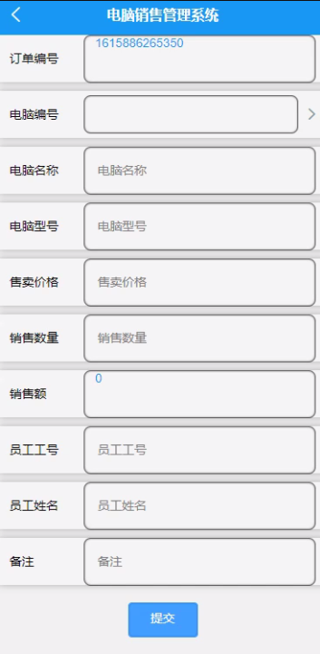

****本项目包含程序+源码+数据库+LW+调试部署环境，文末可获取一份本项目的java源码和数据库参考。****

## ******开题报告******

研究背景：
随着信息技术的快速发展和普及，电脑销售行业也面临着日益激烈的竞争。传统的手工管理方式已经无法满足企业高效运营的需求，因此，开发一套电脑销售管理系统成为了当务之急。该系统将集成员工、客户信息、供应商、电脑信息、销售订单、进货信息、出货信息、退货信息等功能，实现对销售过程的全面管理和控制。

研究意义：
电脑销售管理系统的开发和应用对于提升企业的管理水平和竞争力具有重要意义。首先，该系统可以有效地整合和管理各项销售相关数据，提高数据的准确性和完整性，为决策提供可靠的依据。其次，系统的自动化处理能力可以大大提高工作效率，减少人力资源的浪费，降低企业的运营成本。此外，系统还能够提供实时的销售数据分析和报告，帮助企业及时调整销售策略，增强市场竞争力。

研究目的：
本研究旨在开发一套功能完善、易于操作的电脑销售管理系统，以满足企业对于销售过程全面管理和控制的需求。通过该系统的应用，提高企业的销售效率和运营效益，优化资源配置，增强企业的竞争力。

研究内容：
本研究的主要内容包括员工信息管理、客户信息管理、供应商管理、电脑信息管理、销售订单管理、进货信息管理、出货信息管理、退货信息管理等系统功能。具体而言，研究将围绕以下几个方面展开：

  1. 员工信息管理：包括员工基本信息录入、权限管理、考勤管理等功能，旨在提高员工管理的效率和准确性。
  2. 客户信息管理：包括客户基本信息录入、客户分类管理、客户关系维护等功能，旨在提升客户服务质量和客户满意度。
  3. 供应商管理：包括供应商基本信息录入、供应商评估、供应商合作管理等功能，旨在建立稳定的供应链体系。
  4. 电脑信息管理：包括电脑型号、配置、库存等信息的录入和管理，旨在实现对电脑库存的精确掌控。
  5. 销售订单管理：包括销售订单的录入、跟踪、发货等功能，旨在提高销售过程的效率和准确性。
  6. 进货信息管理：包括进货订单的录入、库存管理、供应商结算等功能，旨在优化采购流程和成本控制。
  7. 出货信息管理：包括出货订单的录入、库存管理、物流跟踪等功能，旨在提升出货效率和准确性。
  8. 退货信息管理：包括退货订单的录入、退款处理、库存调整等功能，旨在规范退货流程和提升客户满意度。

拟解决的主要问题： 通过开发电脑销售管理系统，我们将解决以下主要问题：

  1. 传统手工管理方式效率低下、易出错的问题；
  2. 数据分散、不易统计和分析的问题；
  3. 销售过程中信息交流不畅、沟通成本高的问题；
  4. 人力资源浪费、运营成本高的问题；
  5. 缺乏实时销售数据分析和报告的问题。

研究方案和预期成果：
本研究将采用软件开发的方法，结合企业实际需求，设计并开发一套电脑销售管理系统。预期成果包括一个功能完善、易于操作的系统，能够实现对员工、客户信息、供应商、电脑信息、销售订单、进货信息、出货信息、退货信息等的全面管理和控制。通过该系统的应用，预计可以提高企业的销售效率和运营效益，优化资源配置，增强企业的竞争力。

进度安排：

2022年9月至10月：开题报告编写和提交，完成开题报告的撰写并提交给指导教师进行审核。

2022年11月至2023年1月：系统设计和开发，根据开题报告的要求，进行系统设计和编码工作。

2023年2月至3月：论文撰写和初稿完成，开始撰写论文，并在这个阶段完成论文的初稿。

2023年4月至5月：论文修改和最终定稿，根据指导教师的意见对论文进行修改，并完成最终的定稿。

2023年5月：论文答辩和提交，参加论文答辩并根据答辩结果进行修改，最后将论文提交给学院或学校。

参考文献：

[1]喻佳,吴丹新.基于SpringBoot的Web快速开发框架[J].电脑编程技巧与维护,2021,(09):31-33.

[2]李鹏.基于SpringBoot快速开发平台的实现[J].电子技术与软件工程,2021,(12):36-37.

[3]叶开平,蔡维晟,陈家敏,邓斯妮.基于SpringBoot的综测可视化管理系统的研究与设计[J].电脑知识与技术,2021,(12):100-104.

[4]江健锋,徐振平.Springboot最小系统的设计与实现[J].电脑知识与技术,2021,(04):62-63.

[5]赵炯,司圣杰,周奇才,熊肖磊.通用信息获取系统设计与实现[J].起重运输机械,2020,(16):89-97.

[6]吴英宾.一种内外网数据交互系统的设计与实现[J].软件工程,2020,(08):25-27.

****以上是本项目程序开发之前开题报告内容，最终成品以下面界面为准，大家可以酌情参考使用。要源码参考请在文末进行获取！！****

## ******本项目的界面展示******

