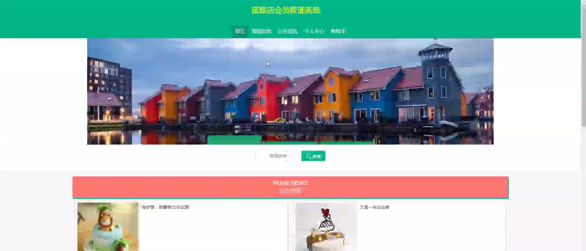
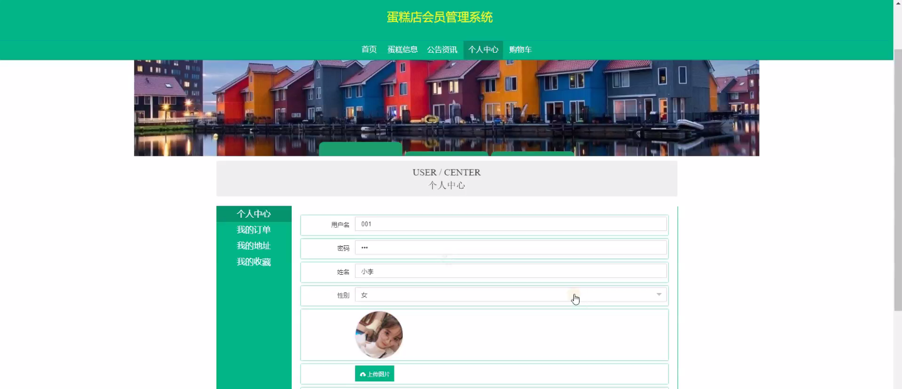
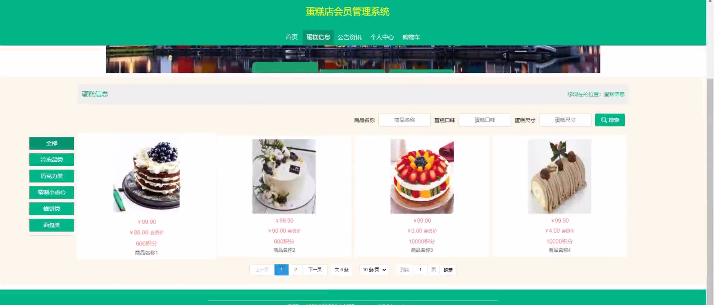
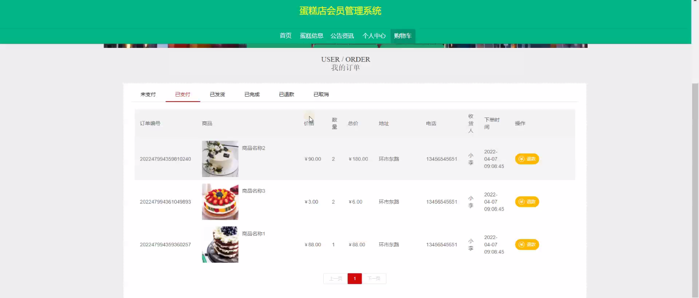
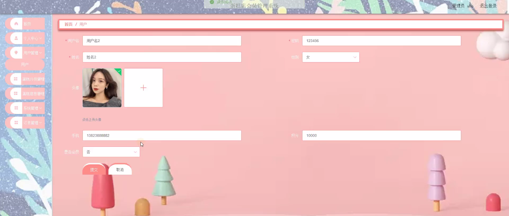
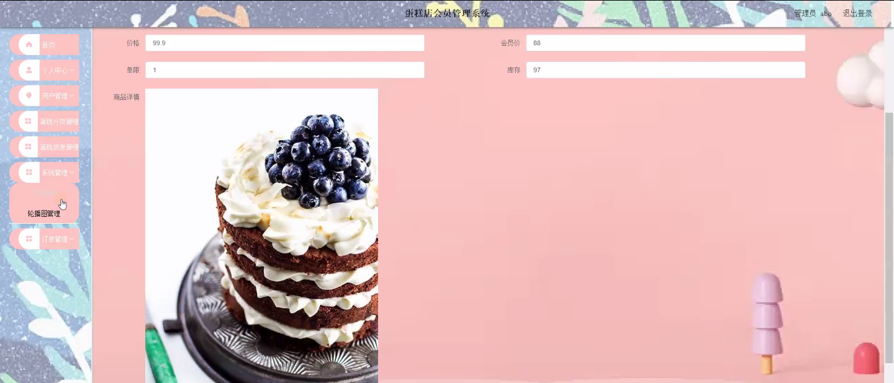
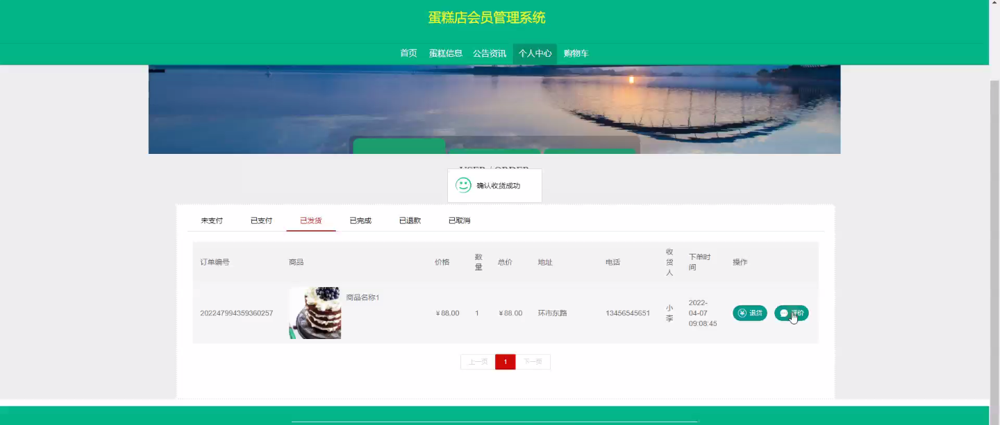

****本项目包含程序+源码+数据库+LW+调试部署环境，文末可获取一份本项目的java源码和数据库参考。****

## ******开题报告******

研究背景：
随着社会经济的发展和人们生活水平的提高，蛋糕作为一种美味的甜点逐渐成为人们日常生活中不可或缺的一部分。蛋糕店作为提供蛋糕产品和服务的场所，面临着越来越多的顾客需求和竞争压力。为了更好地满足顾客的需求、提高服务质量和经营效益，蛋糕店需要建立一个有效的会员管理系统。

研究意义：
会员管理系统对于蛋糕店来说具有重要的意义。首先，通过会员管理系统可以实现对顾客信息的统一管理和快速查询，包括个人信息、购买记录等，从而更好地了解顾客的消费习惯和偏好，为顾客提供个性化的服务。其次，会员管理系统可以帮助蛋糕店建立起稳定的顾客群体，提高顾客的忠诚度和粘性，增加回头客和口碑传播。最后，会员管理系统还可以为蛋糕店提供数据支持，进行市场分析和决策制定，提升蛋糕店的竞争力和盈利能力。

研究目的：
本研究旨在设计和实现一套蛋糕店会员管理系统，通过对用户、蛋糕分类和蛋糕信息等系统功能的研究，实现对顾客信息的全面管理和个性化服务，提高蛋糕店的经营效益和竞争力。

研究内容： 本研究的主要内容包括以下系统功能的设计和实现：

  1. 用户管理：建立用户数据库，包括顾客的基本信息、联系方式、购买记录等。通过用户管理功能，可以实现对顾客信息的录入、查询、修改和删除等操作，为顾客提供个性化的服务。

  2. 蛋糕分类管理：将蛋糕按照不同的分类进行管理，包括蛋糕的种类、口味、尺寸、价格等信息。通过蛋糕分类管理功能，可以方便地对蛋糕进行分类展示和查询，提高顾客的选择便利性。

  3. 蛋糕信息管理：对每款蛋糕进行详细的信息管理，包括蛋糕的名称、描述、图片、库存量等。通过蛋糕信息管理功能，可以及时更新蛋糕的信息，保证顾客获取到准确的产品信息。

拟解决的主要问题：
在设计和实现蛋糕店会员管理系统的过程中，需要解决以下主要问题：如何建立起完善的用户数据库，包括顾客的基本信息和购买记录；如何实现对顾客信息的快速查询和个性化服务；如何进行蛋糕的分类管理和信息更新；如何保证系统的安全性和稳定性等。

研究方案和预期成果：
本研究将采用软件开发的方法，结合数据库技术和网络技术，设计和实现一套功能完善、操作简便的蛋糕店会员管理系统。通过系统的设计和实施，预期可以实现对顾客信息的全面管理和个性化服务，提高蛋糕店的经营效益和竞争力。同时，该系统还具备良好的扩展性和可维护性，可以满足蛋糕店未来的发展需求。

进度安排：

2022年9月至10月：开题报告编写和提交，完成开题报告的撰写并提交给指导教师进行审核。

2022年11月至2023年1月：系统设计和开发，根据开题报告的要求，进行系统设计和编码工作。

2023年2月至3月：论文撰写和初稿完成，开始撰写论文，并在这个阶段完成论文的初稿。

2023年4月至5月：论文修改和最终定稿，根据指导教师的意见对论文进行修改，并完成最终的定稿。

2023年5月：论文答辩和提交，参加论文答辩并根据答辩结果进行修改，最后将论文提交给学院或学校。

参考文献：

[1]喻佳,吴丹新.基于SpringBoot的Web快速开发框架[J].电脑编程技巧与维护,2021,(09):31-33.

[2]李鹏.基于SpringBoot快速开发平台的实现[J].电子技术与软件工程,2021,(12):36-37.

[3]叶开平,蔡维晟,陈家敏,邓斯妮.基于SpringBoot的综测可视化管理系统的研究与设计[J].电脑知识与技术,2021,(12):100-104.

[4]江健锋,徐振平.Springboot最小系统的设计与实现[J].电脑知识与技术,2021,(04):62-63.

[5]赵炯,司圣杰,周奇才,熊肖磊.通用信息获取系统设计与实现[J].起重运输机械,2020,(16):89-97.

[6]吴英宾.一种内外网数据交互系统的设计与实现[J].软件工程,2020,(08):25-27.

****以上是本项目程序开发之前开题报告内容，最终成品以下面界面为准，大家可以酌情参考使用。要源码参考请在文末进行获取！！****

## ******本项目的界面展示******

