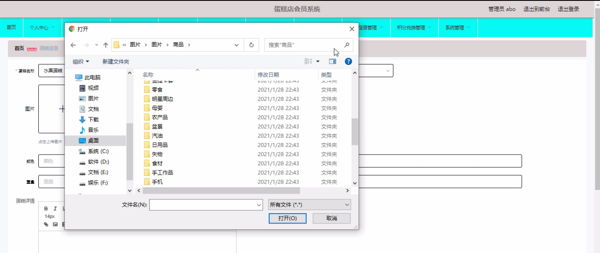

****本项目包含程序+源码+数据库+LW+调试部署环境，文末可获取一份本项目的java源码和数据库参考。****

## ******开题报告******

研究背景：
随着社会经济的发展和人们生活水平的提高，蛋糕店作为一种受欢迎的零食和礼品选择，逐渐成为人们日常生活中不可或缺的一部分。然而，传统的蛋糕店在管理和服务方面存在一些问题，如无法有效地记录顾客的购买历史、无法个性化推荐产品、无法提供优惠和奖励等。因此，建立一个完善的蛋糕店会员系统具有重要的研究意义。

研究意义：
蛋糕店会员系统的建立将为蛋糕店提供更好的管理和服务手段，有助于提升顾客满意度和忠诚度。通过该系统，蛋糕店可以更好地了解顾客的购买偏好和需求，从而精准推荐产品，提供个性化的促销活动，并通过积分兑换等方式激励顾客的消费行为。同时，该系统还可以帮助蛋糕店实现销售数据的统计和分析，为经营决策提供科学依据。

研究目的：
本研究旨在设计和开发一套功能完善的蛋糕店会员系统，以解决传统蛋糕店管理和服务中存在的问题。通过该系统，蛋糕店可以更好地管理商品分类、会员等级、会员信息、蛋糕信息、蛋糕促销、积分蛋糕、预订信息和积分兑换等功能，提供更加便捷和个性化的购物体验，提高顾客满意度和忠诚度。

研究内容： 本研究将围绕蛋糕店会员系统展开，主要包括以下内容：

  1. 商品分类：设计合理的商品分类体系，方便顾客浏览和选择商品。

  2. 会员等级：建立会员等级制度，根据消费金额和频次等指标对会员进行分类，并为不同等级的会员提供相应的优惠和特权。

  3. 会员信息：记录和管理顾客的个人信息，包括姓名、联系方式、生日等，以便于与顾客进行沟通和互动。

  4. 蛋糕信息：完善的蛋糕信息管理，包括蛋糕名称、价格、口味、成分等详细信息，方便顾客了解和选择。

  5. 蛋糕促销：设计各类促销活动，如打折、满减等，以吸引顾客并提高销售额。

  6. 积分蛋糕：建立积分制度，根据顾客的消费金额给予相应的积分奖励，顾客可以用积分兑换蛋糕或享受其他优惠。

  7. 预订信息：记录顾客的预订信息，包括预订时间、数量、取货方式等，方便店铺进行生产和配送安排。

  8. 积分兑换：提供积分兑换功能，顾客可以使用积分兑换蛋糕或其他礼品。

拟解决的主要问题：
本研究旨在解决传统蛋糕店管理和服务中存在的问题，主要包括无法有效记录顾客购买历史、无法个性化推荐产品、无法提供优惠和奖励等问题。通过建立一个完善的蛋糕店会员系统，可以实现对顾客购买行为的跟踪和分析，提供个性化的推荐和优惠，并通过积分兑换等方式激励顾客的消费行为。

研究方案和预期成果：
本研究将采用软件开发的方法，设计和开发一套功能完善的蛋糕店会员系统。预期成果包括一个可用的系统原型和相应的技术文档，该系统将实现商品分类、会员等级、会员信息、蛋糕信息、蛋糕促销、积分蛋糕、预订信息和积分兑换等功能，提供更加便捷和个性化的购物体验，提高顾客满意度和忠诚度。

进度安排：

2022年9月至10月：需求分析和规划，明确系统功能和目标，制定项目计划。

2022年11月至2023年1月：系统设计和编码，完成详细的系统设计并开始编写代码。

2023年2月至3月：用户界面开发和数据库开发，开发用户友好的界面和设计数据库结构。

2023年4月至5月：功能测试、文档编写和上线部署，对系统进行全面的功能测试并编写用户手册。

2023年5月：维护和升级，定期对系统进行维护和升级，修复bug和添加新功能。

参考文献：

[1]邱小群,邓丽艳,陈海潮.基于B/S的信息管理系统设计和实现[J].信息与电脑(理论版),2022,(20):146-148.

[2]谢霜.基于Java技术的网络管理体系结构的应用[J].网络安全技术与应用,2022,(10):14-15.

[3]宋锦华.高职院校Java程序设计课程改革研究[J].科技视界,2022,(20):133-135.

[4]曹嵩彭,王鹏宇.浅析Java语言在软件开发中的应用[J].信息记录材料,2022,(03):114-116.

[5]朱澈,余俊达.武汉东湖学院.基于Java的软硬件信息管理系统V1.0[Z].项目立项编号.鉴定单位.鉴定日期:

****以上是本项目程序开发之前开题报告内容，最终成品以下面界面为准，大家可以酌情参考使用。要源码参考请在文末进行获取！！****

## ******本项目的界面展示******

