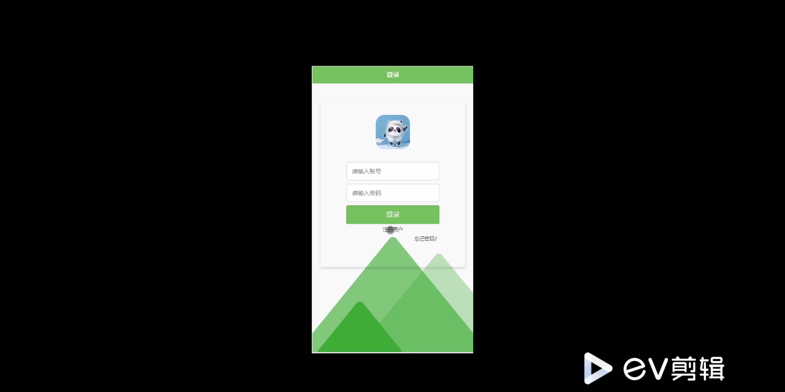
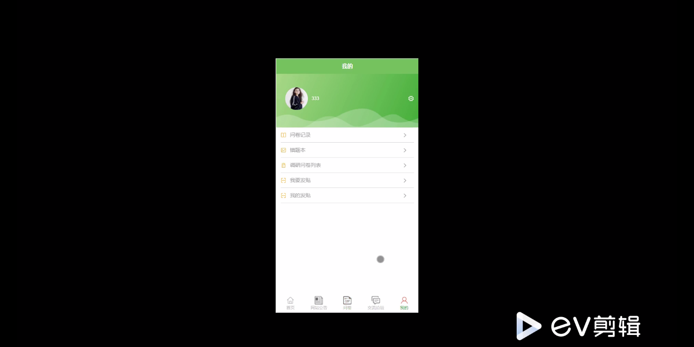
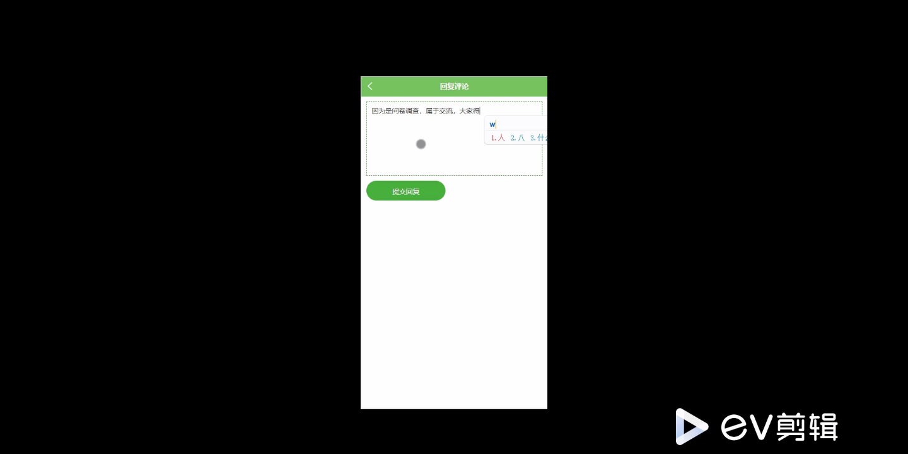
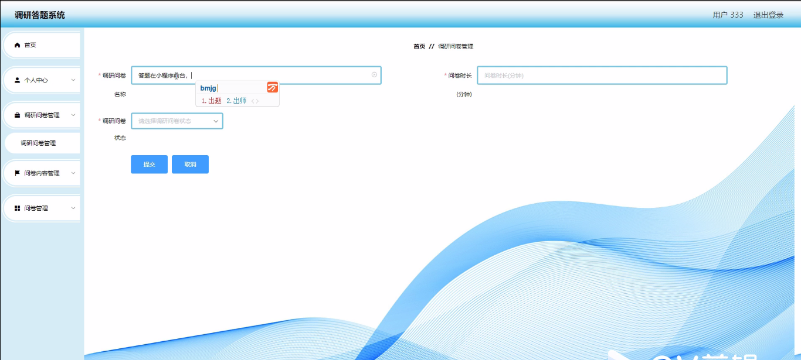
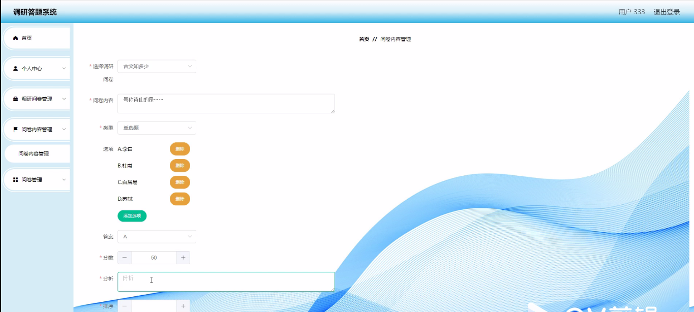
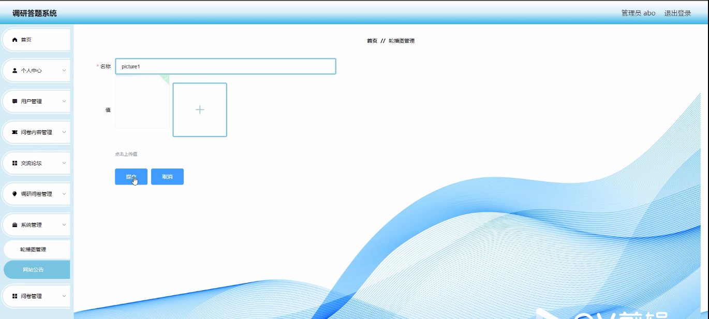
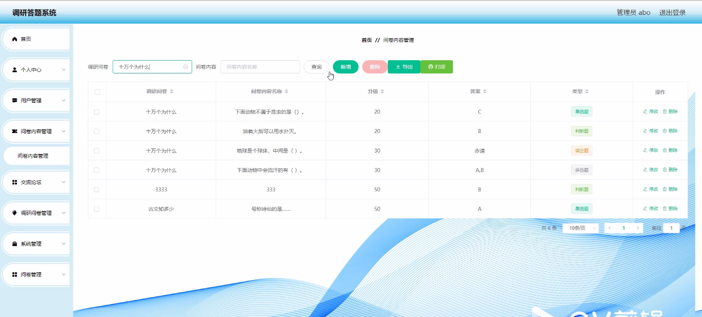

****本项目包含程序+源码+数据库+LW+调试部署环境，文末可获取一份本项目的java源码和数据库参考。****

## ******开题报告******

研究背景：
随着信息技术的迅猛发展，调研答题系统在教育、科研和社会调查等领域中得到了广泛应用。传统的调研方式往往需要大量的人力物力投入，且效率低下，而调研答题系统的出现为解决这一问题提供了新的途径。通过利用计算机技术和互联网平台，调研答题系统能够快速、准确地收集和分析大量的数据，为研究者提供更加便捷高效的调研手段。

研究意义：
调研答题系统的应用具有重要的实践意义。首先，它可以帮助研究者更好地了解被调查对象的态度、观点和需求，从而为相关政策的制定和决策提供科学依据。其次，调研答题系统可以提高调研的效率和精度，节省人力物力资源，降低成本。此外，调研答题系统还可以促进学术交流和知识共享，为学术界提供一个开放、便捷的平台。

研究目的：
本研究旨在设计和开发一种高效、灵活的调研答题系统，以满足不同领域和需求的调研要求。通过对现有调研答题系统的分析和总结，本研究将针对其存在的问题和不足进行改进和优化，提出一种更加完善的系统方案。同时，本研究还将探索调研答题系统在教育、科研和社会调查等领域中的应用前景，为相关领域的发展和创新提供支持。

研究内容： 本研究的主要内容包括系统功能的设计与实现，用户体验的优化，数据分析与结果呈现等方面。

  1. 系统功能的设计与实现：根据调研的具体需求，设计和开发相应的功能模块，包括问卷设计、题目类型设置、逻辑跳转、数据收集和存储等功能。

  2. 用户体验的优化：通过界面设计、操作流程优化等手段，提升用户使用调研答题系统的便捷性和舒适度，使用户能够轻松完成调研任务。

  3. 数据分析与结果呈现：对收集到的大量数据进行有效的分析和挖掘，提取有价值的信息和结论，并将结果以直观、清晰的方式展示给研究者，帮助其更好地理解和利用调研数据。

拟解决的主要问题：
本研究旨在解决传统调研方式效率低下、成本高昂等问题。通过设计和开发一种高效、灵活的调研答题系统，提供便捷的调研手段，优化用户体验，实现数据的快速收集和准确分析，从而提高调研的效率和精度。

研究方案和预期成果：
本研究将采用实证研究方法，通过文献综述、需求调研、系统设计与开发、用户测试等环节，逐步完善调研答题系统的功能和性能。预期成果包括设计与实现一套高效、灵活的调研答题系统，并验证其在教育、科研和社会调查等领域的应用效果。同时，本研究还将撰写相关学术论文，推广研究成果，促进调研答题系统的发展和创新。

进度安排：

2022年9月至10月：需求分析和规划，进行用户需求调研和分析，确定系统功能和目标。

2022年11月至2023年1月：系统设计和开发，完成系统架构设计和技术选型，并开始编写代码。

2023年2月至3月：测试和优化，进行单元测试和集成测试，修复问题并优化系统性能。

2023年4月至5月：文档编写和培训，编写用户手册和系统文档，并进行相关人员的培训。

2023年5月：上线部署和维护，将系统部署到生产环境中，并定期进行维护和升级。

参考文献：

[1]王振华.SpringBoot在教学效果评估系统中的应用[J].电子技术,2023,(05):67-69.

[2]王明泉.基于SpringBoot远程热部署的探索和应用[J].信息与电脑(理论版),2023,(07):1-4.

[3]王亚东,李晓霞,陈强强,剡美娜.基于SpringBoot的需求发布平台设计[J].信息与电脑(理论版),2023,(01):105-107.

[4]陈新府豪.基于SpringBoot和Vue框架的创新方法推理系统的设计与实现[D].导师：黄静.浙江理工大学,2022.

[5]霍福华,韩慧.基于SpringBoot微服务架构下前后端分离的MVVM模型[J].电子技术与软件工程,2022,(01):73-76.

[6]韩策,张娜,王松亭,张凯,何方,袁峰.SpringBoot OPC客户端设计与研究[J].电子世界,2021,(19):25-26.

****以上是本项目程序开发之前开题报告内容，最终成品以下面界面为准，大家可以酌情参考使用。要源码参考请在文末进行获取！！****

## ******本项目的界面展示******

