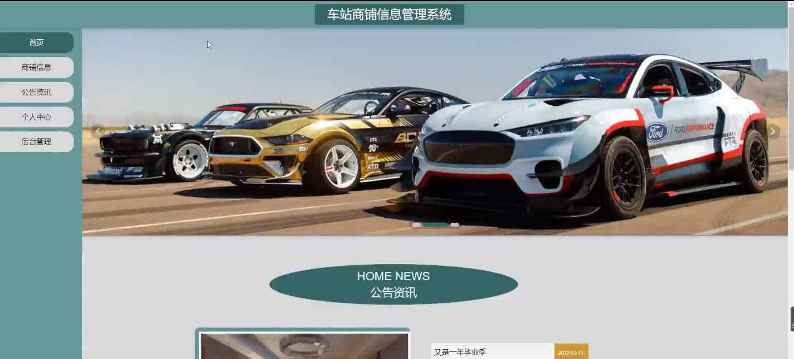
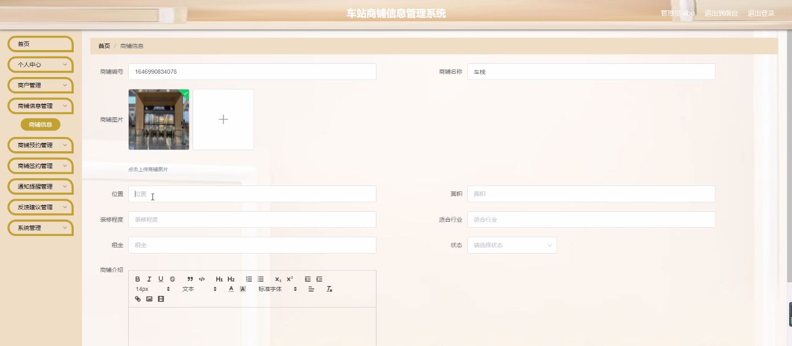
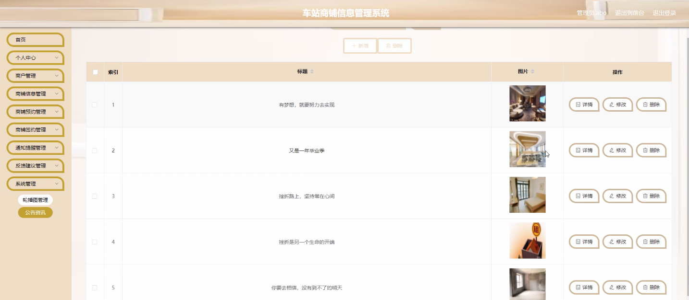
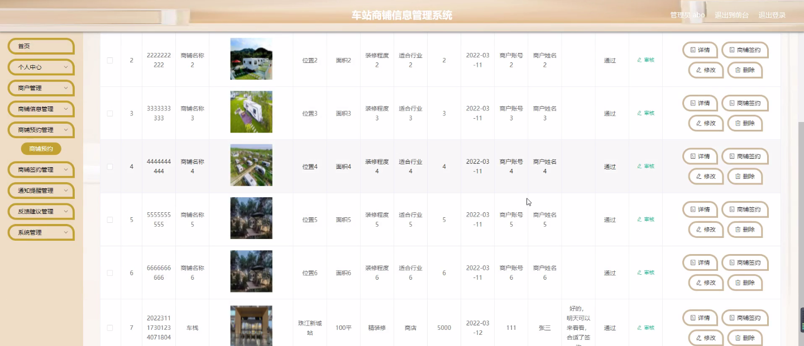
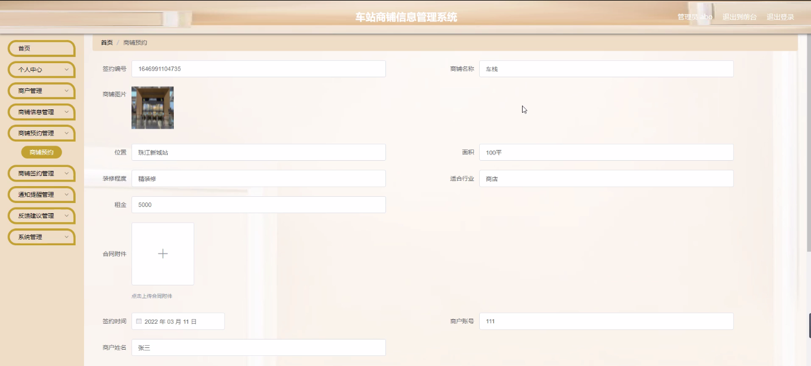
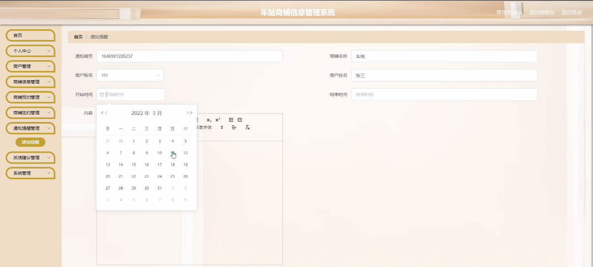

****本项目包含程序+源码+数据库+LW+调试部署环境，文末可获取一份本项目的java源码和数据库参考。****

## ******开题报告******

研究背景：
随着城市化进程的不断加快，车站商铺作为城市交通枢纽的重要组成部分，承担着为旅客提供便利服务的重要职责。然而，目前车站商铺信息管理仍然存在一些问题，如信息不及时、商户管理不规范等。因此，开发一个高效的车站商铺信息管理系统具有重要的现实意义。

研究意义：
车站商铺信息管理系统的建立和完善，可以提高商户管理的效率和准确性，优化商铺资源配置，提升旅客体验，促进车站商业发展。同时，该系统还能够为商户提供更多的商机和发展空间，推动车站商铺经济的繁荣。

研究目的：
本研究旨在设计和开发一套车站商铺信息管理系统，通过对商户、商铺信息、商铺预约、商铺签约、通知提醒和反馈建议等功能的综合应用，实现对车站商铺信息的全面管理和优化，提升商户管理的效率和服务质量，为旅客提供更好的购物和休息环境。

研究内容：
本研究的主要内容包括商户管理、商铺信息管理、商铺预约管理、商铺签约管理、通知提醒和反馈建议等系统功能。具体而言，商户管理模块将实现商户信息的录入、修改和删除，以及商户资质审核和评级等功能；商铺信息管理模块将实现商铺基本信息的维护和查询；商铺预约管理模块将实现旅客对商铺的预约和取消预约；商铺签约管理模块将实现商户与车站管理方的签约流程管理；通知提醒模块将实现对商户和旅客的重要通知和提醒；反馈建议模块将实现旅客对商铺服务的评价和建议反馈。

拟解决的主要问题： 通过开发车站商铺信息管理系统，我们将解决以下主要问题：

  1. 商户管理不规范：通过商户管理模块，实现商户信息的统一管理和资质审核，提高商户管理的规范性和准确性。
  2. 商铺信息不及时：通过商铺信息管理模块，实现商铺信息的及时更新和查询，确保旅客获取到最新的商铺信息。
  3. 商铺预约流程繁琐：通过商铺预约管理模块，简化商铺预约流程，提高预约的便捷性和效率。
  4. 商铺签约流程不透明：通过商铺签约管理模块，实现商户与车站管理方的签约流程的规范化和透明化。
  5. 通知提醒不及时：通过通知提醒模块，及时向商户和旅客发送重要通知和提醒，确保信息的及时传达。

研究方案和预期成果：
本研究将采用软件开发的方法，结合需求分析、系统设计和编码实现等技术手段，设计和开发车站商铺信息管理系统。预期成果包括一个功能完善、操作简便、稳定可靠的车站商铺信息管理系统，并通过实际应用验证其在商户管理、商铺信息管理、商铺预约管理、商铺签约管理、通知提醒和反馈建议等方面的效果和价值。

进度安排：

2022年9月至10月：需求分析和规划，进行用户需求调研和分析，确定系统功能和目标。

2022年11月至2023年1月：系统设计和开发，完成系统架构设计和技术选型，并开始编写代码。

2023年2月至3月：测试和优化，进行单元测试和集成测试，修复问题并优化系统性能。

2023年4月至5月：文档编写和培训，编写用户手册和系统文档，并进行相关人员的培训。

2023年5月：上线部署和维护，将系统部署到生产环境中，并定期进行维护和升级。

参考文献：

[1]王振华.SpringBoot在教学效果评估系统中的应用[J].电子技术,2023,(05):67-69.

[2]王明泉.基于SpringBoot远程热部署的探索和应用[J].信息与电脑(理论版),2023,(07):1-4.

[3]王亚东,李晓霞,陈强强,剡美娜.基于SpringBoot的需求发布平台设计[J].信息与电脑(理论版),2023,(01):105-107.

[4]陈新府豪.基于SpringBoot和Vue框架的创新方法推理系统的设计与实现[D].导师：黄静.浙江理工大学,2022.

[5]霍福华,韩慧.基于SpringBoot微服务架构下前后端分离的MVVM模型[J].电子技术与软件工程,2022,(01):73-76.

[6]韩策,张娜,王松亭,张凯,何方,袁峰.SpringBoot OPC客户端设计与研究[J].电子世界,2021,(19):25-26.

****以上是本项目程序开发之前开题报告内容，最终成品以下面界面为准，大家可以酌情参考使用。要源码参考请在文末进行获取！！****

## ******本项目的界面展示******

## 

