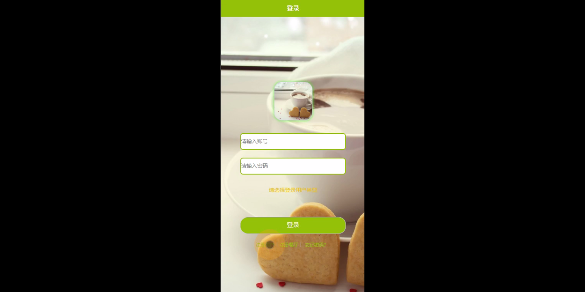
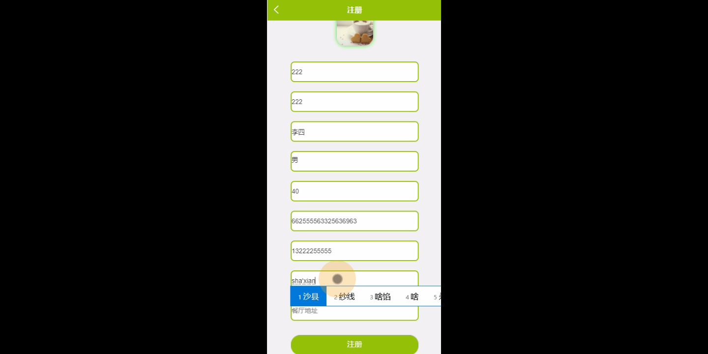
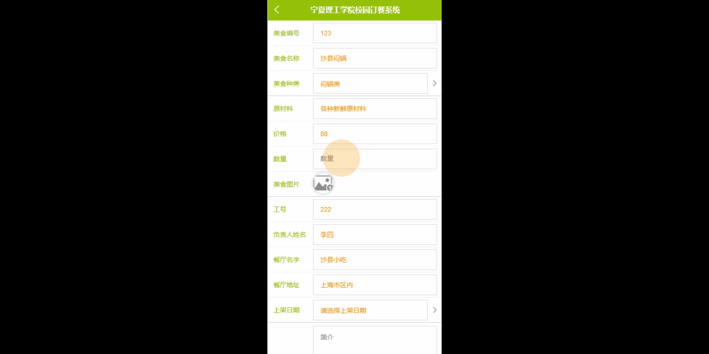
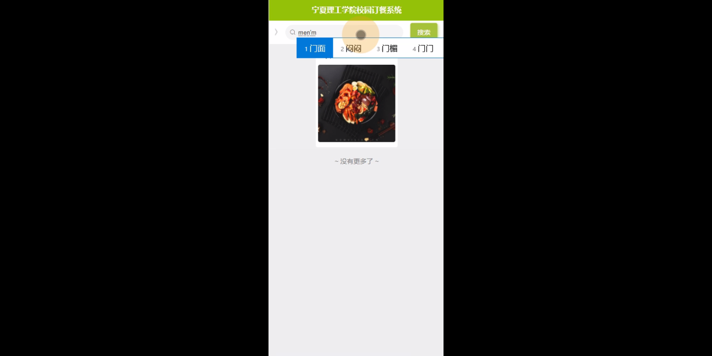
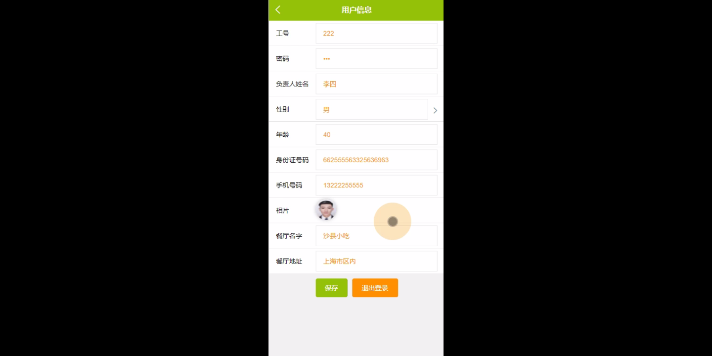
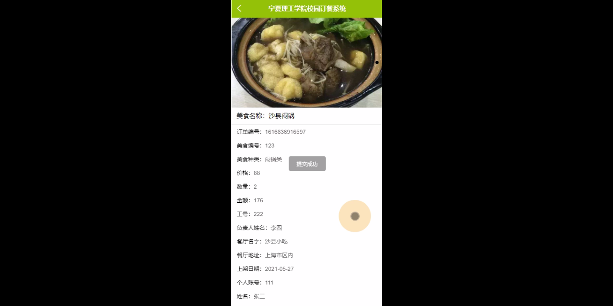

****本项目包含程序+源码+数据库+LW+调试部署环境，文末可获取一份本项目的java源码和数据库参考。****

## ******开题报告******

研究背景：
随着医疗技术的不断发展和医疗服务的日益完善，医院信息管理系统在现代医疗机构中扮演着至关重要的角色。传统的纸质档案管理方式已经无法满足医院日益增长的信息处理需求，因此，开发一个高效、安全、可靠的医院信息管理系统对于提升医疗服务质量、优化医疗资源配置具有重要意义。

研究意义：
医院信息管理系统的建立和应用可以实现医疗数据的电子化管理和共享，提高医院内部各个环节的工作效率，减少人力资源的浪费，提高医疗服务的质量和效果。同时，该系统还能够为医生、护士、患者等提供更加便捷的医疗服务，提升医患沟通和交流的效果，促进医疗资源的合理分配和利用，从而提高整体医疗水平和医疗资源的利用效率。

研究目的：
本研究旨在开发一套完善的医院信息管理系统，通过集成多个功能模块，实现医院内部各个环节的信息化管理和协同工作。具体目标包括但不限于：提高医疗服务的效率和质量、减少人力资源的浪费、优化医疗资源配置、提升医患沟通和交流效果等。

研究内容： 本研究的主要内容是基于题目中所列出的系统功能，设计和开发一个全面、高效的医院信息管理系统。具体包括以下模块：

  1. 用户管理：对医院内部用户进行管理和权限控制。
  2. 医生排班和护士排班：安排医生和护士的工作时间表，确保医疗服务的连续性。
  3. 用户挂号：提供在线挂号服务，方便患者预约就诊。
  4. 诊断信息管理：记录患者的诊断信息，方便医生查阅和分析。
  5. 床位信息管理：管理医院床位的使用情况，确保患者住院需求得到满足。
  6. 入院信息管理：记录患者入院相关信息，方便医院内部各个部门的协同工作。
  7. 药房信息管理：管理药房的库存和药品配送等信息。
  8. 药品信息管理：记录药品的基本信息和使用情况。
  9. 药品记账和检查记账：记录患者的药品费用和检查费用等信息。
  10. 用户取药和回收信息：方便患者领取药品并记录相关信息。
  11. 出院信息管理：记录患者出院相关信息，方便医院内部各个部门的协同工作。

拟解决的主要问题： 在开发医院信息管理系统的过程中，我们将重点解决以下问题：

  1. 如何实现医院内部各个环节的信息共享和协同工作？
  2. 如何确保医疗数据的安全性和隐私保护？
  3. 如何提高医院信息管理系统的稳定性和可靠性？
  4. 如何提供便捷、高效的医疗服务给患者？
  5. 如何优化医疗资源的配置和利用效率？

研究方案和预期成果：
本研究将采用软件工程的方法，结合医院信息管理系统的需求和特点，设计和开发一个完善的系统。通过系统测试和用户反馈，不断改进和优化系统功能和性能，最终实现以下预期成果：

  1. 开发出一套稳定、高效、安全的医院信息管理系统。
  2. 提高医疗服务的效率和质量，减少人力资源的浪费。
  3. 优化医疗资源的配置和利用效率，提高整体医疗水平。
  4. 提供便捷、高效的医疗服务给患者，提升医患沟通和交流效果。

进度安排：

2022年9月至10月：需求分析和规划，明确系统功能和目标，制定项目计划。

2022年11月至2023年1月：系统设计和编码，完成详细的系统设计并开始编写代码。

2023年2月至3月：用户界面开发和数据库开发，开发用户友好的界面和设计数据库结构。

2023年4月至5月：功能测试、文档编写和上线部署，对系统进行全面的功能测试并编写用户手册。

2023年5月：维护和升级，定期对系统进行维护和升级，修复bug和添加新功能。

参考文献：

[1]邱小群,邓丽艳,陈海潮.基于B/S的信息管理系统设计和实现[J].信息与电脑(理论版),2022,(20):146-148.

[2]谢霜.基于Java技术的网络管理体系结构的应用[J].网络安全技术与应用,2022,(10):14-15.

[3]宋锦华.高职院校Java程序设计课程改革研究[J].科技视界,2022,(20):133-135.

[4]曹嵩彭,王鹏宇.浅析Java语言在软件开发中的应用[J].信息记录材料,2022,(03):114-116.

[5]朱澈,余俊达.武汉东湖学院.基于Java的软硬件信息管理系统V1.0[Z].项目立项编号.鉴定单位.鉴定日期:

****以上是本项目程序开发之前开题报告内容，最终成品以下面界面为准，大家可以酌情参考使用。要源码参考请在文末进行获取！！****

## ******本项目的界面展示******

