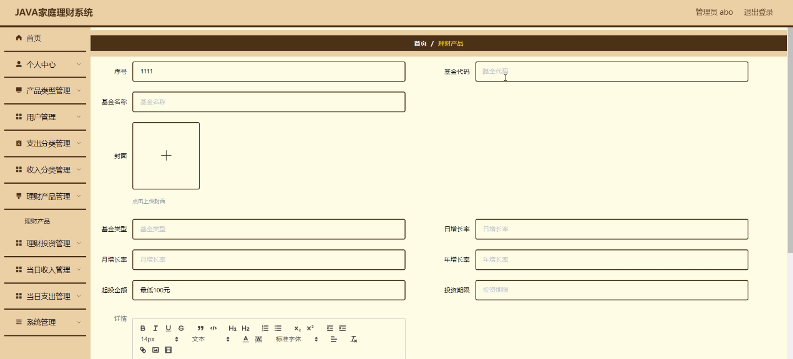
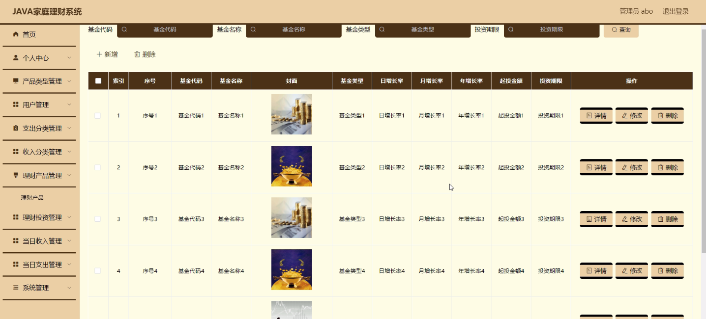
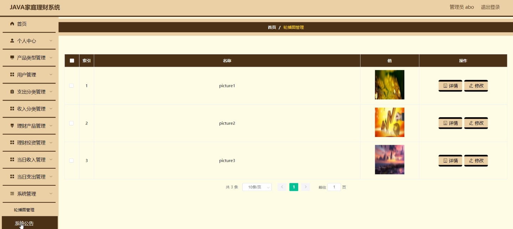
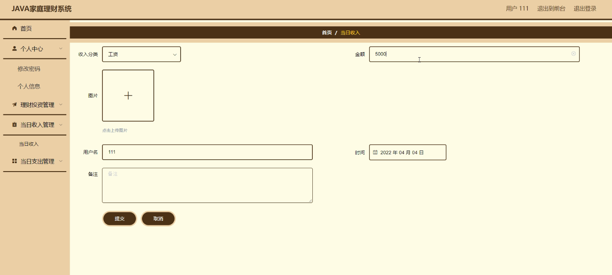

****本项目包含程序+源码+数据库+LW+调试部署环境，文末可获取一份本项目的java源码和数据库参考。****

## ******开题报告******

研究背景：
随着社会经济的发展和人们生活水平的提高，家庭理财管理变得越来越重要。然而，由于缺乏有效的工具和系统，许多家庭在理财方面遇到了困难。传统的手工记录方式已经无法满足现代家庭对理财管理的需求。因此，开发一种家庭理财系统是非常必要的。

研究意义：
家庭理财系统的开发将有助于提高家庭的理财能力和管理效率。通过该系统，家庭可以更好地掌握自己的收入和支出情况，合理规划和分配资金，实现财务目标。同时，该系统还可以提供个性化的理财建议和投资信息，帮助家庭做出明智的理财决策。这对于改善家庭财务状况、提升生活质量具有重要意义。

研究目的：
本研究旨在开发一种功能完善、易于操作的家庭理财系统，以帮助家庭实现有效的理财管理。通过该系统，家庭可以方便地记录和分析收入和支出情况，制定预算计划，进行理财投资，并获得相关的理财建议。同时，该系统还将提供数据可视化功能，帮助家庭更直观地了解自己的财务状况，以便做出更明智的决策。

研究内容：
本研究的主要内容包括以下系统功能：用户管理、支出分类、收入分类、产品类型、理财产品、理财投资、当日收入、当日支出等。其中，用户管理功能用于注册和管理用户账户，确保数据的安全性和隐私性；支出分类和收入分类功能用于对家庭的支出和收入进行分类和记录；产品类型和理财产品功能用于管理各类理财产品的信息和投资情况；理财投资功能用于进行理财投资操作；当日收入和当日支出功能用于实时记录当天的收入和支出情况。

拟解决的主要问题：
通过开发家庭理财系统，我们将解决以下主要问题：1.家庭理财管理的不便利性和低效性；2.缺乏个性化的理财建议和投资信息；3.缺乏对财务状况的直观了解；4.理财投资操作的复杂性和风险性。

研究方案和预期成果：
在研究方案方面，我们将采用敏捷开发方法，结合用户需求和反馈进行系统设计和功能迭代。同时，我们将引入数据分析和机器学习技术，提供个性化的理财建议和投资信息。

预期成果包括：1.一款功能完善、易于操作的家庭理财系统；2.提高家庭理财管理效率和能力；3.帮助家庭实现财务目标和改善生活质量；4.提供个性化的理财建议和投资信息；5.提供直观的财务数据可视化功能。通过这些成果，我们期望能够为广大家庭提供更好的理财管理工具，促进家庭财富的增长和稳定。

进度安排：

2022年9月至10月：需求分析和规划，进行用户需求调研和分析，确定系统功能和目标。

2022年11月至2023年1月：系统设计和开发，完成系统架构设计和技术选型，并开始编写代码。

2023年2月至3月：测试和优化，进行单元测试和集成测试，修复问题并优化系统性能。

2023年4月至5月：文档编写和培训，编写用户手册和系统文档，并进行相关人员的培训。

2023年5月：上线部署和维护，将系统部署到生产环境中，并定期进行维护和升级。

参考文献：

[1]王振华.SpringBoot在教学效果评估系统中的应用[J].电子技术,2023,(05):67-69.

[2]王明泉.基于SpringBoot远程热部署的探索和应用[J].信息与电脑(理论版),2023,(07):1-4.

[3]王亚东,李晓霞,陈强强,剡美娜.基于SpringBoot的需求发布平台设计[J].信息与电脑(理论版),2023,(01):105-107.

[4]陈新府豪.基于SpringBoot和Vue框架的创新方法推理系统的设计与实现[D].导师：黄静.浙江理工大学,2022.

[5]霍福华,韩慧.基于SpringBoot微服务架构下前后端分离的MVVM模型[J].电子技术与软件工程,2022,(01):73-76.

[6]韩策,张娜,王松亭,张凯,何方,袁峰.SpringBoot OPC客户端设计与研究[J].电子世界,2021,(19):25-26.

****以上是本项目程序开发之前开题报告内容，最终成品以下面界面为准，大家可以酌情参考使用。要源码参考请在文末进行获取！！****

## ******本项目的界面展示******

