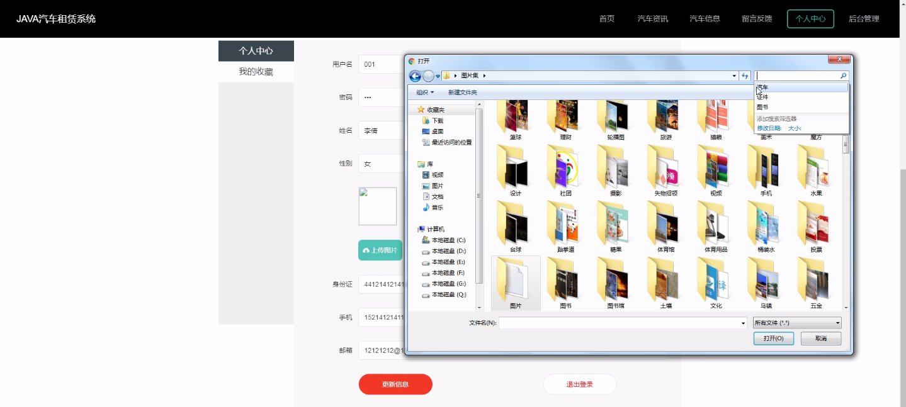
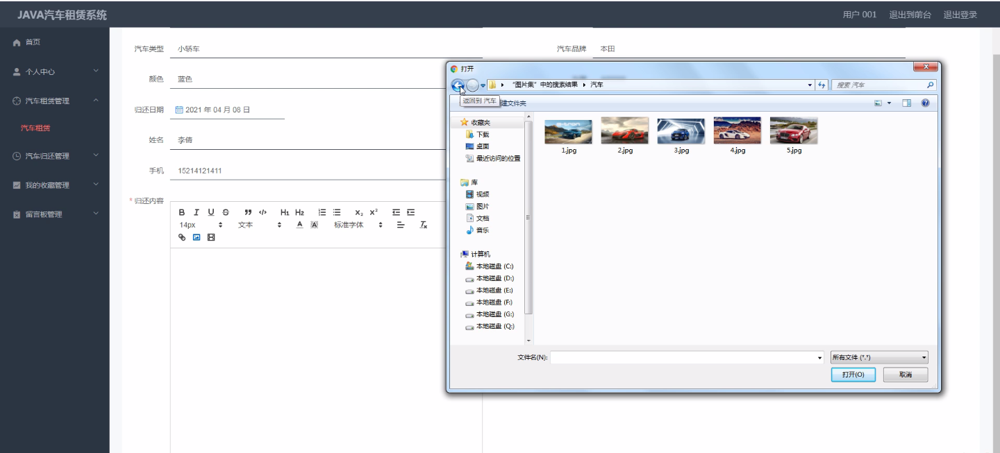

****本项目包含程序+源码+数据库+LW+调试部署环境，文末可获取一份本项目的java源码和数据库参考。****

## ******开题报告******

研究背景：
随着经济的发展和人们生活水平的提高，汽车已经成为现代社会中不可或缺的交通工具。然而，拥有一辆私家车并不是每个人都能负担得起的，尤其是在大城市中，停车位紧张、交通拥堵等问题也使得私家车的使用变得不太便利。因此，汽车租赁服务系统的出现填补了这一空白，为人们提供了一种方便灵活的交通解决方案。

研究意义：
汽车租赁服务系统的建立对于满足人们的出行需求、优化城市交通资源配置、减少环境污染等方面具有重要意义。通过该系统，用户可以根据自身需求选择合适的汽车进行租赁，无需购买整车，节省了资金投入，并且可以根据实际需要选择不同类型的汽车，提高了出行的灵活性和便利性。同时，该系统还可以促进汽车共享经济的发展，减少闲置车辆资源的浪费，提高资源利用率。

研究目的：
本研究旨在探索和分析汽车租赁服务系统的运作机制和关键技术，提出相应的解决方案，以期能够优化系统的功能和性能，提升用户体验，并为相关企业和政府部门提供参考和决策依据。通过研究，我们希望能够深入了解汽车租赁服务系统在满足用户需求、提高交通效率、减少环境污染等方面的作用，为推动城市交通可持续发展做出贡献。

研究内容： 本研究的主要内容包括以下几个方面：

  1. 用户需求分析：通过调查问卷、访谈等方式，收集和分析用户对汽车租赁服务系统的需求和期望，了解用户对于汽车品牌、资讯、信息、租赁和归还等功能的重视程度和使用习惯。

  2. 系统功能设计：根据用户需求分析的结果，设计和优化汽车租赁服务系统的各项功能，包括用户注册登录、汽车品牌展示、汽车资讯发布、汽车信息查询、租赁预订、租赁归还等模块，确保系统的易用性和稳定性。

  3. 技术实现方案：基于现有的信息技术和互联网技术，结合系统功能设计的要求，提出相应的技术实现方案，包括前端界面设计、后台数据库搭建、数据安全保护等方面的技术支持。

  4. 系统测试与评估：通过模拟用户使用场景和真实用户的反馈，对汽车租赁服务系统进行测试和评估，发现并解决系统存在的问题，提高系统的性能和用户满意度。

进度安排：

2022年9月至10月：需求分析和规划，明确系统功能和目标，制定项目计划。

2022年11月至2023年1月：系统设计和编码，完成详细的系统设计并开始编写代码。

2023年2月至3月：用户界面开发和数据库开发，开发用户友好的界面和设计数据库结构。

2023年4月至5月：功能测试、文档编写和上线部署，对系统进行全面的功能测试并编写用户手册。

2023年5月：维护和升级，定期对系统进行维护和升级，修复bug和添加新功能。

参考文献：

[1]邱小群,邓丽艳,陈海潮.基于B/S的信息管理系统设计和实现[J].信息与电脑(理论版),2022,(20):146-148.

[2]谢霜.基于Java技术的网络管理体系结构的应用[J].网络安全技术与应用,2022,(10):14-15.

[3]宋锦华.高职院校Java程序设计课程改革研究[J].科技视界,2022,(20):133-135.

[4]曹嵩彭,王鹏宇.浅析Java语言在软件开发中的应用[J].信息记录材料,2022,(03):114-116.

[5]朱澈,余俊达.武汉东湖学院.基于Java的软硬件信息管理系统V1.0[Z].项目立项编号.鉴定单位.鉴定日期:

****以上是本项目程序开发之前开题报告内容，最终成品以下面界面为准，大家可以酌情参考使用。要源码参考请在文末进行获取！！****

## ******本项目的界面展示******

