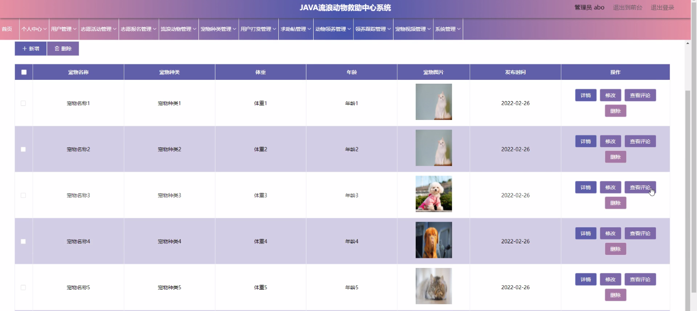

****本项目包含程序+源码+数据库+LW+调试部署环境，文末可获取一份本项目的java源码和数据库参考。****

## ******开题报告******

研究背景：
在现代社会中，流浪动物问题已经成为一个严重的社会问题。大量的流浪动物无家可归，生活在街头巷尾，面临着饥饿、疾病和虐待的威胁。这不仅对动物本身造成了伤害，也给社会带来了许多负面影响。因此，建立一个流浪动物救助中心系统具有重要的意义。

研究意义：
流浪动物救助中心系统的建立可以提供一个集中管理和协调流浪动物救助工作的平台。通过该系统，可以更好地组织志愿者活动、记录流浪动物信息、促进领养和跟踪等。这将有助于提高流浪动物的生存率和生活质量，减少流浪动物对社会的负面影响，构建和谐的人与动物共处环境。

研究目的： 本研究旨在设计和开发一套完善的流浪动物救助中心系统，以实现以下目标：

  1. 提供一个方便快捷的平台，使用户能够轻松参与到流浪动物救助工作中，包括志愿活动、志愿报名等。
  2. 管理和记录流浪动物的基本信息，包括宠物种类、领养情况、领养跟踪等，以便更好地进行管理和统计。
  3. 提供用户打赏功能，鼓励用户对救助中心和志愿者的支持和认可。
  4. 建立一个求助帖平台，让用户能够发布寻找丢失宠物或寻求救助的信息，提高流浪动物的找回率。
  5. 通过宠物视频等方式，提高公众对流浪动物救助工作的关注度和参与度。

研究内容： 根据系统功能的需求，本研究将主要涉及以下内容：

  1. 用户管理：设计用户注册、登录、个人信息管理等功能，确保用户能够方便地使用系统。
  2. 志愿活动管理：建立志愿活动发布、报名、签到等功能，方便志愿者参与流浪动物救助工作。
  3. 流浪动物管理：记录流浪动物的基本信息，包括品种、年龄、性别等，以便进行分类和管理。
  4. 宠物种类管理：建立宠物种类数据库，方便用户选择和了解不同种类的宠物。
  5. 用户打赏管理：设计用户打赏功能，以鼓励和奖励志愿者的辛勤工作。
  6. 求助帖管理：提供一个求助帖发布平台，让用户能够寻找丢失宠物或寻求救助的信息。
  7. 动物领养和领养跟踪：建立动物领养流程和领养后的跟踪管理，确保流浪动物能够找到温暖的家庭。
  8. 宠物视频管理：提供宠物视频分享功能，增加公众对流浪动物救助工作的了解和关注。

拟解决的主要问题：

  1. 如何设计一个用户友好、操作简便的流浪动物救助中心系统？
  2. 如何有效管理和记录大量流浪动物的基本信息，方便分类和统计？
  3. 如何鼓励和奖励志愿者参与流浪动物救助工作？
  4. 如何提高流浪动物的找回率和领养率？
  5. 如何通过宠物视频等方式，提高公众对流浪动物救助工作的关注度和参与度？

研究方案和预期成果将在后续的研究中进行详细探讨和分析。

进度安排：

2022年9月至10月：需求分析和规划，明确系统功能和目标，制定项目计划。

2022年11月至2023年1月：系统设计和编码，完成详细的系统设计并开始编写代码。

2023年2月至3月：用户界面开发和数据库开发，开发用户友好的界面和设计数据库结构。

2023年4月至5月：功能测试、文档编写和上线部署，对系统进行全面的功能测试并编写用户手册。

2023年5月：维护和升级，定期对系统进行维护和升级，修复bug和添加新功能。

参考文献：

[1]邱小群,邓丽艳,陈海潮.基于B/S的信息管理系统设计和实现[J].信息与电脑(理论版),2022,(20):146-148.

[2]谢霜.基于Java技术的网络管理体系结构的应用[J].网络安全技术与应用,2022,(10):14-15.

[3]宋锦华.高职院校Java程序设计课程改革研究[J].科技视界,2022,(20):133-135.

[4]曹嵩彭,王鹏宇.浅析Java语言在软件开发中的应用[J].信息记录材料,2022,(03):114-116.

[5]朱澈,余俊达.武汉东湖学院.基于Java的软硬件信息管理系统V1.0[Z].项目立项编号.鉴定单位.鉴定日期:

****以上是本项目程序开发之前开题报告内容，最终成品以下面界面为准，大家可以酌情参考使用。要源码参考请在文末进行获取！！****

## ******本项目的界面展示******

