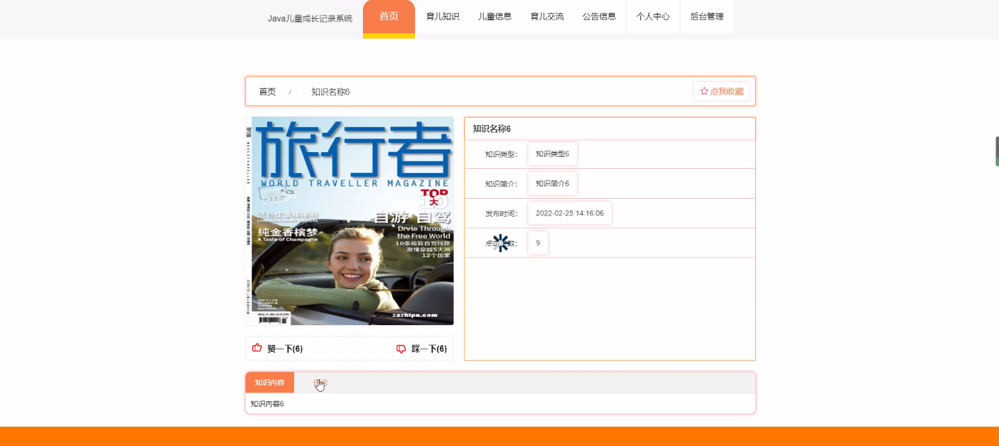
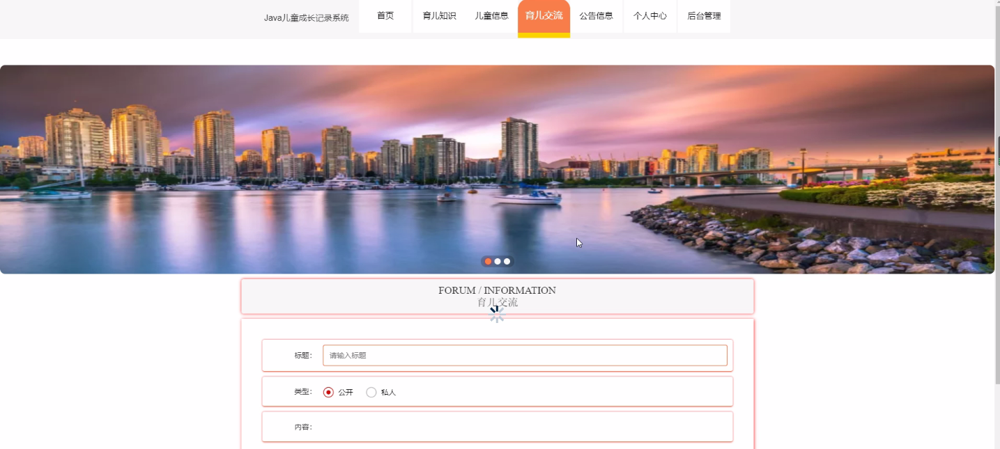
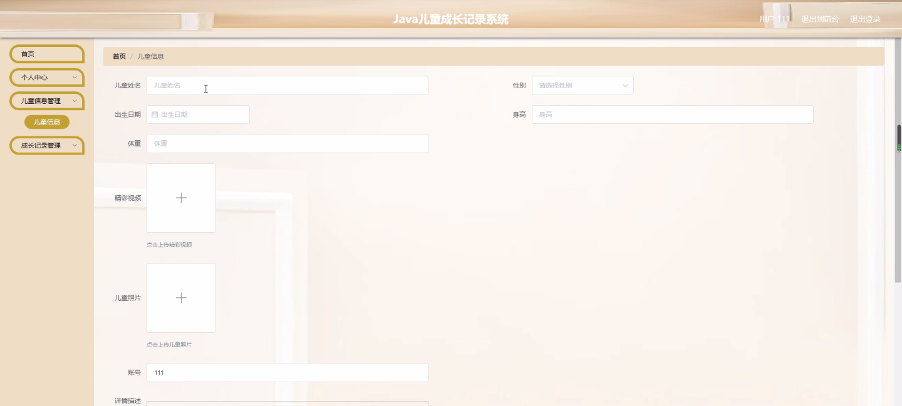
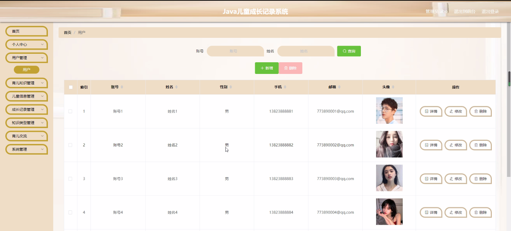
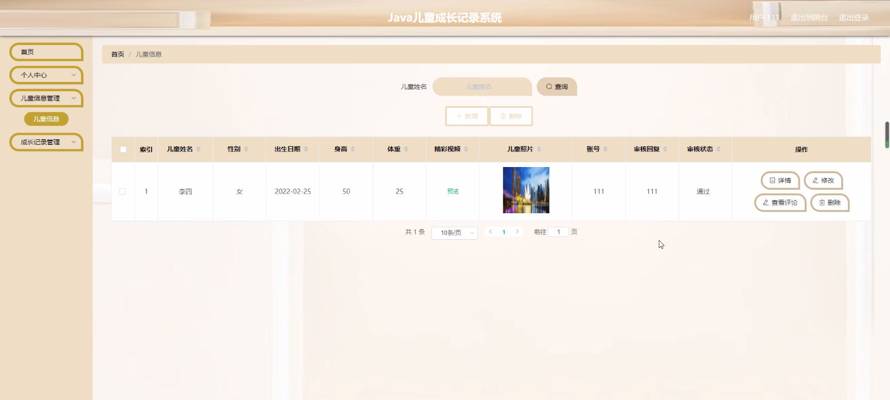

****本项目包含程序+源码+数据库+LW+调试部署环境，文末可获取一份本项目的java源码和数据库参考。****

## ******开题报告******

研究背景：
随着社会的发展和科技的进步，人们对于儿童成长的关注度不断提高。儿童的成长过程中充满了各种挑战和变化，家长和教育者需要及时了解儿童的发展情况，以便能够提供适当的支持和指导。然而，传统的纸质记录方式存在信息不全、易丢失等问题，无法满足现代家庭对于儿童成长记录的需求。

研究意义：
建立一个儿童成长记录系统具有重要的实际意义。首先，通过系统化的记录，可以帮助家长和教育者更好地了解儿童的成长轨迹，掌握其发展特点和个性特征，从而更加精准地进行教育和培养。其次，儿童成长记录系统还可以为医生和专业人士提供宝贵的参考资料，辅助他们进行儿童健康评估和干预。此外，通过系统化的数据分析和挖掘，可以为儿童成长研究提供大量的实证数据，推动儿童心理学和教育学等领域的发展。

研究目的：
本研究旨在设计和开发一种儿童成长记录系统，通过利用现代信息技术手段，实现对儿童成长过程的全面、准确、方便的记录和管理。该系统将提供多种功能模块，包括用户管理、育儿知识分享、儿童信息录入、成长记录生成以及知识分类等，以满足家长、教育者和专业人士的不同需求。

研究内容： 本研究的主要内容包括以下几个方面：

  1. 用户管理：设计并实现一个完善的用户管理系统，包括注册、登录、权限管理等功能，确保用户信息的安全和隐私。

  2. 育儿知识分享：建立一个平台，让用户可以浏览和分享育儿知识，包括儿童健康、心理发展、教育方法等方面的内容，提供给用户参考和借鉴。

  3. 儿童信息录入：设计一个简洁易用的界面，供用户录入儿童的基本信息，包括年龄、身高体重、生活习惯等，以及其他相关的评估指标。

  4. 成长记录生成：根据用户录入的信息和系统内置的算法，自动生成儿童成长记录报告，包括身体发育、认知能力、情绪表达等方面的评估结果。

  5. 知识分类：将儿童成长相关的知识进行分类整理，提供给用户便捷的检索和学习功能，帮助他们更好地了解儿童成长的各个方面。

拟解决的主要问题： 通过研究和开发儿童成长记录系统，我们希望解决以下主要问题：

  1. 传统纸质记录方式存在信息不全、易丢失等问题，无法满足现代家庭对于儿童成长记录的需求。

  2. 家长和教育者在儿童成长过程中缺乏准确和全面的数据支持，难以进行科学的教育和培养。

  3. 医生和专业人士在儿童健康评估和干预中缺乏有效的参考资料，影响其工作的准确性和效果。

  4. 目前市场上缺乏一款功能完善、操作简便的儿童成长记录系统，无法满足用户的多样化需求。

研究方案和预期成果： 本研究将采用软件工程的方法，结合用户需求分析和系统设计原则，开发一款儿童成长记录系统。预期的成果包括：

  1. 设计并实现一个功能完善、操作简便的儿童成长记录系统，满足家长、教育者和专业人士的不同需求。

  2. 提供全面、准确的儿童成长记录和评估报告，帮助家长和教育者更好地了解儿童的发展情况。

  3. 提供丰富的育儿知识分享平台，让用户可以获取和分享有关儿童成长的知识和经验。

  4. 推动儿童心理学和教育学等领域的发展，为相关研究提供实证数据和参考资料。

  5. 促进家庭教育和儿童健康管理的科学化和智能化，提升社会对于儿童成长的关注度和重视程度。

进度安排：

2022年9月至10月：需求分析和规划，明确系统功能和目标，制定项目计划。

2022年11月至2023年1月：系统设计和编码，完成详细的系统设计并开始编写代码。

2023年2月至3月：用户界面开发和数据库开发，开发用户友好的界面和设计数据库结构。

2023年4月至5月：功能测试、文档编写和上线部署，对系统进行全面的功能测试并编写用户手册。

2023年5月：维护和升级，定期对系统进行维护和升级，修复bug和添加新功能。

参考文献：

[1]邱小群,邓丽艳,陈海潮.基于B/S的信息管理系统设计和实现[J].信息与电脑(理论版),2022,(20):146-148.

[2]谢霜.基于Java技术的网络管理体系结构的应用[J].网络安全技术与应用,2022,(10):14-15.

[3]宋锦华.高职院校Java程序设计课程改革研究[J].科技视界,2022,(20):133-135.

[4]曹嵩彭,王鹏宇.浅析Java语言在软件开发中的应用[J].信息记录材料,2022,(03):114-116.

[5]朱澈,余俊达.武汉东湖学院.基于Java的软硬件信息管理系统V1.0[Z].项目立项编号.鉴定单位.鉴定日期:

****以上是本项目程序开发之前开题报告内容，最终成品以下面界面为准，大家可以酌情参考使用。要源码参考请在文末进行获取！！****

## ******本项目的界面展示******

