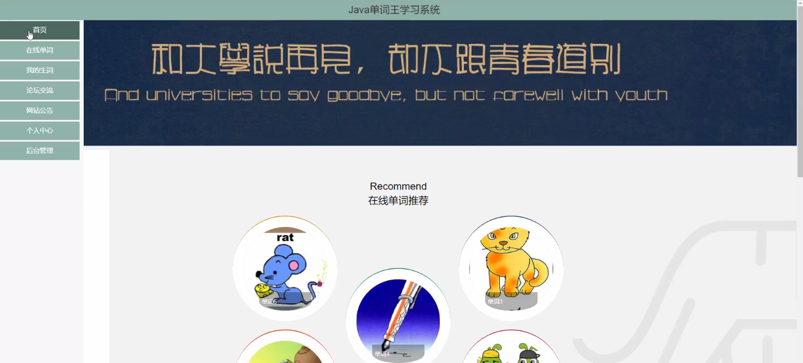
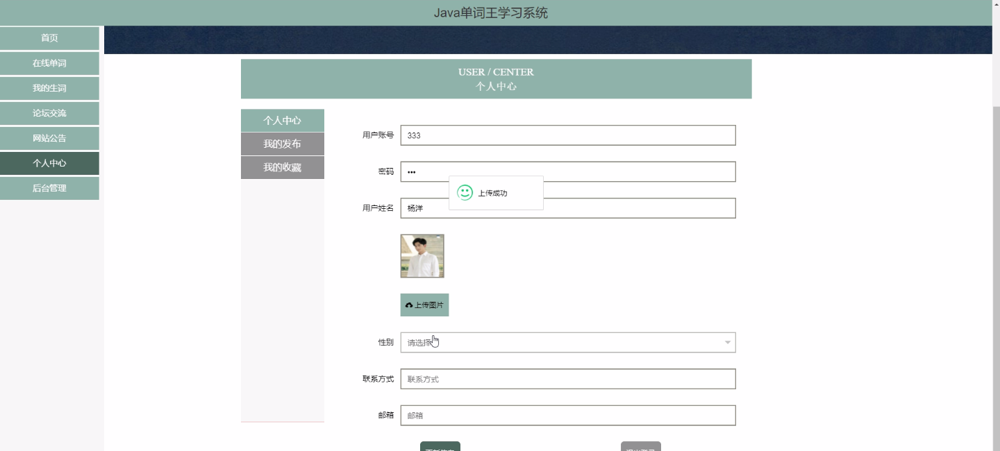
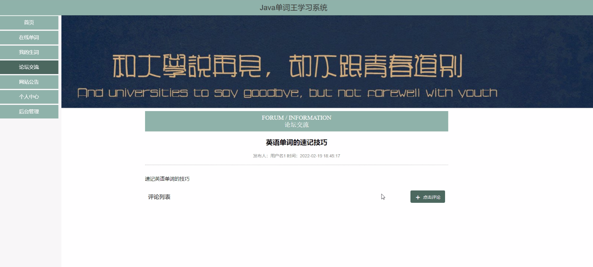
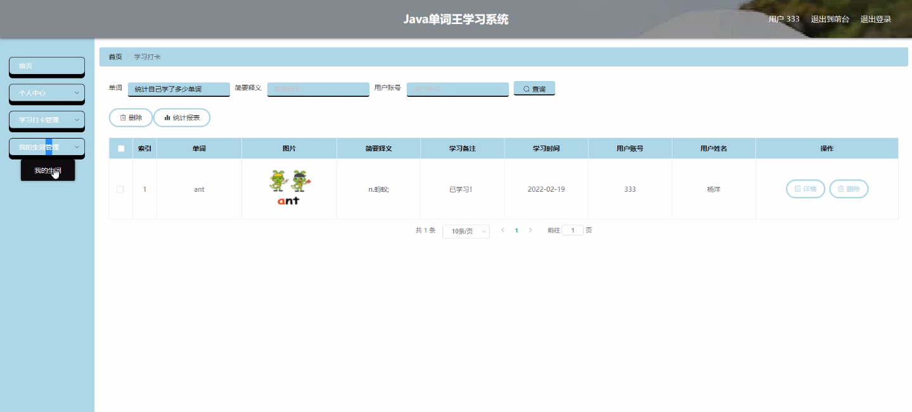
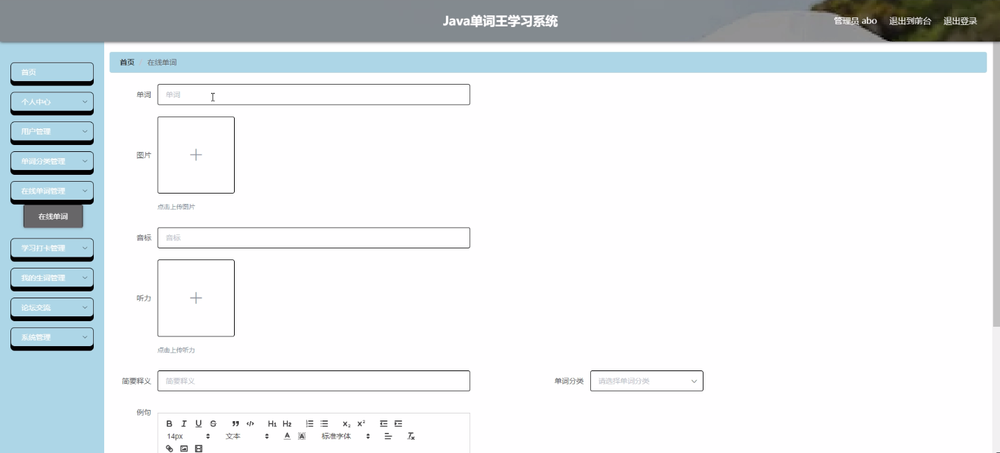
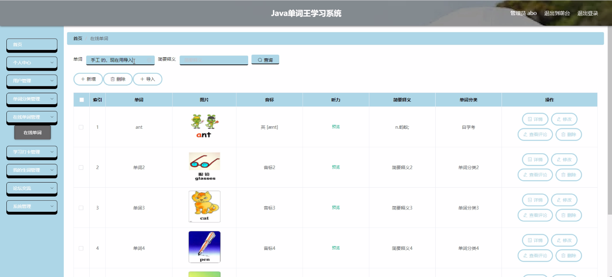
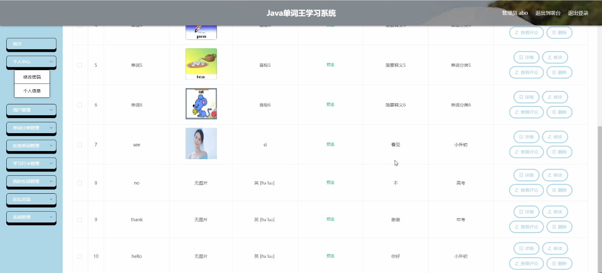
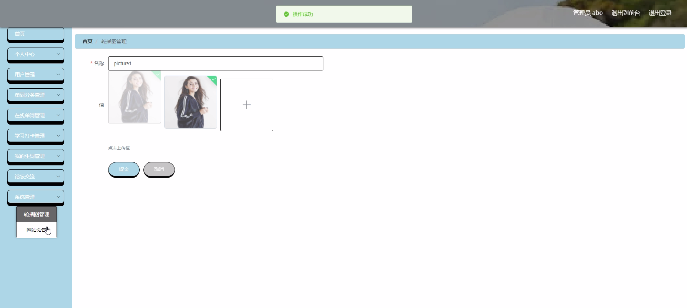

****本项目包含程序+源码+数据库+LW+调试部署环境，文末可获取一份本项目的java源码和数据库参考。****

## ******开题报告******

研究背景：
在当今全球化的社会中，英语已经成为一种国际通用语言。掌握良好的英语能力对于个人的学习、工作和生活都具有重要意义。然而，许多学习者在学习英语的过程中面临着各种挑战，如词汇量不足、记忆困难、学习方法不当等。因此，开发一种高效、智能的单词学习系统变得尤为重要。

研究意义：
单词王学习系统的开发将有助于提高学习者的英语单词学习效率和质量。通过该系统，学习者可以更加便捷地进行单词分类、在线查找单词、进行学习打卡以及管理个人的生词本。这将帮助学习者建立起系统化的单词学习计划，并提供个性化的学习推荐，从而使学习者更加科学、高效地进行英语单词学习。

研究目的：
本研究旨在设计和开发一种功能完善、易用性强的单词王学习系统，以满足广大英语学习者的需求。通过该系统，学习者可以获得个性化的学习支持和指导，提高单词记忆效果，增强学习动力，并培养良好的学习习惯。同时，该系统还将为教师提供有效的教学工具，帮助他们更好地组织和管理学生的单词学习。

研究内容： 单词王学习系统将包括以下功能：

  1. 用户管理：学习者可以注册账号并登录系统，通过个人中心管理学习进度、查看学习记录等。

  2. 单词分类：系统将提供多种分类方式，如按词汇等级、主题、词性等对单词进行分类，方便学习者有针对性地进行学习。

  3. 在线单词：学习者可以通过系统在线查找单词的释义、例句、发音等信息，满足他们对单词的详细了解需求。

  4. 学习打卡：学习者可以在系统中设定学习目标，并进行学习打卡记录，以监督自己的学习进度。

  5. 我的生词：学习者可以将不熟悉或需要重点记忆的单词添加到个人的生词本中，方便随时复习和巩固。

拟解决的主要问题： 通过单词王学习系统的开发，我们将解决以下问题：

  1. 学习者在单词学习过程中遇到的记忆困难和效率低下的问题。

  2. 学习者对于单词分类和在线查找功能的需求。

  3. 学习者在学习过程中缺乏有效的学习计划和学习动力的问题。

研究方案和预期成果： 本研究将采用用户需求调研、系统设计与开发、功能测试等方法进行。预期成果包括：

  1. 设计并开发出一款功能完善、易用性强的单词王学习系统。

  2. 提供个性化的学习支持和指导，帮助学习者提高单词记忆效果和学习动力。

  3. 为教师提供有效的教学工具，帮助他们更好地组织和管理学生的单词学习。

  4. 提高学习者的英语单词学习效率和质量，促进他们的英语学习进步。

进度安排：

2022年9月至10月：开题报告编写和提交，完成开题报告的撰写并提交给指导教师进行审核。

2022年11月至2023年1月：系统设计和开发，根据开题报告的要求，进行系统设计和编码工作。

2023年2月至3月：论文撰写和初稿完成，开始撰写论文，并在这个阶段完成论文的初稿。

2023年4月至5月：论文修改和最终定稿，根据指导教师的意见对论文进行修改，并完成最终的定稿。

2023年5月：论文答辩和提交，参加论文答辩并根据答辩结果进行修改，最后将论文提交给学院或学校。

参考文献：

[1]喻佳,吴丹新.基于SpringBoot的Web快速开发框架[J].电脑编程技巧与维护,2021,(09):31-33.

[2]李鹏.基于SpringBoot快速开发平台的实现[J].电子技术与软件工程,2021,(12):36-37.

[3]叶开平,蔡维晟,陈家敏,邓斯妮.基于SpringBoot的综测可视化管理系统的研究与设计[J].电脑知识与技术,2021,(12):100-104.

[4]江健锋,徐振平.Springboot最小系统的设计与实现[J].电脑知识与技术,2021,(04):62-63.

[5]赵炯,司圣杰,周奇才,熊肖磊.通用信息获取系统设计与实现[J].起重运输机械,2020,(16):89-97.

[6]吴英宾.一种内外网数据交互系统的设计与实现[J].软件工程,2020,(08):25-27.

****以上是本项目程序开发之前开题报告内容，最终成品以下面界面为准，大家可以酌情参考使用。要源码参考请在文末进行获取！！****

## ******本项目的界面展示******

