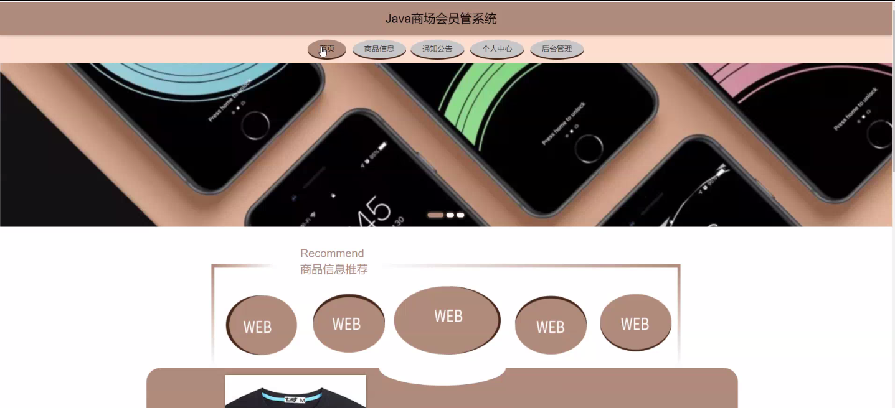
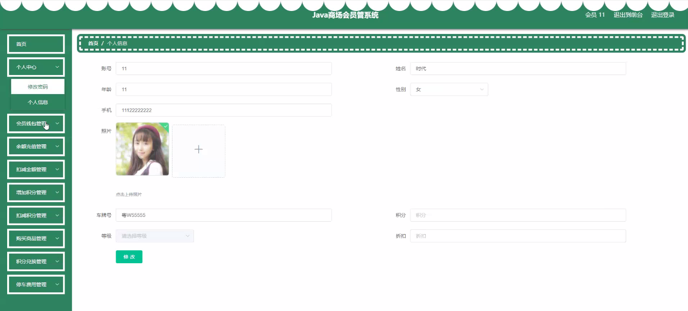
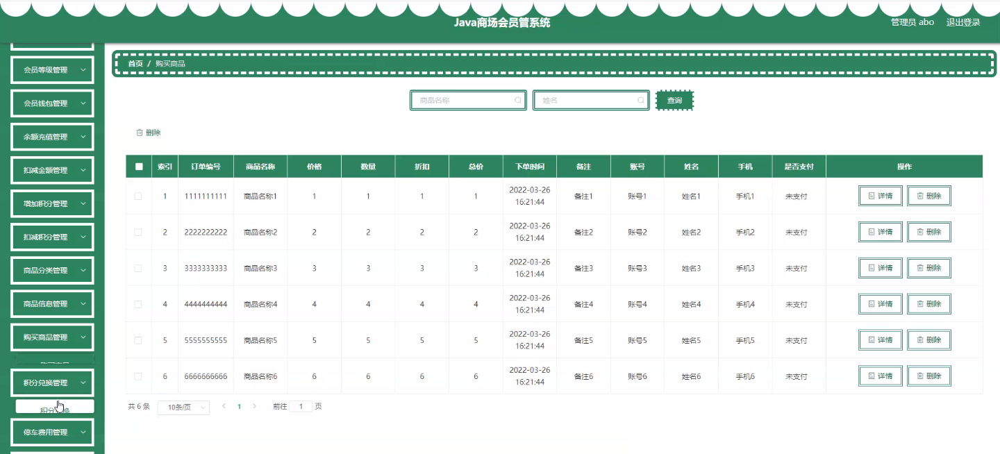
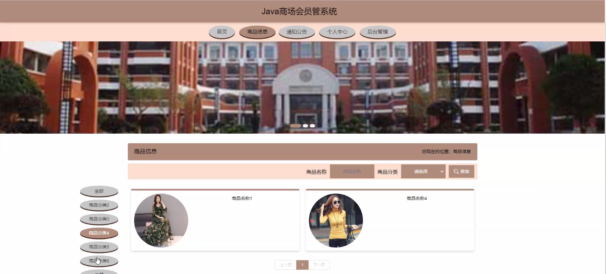
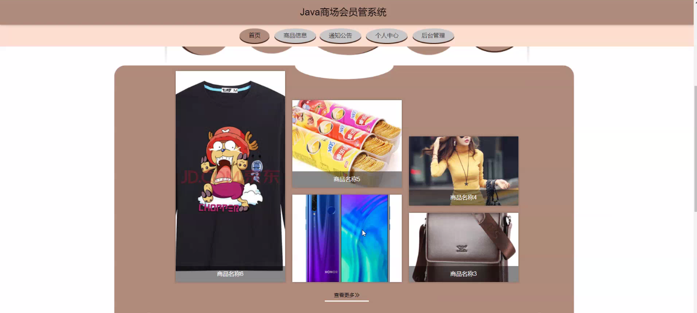

****本项目包含程序+源码+数据库+LW+调试部署环境，文末可获取一份本项目的java源码和数据库参考。****

## ******开题报告******

研究背景：
随着社会经济的发展和消费水平的提高，商场作为人们购物的重要场所之一，吸引了越来越多的消费者。为了更好地满足消费者的需求，商场普遍引入了会员管理系统，以提供更加个性化、便捷的服务。然而，目前存在的一些问题，如会员等级划分不合理、积分兑换流程繁琐等，影响了会员体验和商场的运营效率。因此，对商场会员管理系统进行深入研究具有重要意义。

研究意义：
商场会员管理系统的优化改进，可以提升商场的竞争力和用户满意度。通过合理的会员等级划分和优惠政策设计，可以激励消费者增加购买频次和金额，促进商场销售额的增长。同时，通过简化积分兑换流程和提供更加便捷的服务，可以提高会员的忠诚度和粘性，增强商场品牌形象。因此，研究商场会员管理系统的优化改进，对于商场的可持续发展和市场竞争具有重要意义。

研究目的：
本研究旨在通过对商场会员管理系统的研究和优化，提升商场的运营效率和用户体验。具体目标包括：优化会员等级划分，使之更加合理和科学；简化积分兑换流程，提高兑换效率；设计便捷的会员服务功能，提升用户满意度；提供个性化的推荐和优惠策略，增加消费者购买欲望；改进会员钱包功能，提供更加灵活的支付方式。

研究内容：
本研究的主要内容包括以下系统功能的研究和优化：会员等级、会员、会员钱包、余额充值、扣减金额、增加积分、扣减积分、商品分类、商品信息、购买商品、积分兑换、停车费用等。通过对这些功能的深入研究和分析，我们将提出相应的优化方案，以解决现有商场会员管理系统存在的问题，并提升系统的整体性能和用户体验。

拟解决的主要问题：

  1. 会员等级划分不合理，无法准确反映会员的价值和忠诚度。
  2. 积分兑换流程繁琐，影响了用户的兑换体验和积分使用效率。
  3. 会员钱包功能不够灵活，无法满足不同消费场景下的支付需求。
  4. 商品分类和信息展示不清晰，影响了用户的购物体验和商品选择。
  5. 停车费用管理不便捷，导致停车服务质量下降。

研究方案和预期成果：
本研究将采用综合性的研究方法，包括文献调研、实地调研、数据分析等。通过对商场会员管理系统进行深入研究和分析，结合用户需求和市场趋势，提出相应的优化方案。预期成果包括：合理的会员等级划分方案、简化的积分兑换流程、灵活的会员钱包功能设计、优化的商品分类和信息展示方式、便捷的停车费用管理方案等。这些成果将为商场提供参考，以提升会员管理系统的效能和用户体验，进而促进商场的可持续发展。

进度安排：

2022年9月至10月：需求分析和规划，进行用户需求调研和分析，确定系统功能和目标。

2022年11月至2023年1月：系统设计和开发，完成系统架构设计和技术选型，并开始编写代码。

2023年2月至3月：测试和优化，进行单元测试和集成测试，修复问题并优化系统性能。

2023年4月至5月：文档编写和培训，编写用户手册和系统文档，并进行相关人员的培训。

2023年5月：上线部署和维护，将系统部署到生产环境中，并定期进行维护和升级。

参考文献：

[1]王振华.SpringBoot在教学效果评估系统中的应用[J].电子技术,2023,(05):67-69.

[2]王明泉.基于SpringBoot远程热部署的探索和应用[J].信息与电脑(理论版),2023,(07):1-4.

[3]王亚东,李晓霞,陈强强,剡美娜.基于SpringBoot的需求发布平台设计[J].信息与电脑(理论版),2023,(01):105-107.

[4]陈新府豪.基于SpringBoot和Vue框架的创新方法推理系统的设计与实现[D].导师：黄静.浙江理工大学,2022.

[5]霍福华,韩慧.基于SpringBoot微服务架构下前后端分离的MVVM模型[J].电子技术与软件工程,2022,(01):73-76.

[6]韩策,张娜,王松亭,张凯,何方,袁峰.SpringBoot OPC客户端设计与研究[J].电子世界,2021,(19):25-26.

****以上是本项目程序开发之前开题报告内容，最终成品以下面界面为准，大家可以酌情参考使用。要源码参考请在文末进行获取！！****

## ******本项目的界面展示******

