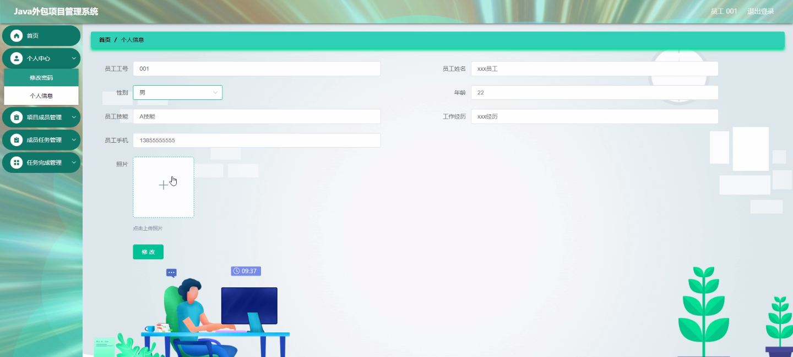
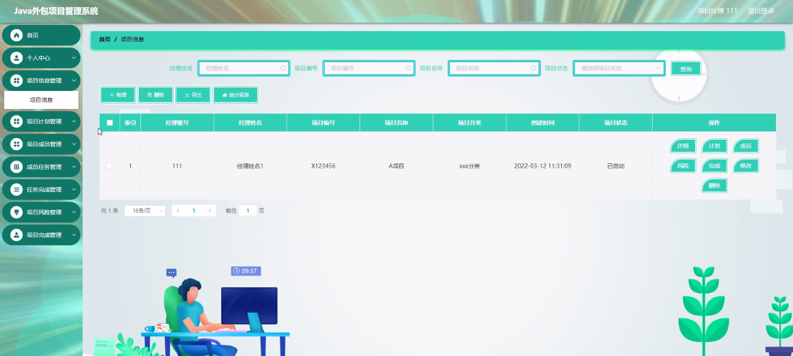
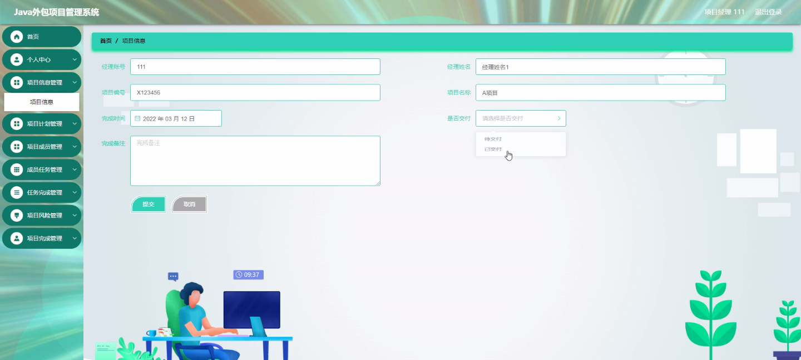
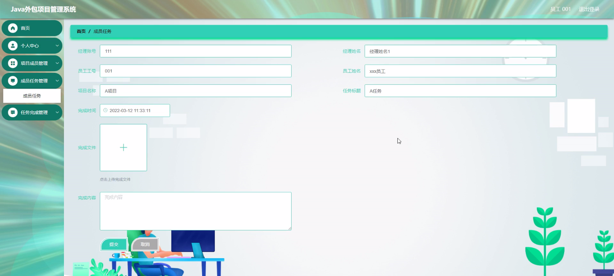
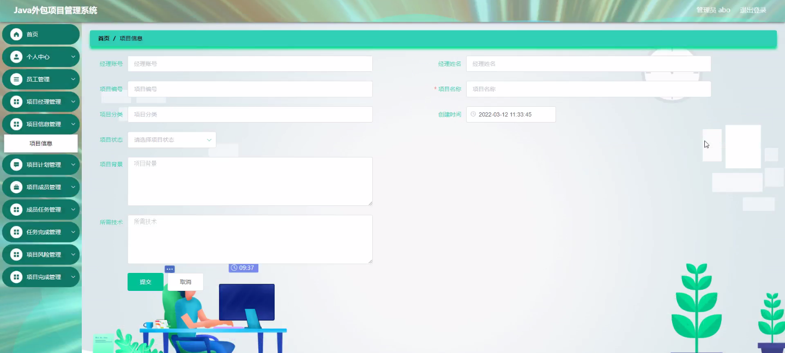

****本项目包含程序+源码+数据库+LW+调试部署环境，文末可获取一份本项目的java源码和数据库参考。****

## ******开题报告******

研究背景：
随着信息技术的不断发展和应用，外包项目在现代企业中扮演着越来越重要的角色。外包项目管理系统作为一种关键的工具，可以帮助企业有效地管理和监控外包项目的各个方面，提高项目的执行效率和质量。然而，目前市场上存在着各种各样的外包项目管理系统，但很多系统功能单一、操作复杂，无法满足企业的实际需求。因此，开发一款全面、易用且功能强大的外包项目管理系统具有重要的研究意义和实际价值。

研究意义：
外包项目管理系统的研究对于提升企业的项目管理能力和竞争力具有重要意义。通过深入研究外包项目管理系统的设计与实施，可以帮助企业更好地理解和应用现代项目管理理论和方法，提高项目管理的水平和效果。同时，该研究还可以促进外包项目管理领域的创新和发展，推动相关技术和方法的进步，为企业的项目管理实践提供更加科学和有效的支持。

研究目的：
本研究旨在开发一款功能全面、易用且高效的外包项目管理系统，以满足企业对于项目管理的需求。具体目标包括：（1）深入分析外包项目管理的特点和挑战，明确系统设计的基本原则和要求；（2）研究和应用现代项目管理理论和方法，构建科学合理的项目管理模型；（3）设计和实现各项功能模块，提供全面的项目管理工具和功能；（4）测试和优化系统性能，确保系统的稳定性和可靠性；（5）验证系统在实际项目管理中的应用效果，评估系统的实际价值和经济效益。

研究内容：
本研究的主要内容包括员工管理、项目经理管理、项目信息管理、项目计划管理、项目成员管理、成员任务管理、任务完成管理、项目风险管理和项目完成管理等系统功能。具体而言，研究将围绕以下几个方面展开：（1）员工管理：包括员工信息录入、权限管理、考勤管理等；（2）项目经理管理：包括项目指派、任务分配、进度监控等；（3）项目信息管理：包括项目基本信息、合同信息、费用信息等；（4）项目计划管理：包括项目计划制定、进度管理、资源分配等；（5）项目成员管理：包括成员信息维护、协作管理、沟通交流等；（6）成员任务管理：包括任务分解、任务分配、任务跟踪等；（7）任务完成管理：包括任务进度监控、任务评估、任务验收等；（8）项目风险管理：包括风险识别、风险评估、风险应对等；（9）项目完成管理：包括项目总结、成果评估、经验总结等。

拟解决的主要问题：
在开发外包项目管理系统的过程中，我们将重点解决以下几个主要问题：（1）如何设计一个全面、易用且高效的系统界面，以提高用户的操作体验和工作效率；（2）如何建立科学合理的项目管理模型，以支持项目的有效执行和控制；（3）如何确保系统的稳定性和可靠性，以满足企业对于数据安全和系统稳定性的需求；（4）如何与其他企业系统进行集成，实现数据的共享和交流；（5）如何评估系统在实际项目管理中的应用效果，以验证系统的实际价值和经济效益。

进度安排：

2022年9月至10月：开题报告编写和提交，完成开题报告的撰写并提交给指导教师进行审核。

2022年11月至2023年1月：系统设计和开发，根据开题报告的要求，进行系统设计和编码工作。

2023年2月至3月：论文撰写和初稿完成，开始撰写论文，并在这个阶段完成论文的初稿。

2023年4月至5月：论文修改和最终定稿，根据指导教师的意见对论文进行修改，并完成最终的定稿。

2023年5月：论文答辩和提交，参加论文答辩并根据答辩结果进行修改，最后将论文提交给学院或学校。

参考文献：

[1]喻佳,吴丹新.基于SpringBoot的Web快速开发框架[J].电脑编程技巧与维护,2021,(09):31-33.

[2]李鹏.基于SpringBoot快速开发平台的实现[J].电子技术与软件工程,2021,(12):36-37.

[3]叶开平,蔡维晟,陈家敏,邓斯妮.基于SpringBoot的综测可视化管理系统的研究与设计[J].电脑知识与技术,2021,(12):100-104.

[4]江健锋,徐振平.Springboot最小系统的设计与实现[J].电脑知识与技术,2021,(04):62-63.

[5]赵炯,司圣杰,周奇才,熊肖磊.通用信息获取系统设计与实现[J].起重运输机械,2020,(16):89-97.

[6]吴英宾.一种内外网数据交互系统的设计与实现[J].软件工程,2020,(08):25-27.

****以上是本项目程序开发之前开题报告内容，最终成品以下面界面为准，大家可以酌情参考使用。要源码参考请在文末进行获取！！****

## ******本项目的界面展示******

