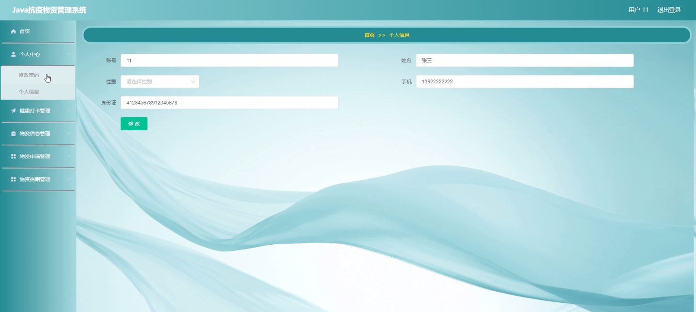
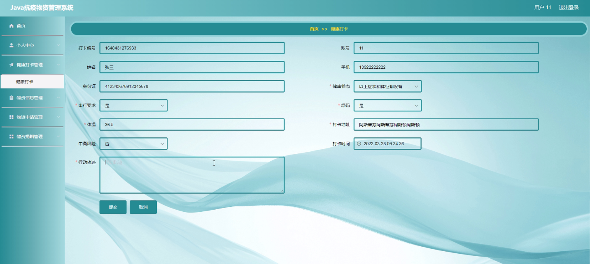
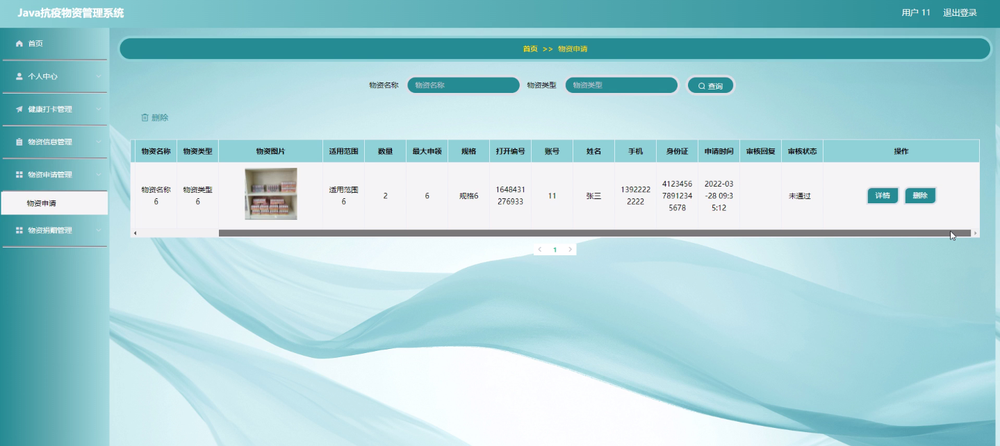
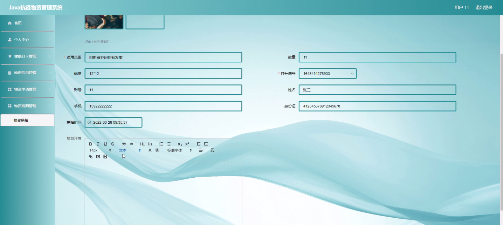
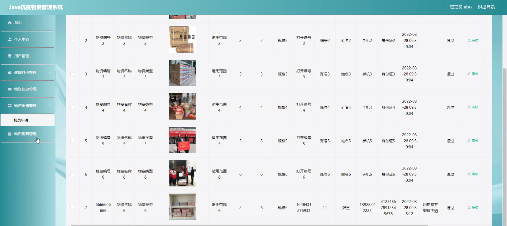
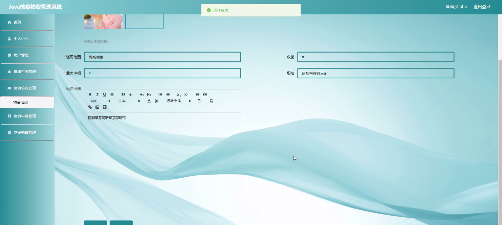

****本项目包含程序+源码+数据库+LW+调试部署环境，文末可获取一份本项目的java源码和数据库参考。****

## ******开题报告******

研究背景：
在当前全球范围内的新冠疫情爆发下，对抗疫物资的管理和分配变得尤为重要。然而，由于疫情的突发性和规模之大，传统的物资管理方式已经无法满足需求。因此，建立一个高效、准确、可追溯的抗疫物资管理系统势在必行。

研究意义：
抗疫物资管理系统的建立具有重要的现实意义。首先，它可以提高物资的调配效率，确保物资能够及时送达需要的地方，最大限度地减少物资浪费。其次，通过系统化的管理和信息共享，可以更好地了解物资的流向和使用情况，为后续的物资采购和分配提供科学依据。此外，抗疫物资管理系统还可以加强与各相关部门和机构的协作，形成合力，共同应对疫情挑战。

研究目的：
本研究旨在设计和开发一套完善的抗疫物资管理系统，以满足疫情期间物资管理的需求。通过该系统，可以实现对物资的全生命周期管理，包括物资的采购、储存、分配和使用等环节。同时，系统还将提供用户健康打卡、物资信息查询、物资申请和捐赠等功能，以便更好地满足不同角色的需求。

研究内容： 本研究的主要内容包括以下几个方面：

  1. 用户管理：建立用户档案，记录用户的基本信息和权限，并提供用户注册、登录、修改密码等功能，以确保系统的安全性和可靠性。

  2. 健康打卡：用户可以通过系统进行健康打卡，记录自己的身体状况和接触情况，为后续的物资分配提供参考依据。

  3. 物资信息管理：建立物资库存管理系统，记录物资的种类、数量、存放位置等信息，并实现对物资的分类、标记和追溯。

  4. 物资申请：用户可以通过系统提交物资申请，包括物资种类、数量和用途等信息，系统将根据用户的需求和优先级进行物资分配。

  5. 物资捐赠：系统将提供物资捐赠功能，用户可以通过系统进行物资捐赠，包括物资种类、数量和捐赠地点等信息，以促进社会各界的爱心捐助。

  6. 用户提醒：系统将根据用户的需求和权限，提供相关的物资使用提醒和预警功能，以确保物资的合理利用和及时补充。

拟解决的主要问题：
本研究旨在解决抗疫物资管理过程中存在的一系列问题，包括物资调配不均、信息共享不畅、物资浪费等。通过建立一个高效、准确、可追溯的抗疫物资管理系统，可以实现物资的精细化管理和优化分配，最大限度地满足疫情期间的物资需求。

研究方案和预期成果：
本研究将采用软件工程的方法，设计和开发一个基于云计算和物联网技术的抗疫物资管理系统。通过需求分析、系统设计、编码实现和测试验证等步骤，最终完成一个功能完备、稳定可靠的系统。预期成果包括一个具有用户管理、健康打卡、物资信息管理、物资申请、物资捐赠和用户提醒等功能的抗疫物资管理系统，并通过实际应用验证其有效性和可行性。

进度安排：

2022年9月至10月：需求分析和规划，明确系统功能和目标，制定项目计划。

2022年11月至2023年1月：系统设计和编码，完成详细的系统设计并开始编写代码。

2023年2月至3月：用户界面开发和数据库开发，开发用户友好的界面和设计数据库结构。

2023年4月至5月：功能测试、文档编写和上线部署，对系统进行全面的功能测试并编写用户手册。

2023年5月：维护和升级，定期对系统进行维护和升级，修复bug和添加新功能。

参考文献：

[1]邱小群,邓丽艳,陈海潮.基于B/S的信息管理系统设计和实现[J].信息与电脑(理论版),2022,(20):146-148.

[2]谢霜.基于Java技术的网络管理体系结构的应用[J].网络安全技术与应用,2022,(10):14-15.

[3]宋锦华.高职院校Java程序设计课程改革研究[J].科技视界,2022,(20):133-135.

[4]曹嵩彭,王鹏宇.浅析Java语言在软件开发中的应用[J].信息记录材料,2022,(03):114-116.

[5]朱澈,余俊达.武汉东湖学院.基于Java的软硬件信息管理系统V1.0[Z].项目立项编号.鉴定单位.鉴定日期:

****以上是本项目程序开发之前开题报告内容，最终成品以下面界面为准，大家可以酌情参考使用。要源码参考请在文末进行获取！！****

## ******本项目的界面展示******

