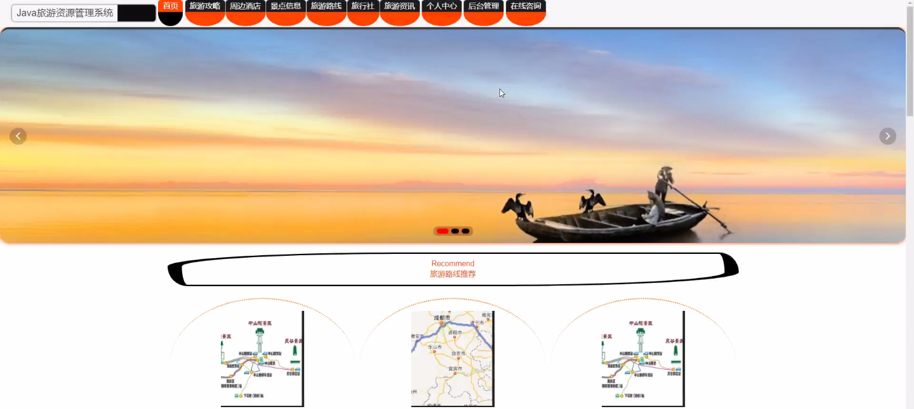
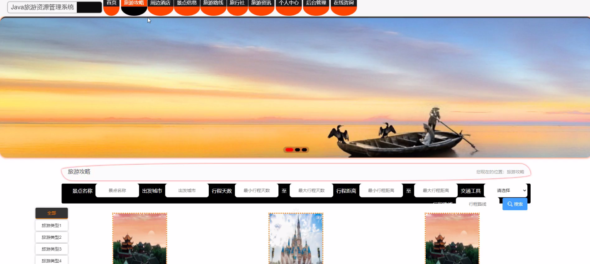
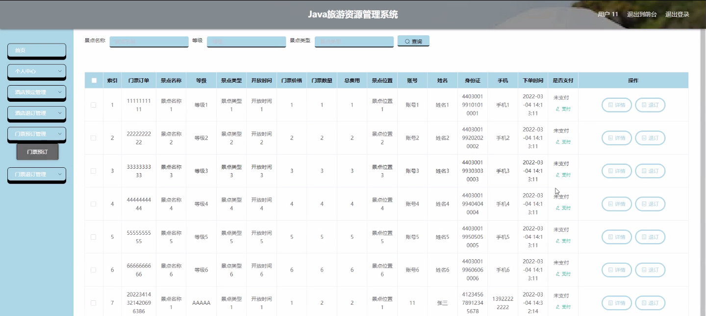
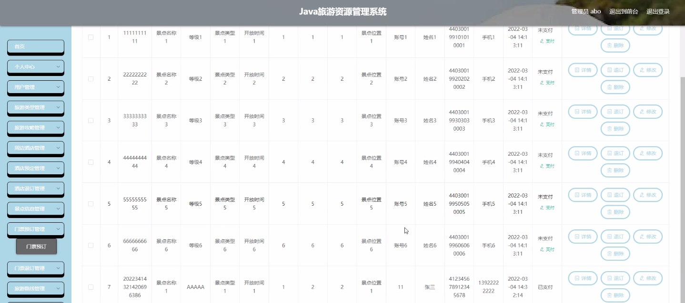
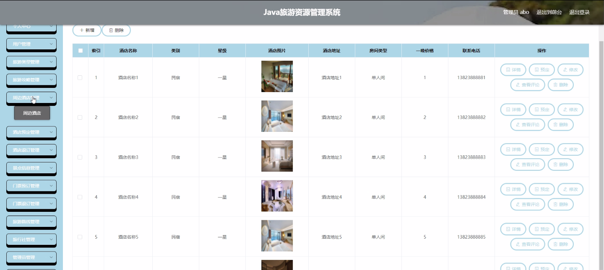

****本项目包含程序+源码+数据库+LW+调试部署环境，文末可获取一份本项目的java源码和数据库参考。****

## ******开题报告******

研究背景：
随着旅游业的快速发展，旅游资源管理系统在旅游行业中扮演着重要的角色。传统的旅游资源管理方式已经无法满足人们对旅游服务的需求，因此需要开发一种高效、智能化的系统来管理和提供旅游资源信息。这样的系统将为旅游者提供更便捷、个性化的旅游体验，同时也能够帮助旅游从业者提高运营效率和服务质量。

研究意义：
旅游资源管理系统的开发和应用对于促进旅游业的可持续发展具有重要意义。首先，该系统可以提供准确、全面的旅游资源信息，帮助旅游者更好地了解目的地的特色和各项服务。其次，通过系统的智能推荐功能，可以根据用户的偏好和需求，为其提供个性化的旅游攻略和路线规划，提升旅游体验。最后，该系统还可以实现旅游资源的合理分配和利用，提高旅游业的整体效益。

研究目的：
本研究旨在设计和开发一套完善的旅游资源管理系统，以满足旅游者和旅游从业者的需求。通过该系统，旅游者可以方便地获取准确、全面的旅游资源信息，并根据个人喜好进行选择和定制化服务。同时，旅游从业者可以通过该系统实现资源的优化配置和管理，提高运营效率和服务质量。

研究内容：
本研究的主要内容包括以下系统功能：用户管理、旅游类型分类、旅游攻略发布与浏览、周边酒店信息管理、酒店预定与退订、景点信息管理、门票预订与退订、旅游路线规划、旅行社管理等。通过对这些功能的设计和实现，可以构建一个完整的旅游资源管理系统。

拟解决的主要问题：

  1. 如何实现旅游资源的准确、全面的信息展示和管理？
  2. 如何根据用户的偏好和需求，为其提供个性化的旅游攻略和路线规划？
  3. 如何实现旅游资源的合理分配和利用，提高旅游业的整体效益？
  4. 如何确保系统的安全性和稳定性，保护用户和旅游从业者的信息安全？
  5. 如何提供便捷的预订和退订服务，提升用户的满意度和体验？

研究方案和预期成果：
本研究将采用系统开发的方法，结合用户需求和技术实现，设计和开发一套旅游资源管理系统。通过对系统功能的完善和优化，提高系统的性能和用户体验。预期成果包括：一个功能完备、操作简便的旅游资源管理系统，能够满足旅游者和旅游从业者的需求；提供准确、全面的旅游资源信息，帮助用户进行选择和定制化服务；实现旅游资源的合理分配和利用，提高旅游业的整体效益；保障系统的安全性和稳定性，保护用户和旅游从业者的信息安全。

进度安排：

2022年9月至10月：需求分析和规划，进行用户需求调研和分析，确定系统功能和目标。

2022年11月至2023年1月：系统设计和开发，完成系统架构设计和技术选型，并开始编写代码。

2023年2月至3月：测试和优化，进行单元测试和集成测试，修复问题并优化系统性能。

2023年4月至5月：文档编写和培训，编写用户手册和系统文档，并进行相关人员的培训。

2023年5月：上线部署和维护，将系统部署到生产环境中，并定期进行维护和升级。

参考文献：

[1]王振华.SpringBoot在教学效果评估系统中的应用[J].电子技术,2023,(05):67-69.

[2]王明泉.基于SpringBoot远程热部署的探索和应用[J].信息与电脑(理论版),2023,(07):1-4.

[3]王亚东,李晓霞,陈强强,剡美娜.基于SpringBoot的需求发布平台设计[J].信息与电脑(理论版),2023,(01):105-107.

[4]陈新府豪.基于SpringBoot和Vue框架的创新方法推理系统的设计与实现[D].导师：黄静.浙江理工大学,2022.

[5]霍福华,韩慧.基于SpringBoot微服务架构下前后端分离的MVVM模型[J].电子技术与软件工程,2022,(01):73-76.

[6]韩策,张娜,王松亭,张凯,何方,袁峰.SpringBoot OPC客户端设计与研究[J].电子世界,2021,(19):25-26.

****以上是本项目程序开发之前开题报告内容，最终成品以下面界面为准，大家可以酌情参考使用。要源码参考请在文末进行获取！！****

## ******本项目的界面展示******

