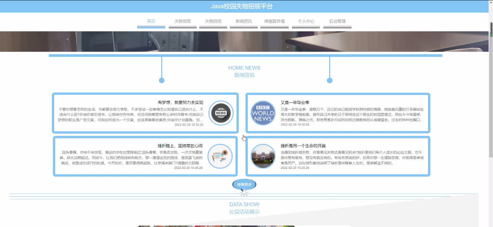
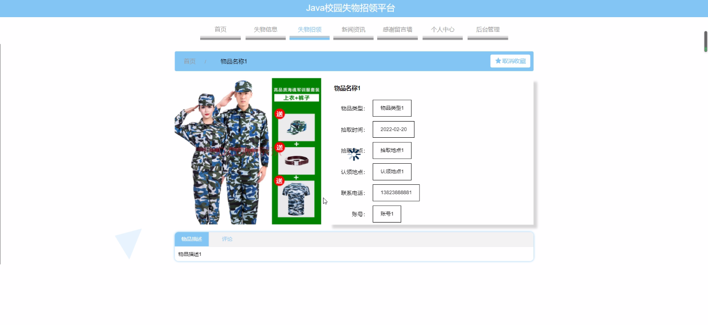
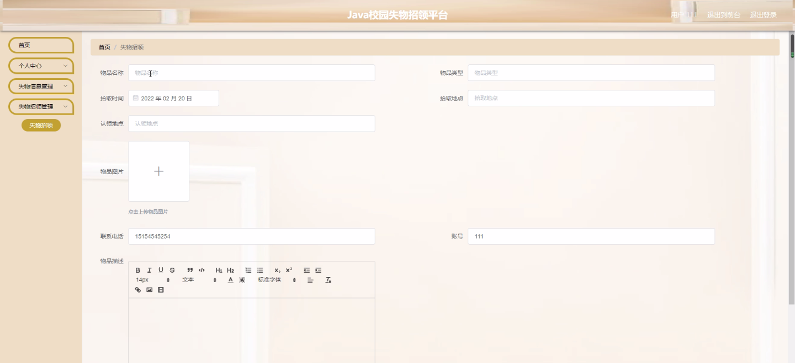
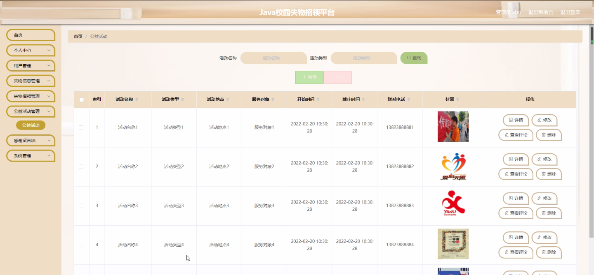
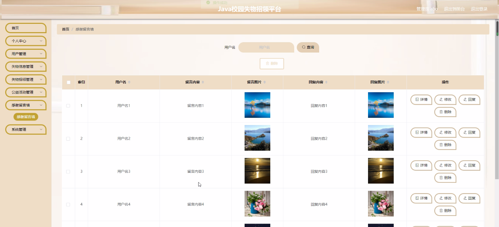

****本项目包含程序+源码+数据库+LW+调试部署环境，文末可获取一份本项目的java源码和数据库参考。****

## ******开题报告******

研究背景：
随着高校规模的不断扩大和学生人数的增加，校园失物招领问题日益突出。每年都有大量的学生丢失贵重物品或者捡到他人遗失物品，但由于信息传递渠道不畅、信息发布方式不统一等原因，很多失主无法找回自己的物品，也无法及时将捡到的物品归还给失主。因此，建立一个校园失物招领平台具有重要的现实意义。

研究意义：
校园失物招领平台的建立可以提供一个便捷、高效的信息交流平台，方便学生之间进行失物招领信息的发布和查询。通过这个平台，失主可以快速找回自己的物品，而捡到物品的同学也能够及时将物品归还给失主，实现资源的有效利用和共享。同时，该平台还可以促进校园公益活动的开展，鼓励学生积极参与社会实践和志愿服务，提升学生的社会责任感和公民意识。

研究目的：
本研究旨在设计和开发一种校园失物招领平台，通过该平台实现失物信息的发布、查询和归还功能，提高校园失物招领的效率和准确性。同时，希望通过该平台的建立，促进学生之间的互助和合作，培养学生的社会交往能力和团队合作精神。

研究内容： 本研究的主要内容包括以下几个方面：

  1. 用户系统：设计并开发用户注册、登录、个人信息管理等功能，使用户能够方便地使用平台进行失物招领相关操作。

  2. 失物信息系统：建立一个失物信息数据库，实现失物信息的发布、浏览和搜索功能，方便失主和捡到物品的同学进行信息交流。

  3. 失物招领系统：设计并开发失物招领功能模块，包括失主认领、物品归还等功能，确保失主能够及时找回自己的物品。

  4. 公益活动系统：构建一个公益活动平台，鼓励学生参与志愿服务和社会实践，提升学生的社会责任感和公民意识。

拟解决的主要问题：
本研究旨在解决校园失物招领过程中存在的信息不畅、信息发布方式不统一等问题。通过建立一个统一的校园失物招领平台，可以提高失物招领的效率和准确性，方便失主找回物品，促进学生之间的互助和合作。

研究方案和预期成果：
本研究将采用软件开发的方法，设计并开发一个校园失物招领平台，并进行系统测试和优化。预期成果包括一个功能完善、操作简便的校园失物招领平台，能够满足学生的需求，提高失物招领的效率和准确性。同时，该平台还将促进学生之间的互助和合作，培养学生的社会交往能力和团队合作精神。

进度安排：

2022年9月至10月：需求分析和规划，明确系统功能和目标，制定项目计划。

2022年11月至2023年1月：系统设计和编码，完成详细的系统设计并开始编写代码。

2023年2月至3月：用户界面开发和数据库开发，开发用户友好的界面和设计数据库结构。

2023年4月至5月：功能测试、文档编写和上线部署，对系统进行全面的功能测试并编写用户手册。

2023年5月：维护和升级，定期对系统进行维护和升级，修复bug和添加新功能。

参考文献：

[1]邱小群,邓丽艳,陈海潮.基于B/S的信息管理系统设计和实现[J].信息与电脑(理论版),2022,(20):146-148.

[2]谢霜.基于Java技术的网络管理体系结构的应用[J].网络安全技术与应用,2022,(10):14-15.

[3]宋锦华.高职院校Java程序设计课程改革研究[J].科技视界,2022,(20):133-135.

[4]曹嵩彭,王鹏宇.浅析Java语言在软件开发中的应用[J].信息记录材料,2022,(03):114-116.

[5]朱澈,余俊达.武汉东湖学院.基于Java的软硬件信息管理系统V1.0[Z].项目立项编号.鉴定单位.鉴定日期:

****以上是本项目程序开发之前开题报告内容，最终成品以下面界面为准，大家可以酌情参考使用。要源码参考请在文末进行获取！！****

## ******本项目的界面展示******

