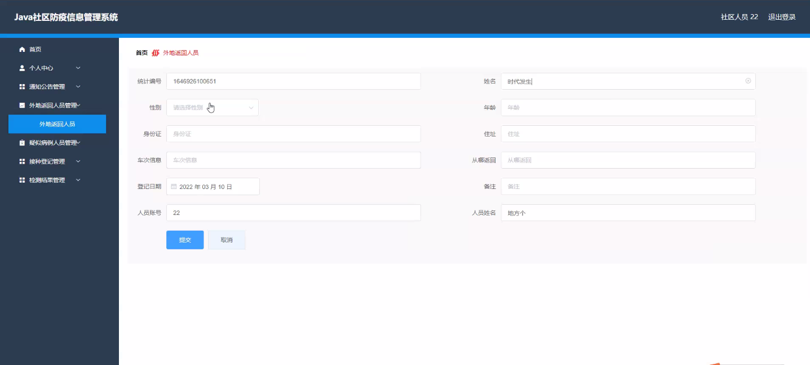
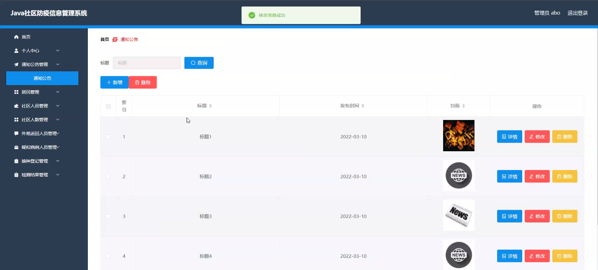
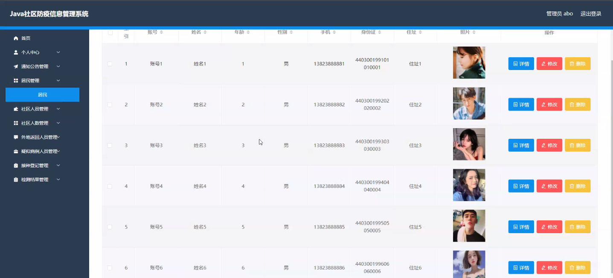
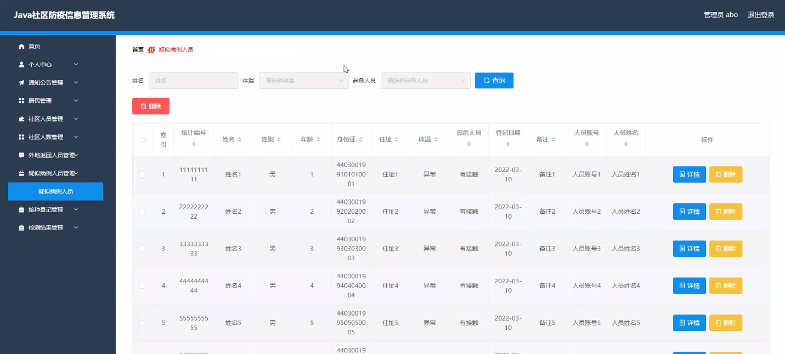
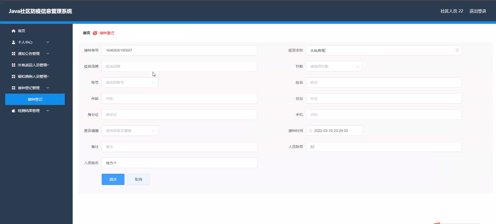
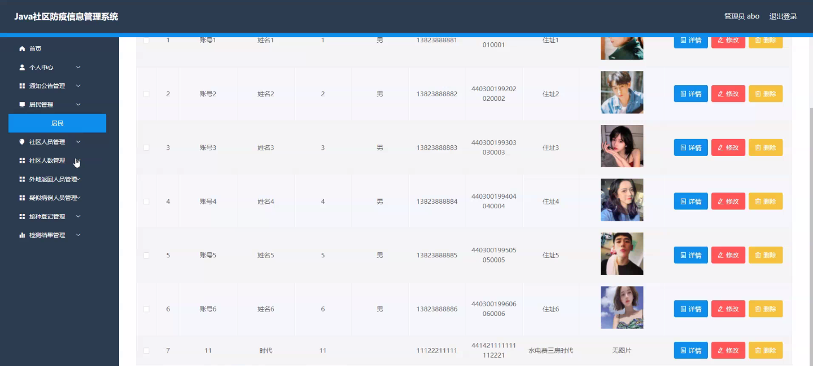

****本项目包含程序+源码+数据库+LW+调试部署环境，文末可获取一份本项目的java源码和数据库参考。****

## ******开题报告******

研究背景：
随着全球范围内新冠疫情的爆发，社区防疫工作变得尤为重要。传统的纸质记录和人工管理方式已经无法满足社区防疫的需求，因此，社区防疫信息管理系统的开发和应用成为了当务之急。

研究意义：
社区防疫信息管理系统的建立对于提高社区防疫工作的效率和准确性具有重要意义。通过该系统，可以实现对居民、社区人数、外地返回人员、疑似病例人员、接种登记、社区人员、检测结果、通知公告等信息的集中管理和实时更新，从而提升社区防疫工作的科学性和精细化水平。

研究目的：
本研究旨在开发一套完善的社区防疫信息管理系统，以提高社区防疫工作的效率和准确性。通过该系统，可以实现对各项社区防疫工作的全面监控和数据分析，为决策者提供科学依据，帮助社区有效应对疫情，保障居民的生命安全和身体健康。

研究内容： 本研究的主要内容包括以下系统功能的设计和实现：

  1. 居民管理：建立居民档案，包括个人基本信息、健康状况、接种记录等，方便对居民进行管理和跟踪。

  2. 社区人数统计：实时统计社区人口数量，并根据人口变动情况进行分析和预测，为社区资源配置提供参考。

  3. 外地返回人员管理：对从外地返回的人员进行登记和隔离管理，确保其健康状况得到有效监控和控制。

  4. 疑似病例人员管理：对出现发热、咳嗽等症状的居民进行登记和隔离管理，及时识别和隔离潜在感染者。

  5. 接种登记：记录居民的疫苗接种情况，实现疫苗接种信息的全面管理和查询。

  6. 社区人员管理：对社区工作人员进行管理，包括工作安排、培训记录等，提高社区工作效率和协同能力。

  7. 检测结果管理：记录居民的核酸检测结果和抗体检测结果，为疫情防控提供重要数据支持。

  8. 通知公告发布：向居民发布防疫相关的通知和公告，提高居民的防控意识和行动力。

拟解决的主要问题：
本研究旨在解决传统社区防疫工作中存在的信息管理不便、数据不准确、反应滞后等问题。通过引入社区防疫信息管理系统，可以实现信息的集中管理、数据的实时更新和分析，提高社区防疫工作的科学性和精细化水平。

研究方案和预期成果：
本研究将采用软件开发和数据库技术，设计并实现社区防疫信息管理系统。预期成果包括一个功能完善、操作简便、安全可靠的系统，并能够有效提升社区防疫工作的效率和准确性。同时，该系统还将为决策者提供科学依据，帮助社区有效应对疫情，保障居民的生命安全和身体健康。

进度安排：

2022年9月至10月：开题报告编写和提交，完成开题报告的撰写并提交给指导教师进行审核。

2022年11月至2023年1月：系统设计和开发，根据开题报告的要求，进行系统设计和编码工作。

2023年2月至3月：论文撰写和初稿完成，开始撰写论文，并在这个阶段完成论文的初稿。

2023年4月至5月：论文修改和最终定稿，根据指导教师的意见对论文进行修改，并完成最终的定稿。

2023年5月：论文答辩和提交，参加论文答辩并根据答辩结果进行修改，最后将论文提交给学院或学校。

参考文献：

[1]喻佳,吴丹新.基于SpringBoot的Web快速开发框架[J].电脑编程技巧与维护,2021,(09):31-33.

[2]李鹏.基于SpringBoot快速开发平台的实现[J].电子技术与软件工程,2021,(12):36-37.

[3]叶开平,蔡维晟,陈家敏,邓斯妮.基于SpringBoot的综测可视化管理系统的研究与设计[J].电脑知识与技术,2021,(12):100-104.

[4]江健锋,徐振平.Springboot最小系统的设计与实现[J].电脑知识与技术,2021,(04):62-63.

[5]赵炯,司圣杰,周奇才,熊肖磊.通用信息获取系统设计与实现[J].起重运输机械,2020,(16):89-97.

[6]吴英宾.一种内外网数据交互系统的设计与实现[J].软件工程,2020,(08):25-27.

****以上是本项目程序开发之前开题报告内容，最终成品以下面界面为准，大家可以酌情参考使用。要源码参考请在文末进行获取！！****

## ******本项目的界面展示******

