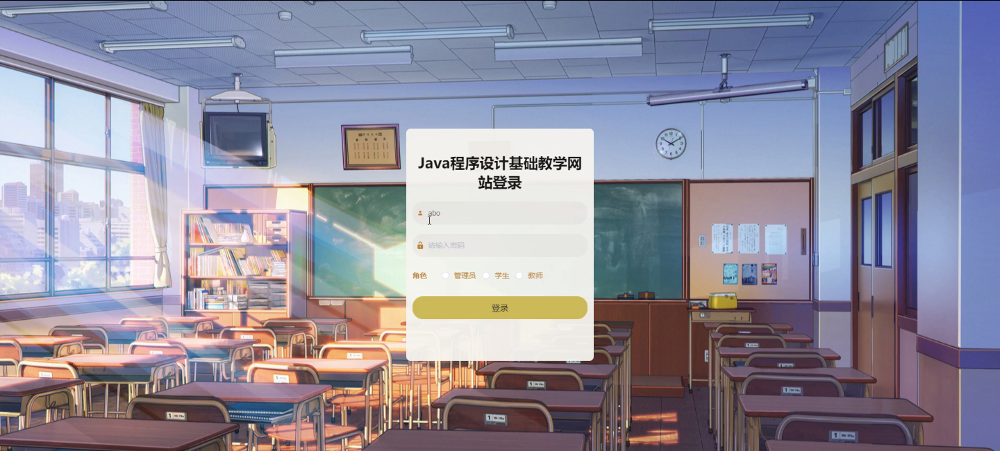
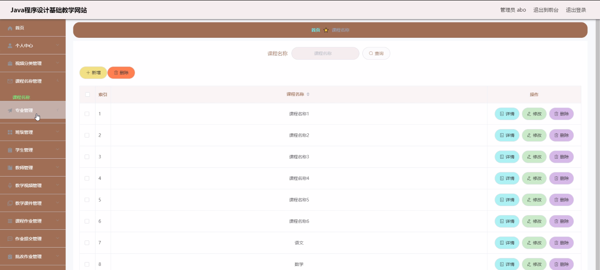
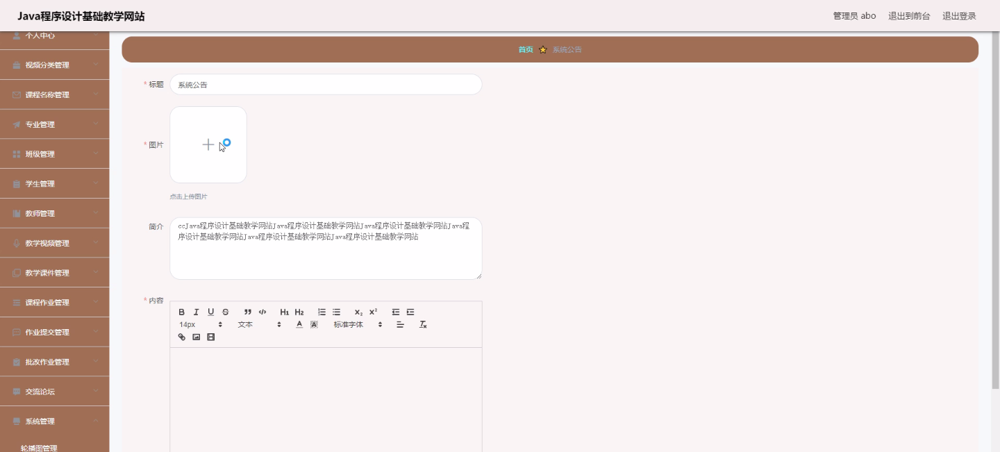
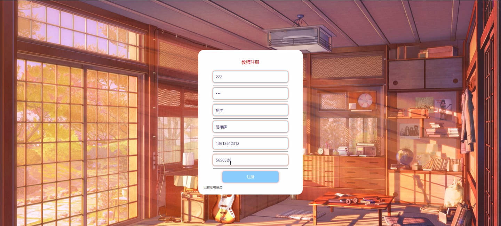
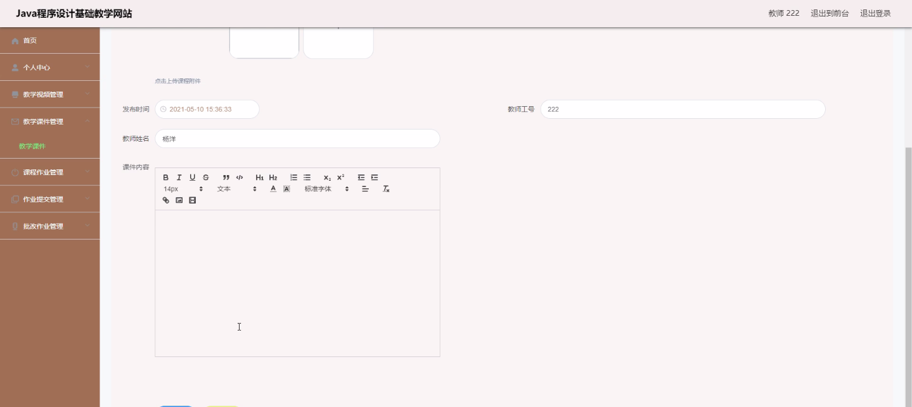
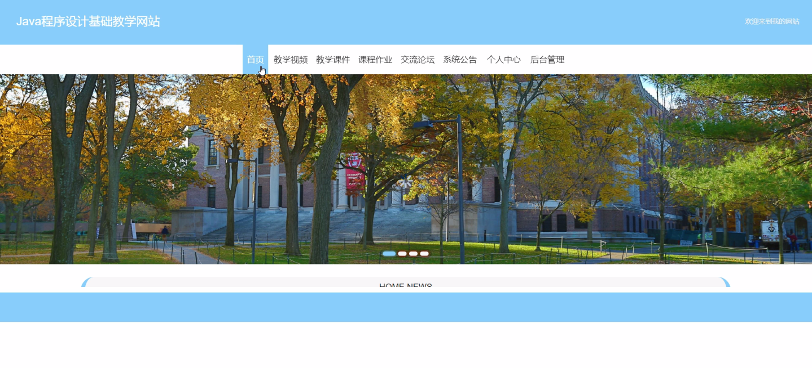
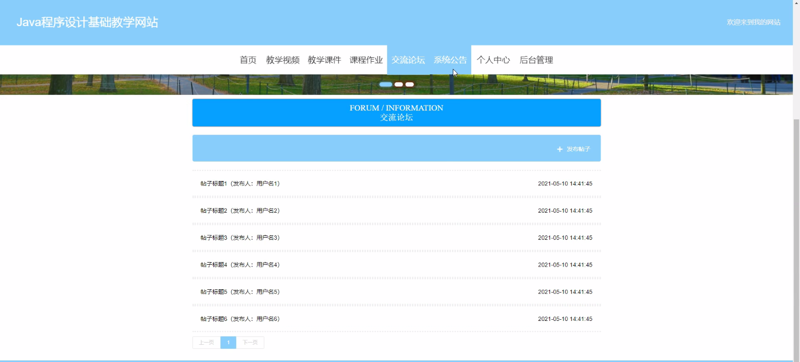
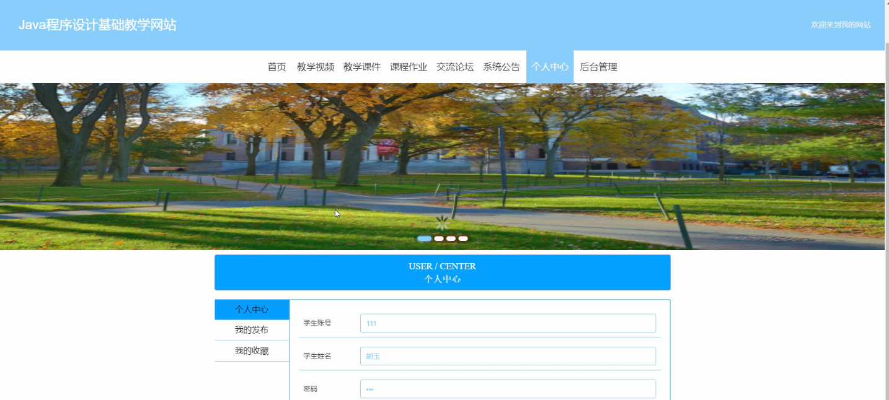

****本项目包含程序+源码+数据库+LW+调试部署环境，文末可获取一份本项目的java源码和数据库参考。****

## ******开题报告******

研究背景：
随着信息技术的快速发展和互联网的普及，计算机程序设计已经成为现代社会中一项重要的技能。然而，传统的课堂教学方式往往无法满足学生对于程序设计知识的需求，教师在面对大量学生时也面临着教学效率低下的问题。因此，开发一个基于网络的程序设计基础教学网站具有重要的意义。

研究意义：
该教学网站的开发将为学生提供一个灵活、便捷的学习平台，使他们能够根据自己的时间和进度进行学习。同时，教师可以通过该网站实现对学生的有效管理和指导，提高教学效果。此外，该网站还可以为学生和教师提供交流和互动的机会，促进知识的共享和合作。

研究目的：
本研究旨在开发一个功能完善、易于使用的程序设计基础教学网站，以满足学生和教师的需求。通过该网站，学生可以系统地学习程序设计的基础知识和技能，提高编程能力；教师可以通过该网站进行教学管理和指导，提高教学效果。同时，本研究还旨在探索如何利用信息技术手段提升程序设计教学的效果和质量。

研究内容： 根据系统功能的要求，该教学网站将包括以下内容：

  1. 学生功能：学生可以注册、登录账号，并查看个人信息、学习进度等。
  2. 教师功能：教师可以注册、登录账号，并管理学生信息、课程安排等。
  3. 教学视频：提供丰富的教学视频资源，覆盖程序设计的基础知识和实例讲解。
  4. 视频分类：对教学视频进行分类，方便学生按照自己的需求选择学习内容。
  5. 课程名称：每个课程都有明确的名称和简介，方便学生了解课程内容。
  6. 教学课件：提供课程相关的教学课件，帮助学生深入理解和掌握知识点。
  7. 课程作业：针对每个课程设置相应的作业，用于检验学生的学习效果。
  8. 作业提交：学生可以通过网站提交作业，教师可以对作业进行批改和评价。
  9. 专业和班级：学生可以选择自己所属的专业和班级，方便教师进行管理和指导。

拟解决的主要问题：
通过该教学网站，我们将解决传统课堂教学方式效率低下的问题，提供一个灵活、便捷的学习平台。同时，通过在线交流和互动，促进学生和教师之间的沟通和合作，提高教学效果。此外，通过丰富的教学资源和作业评价机制，激发学生的学习兴趣和积极性，提高他们的编程能力和创新能力。

研究方案和预期成果：
本研究将采用前后端分离的开发模式，使用现代化的技术和工具进行系统设计和开发。预计在一年的时间内完成系统的开发和测试，并进行实际应用和评估。预期成果包括一个功能完善、稳定可靠的程序设计基础教学网站，能够满足学生和教师的需求，并提高程序设计教学的效果和质量。

进度安排：

2022年9月至10月：需求分析和规划，进行用户需求调研和分析，确定系统功能和目标。

2022年11月至2023年1月：系统设计和开发，完成系统架构设计和技术选型，并开始编写代码。

2023年2月至3月：测试和优化，进行单元测试和集成测试，修复问题并优化系统性能。

2023年4月至5月：文档编写和培训，编写用户手册和系统文档，并进行相关人员的培训。

2023年5月：上线部署和维护，将系统部署到生产环境中，并定期进行维护和升级。

参考文献：

[1]王振华.SpringBoot在教学效果评估系统中的应用[J].电子技术,2023,(05):67-69.

[2]王明泉.基于SpringBoot远程热部署的探索和应用[J].信息与电脑(理论版),2023,(07):1-4.

[3]王亚东,李晓霞,陈强强,剡美娜.基于SpringBoot的需求发布平台设计[J].信息与电脑(理论版),2023,(01):105-107.

[4]陈新府豪.基于SpringBoot和Vue框架的创新方法推理系统的设计与实现[D].导师：黄静.浙江理工大学,2022.

[5]霍福华,韩慧.基于SpringBoot微服务架构下前后端分离的MVVM模型[J].电子技术与软件工程,2022,(01):73-76.

[6]韩策,张娜,王松亭,张凯,何方,袁峰.SpringBoot OPC客户端设计与研究[J].电子世界,2021,(19):25-26.

****以上是本项目程序开发之前开题报告内容，最终成品以下面界面为准，大家可以酌情参考使用。要源码参考请在文末进行获取！！****

## ******本项目的界面展示******

