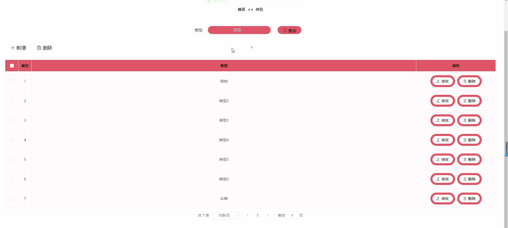

****本项目包含程序+源码+数据库+LW+调试部署环境，文末可获取一份本项目的java源码和数据库参考。****

## ******开题报告******

研究背景：
随着社会的发展和科技的进步，人们对于民主参与的需求日益增长。传统的投票方式存在一些不足，如时间成本高、信息传递不及时等问题。因此，开发一种自主在线投票系统具有重要的现实意义。

研究意义：
自主在线投票系统作为一种新型的投票方式，可以提供便捷、高效、公正的投票环境，有效解决了传统投票方式存在的问题。通过引入互联网技术，该系统可以实现全天候的投票服务，方便了广大选民的参与，并且能够快速准确地统计投票结果，提高了投票的公正性和透明度。

研究目的：
本研究旨在设计和开发一种自主在线投票系统，以满足人们对于民主参与的需求。通过构建一个安全可靠、易于使用的投票平台，提供给用户一个方便、高效的投票体验，促进民主决策的实施和社会治理的改善。

研究内容： 本研究的主要内容包括以下几个方面：

  1. 用户管理：设计并实现用户注册、登录、权限管理等功能，确保投票系统的安全性和可控性。

  2. 类型管理：建立投票类型的分类体系，使用户能够根据自身需求选择相应的投票类型。

  3. 投票信息管理：设计并实现投票信息的发布、修改、删除等功能，确保投票信息的准确性和及时性。

  4. 投票信息统计：开发统计模块，对投票结果进行汇总和分析，为决策提供科学依据。

  5. 投票公告管理：设计并实现投票公告的发布、查看、评论等功能，增加投票的透明度和互动性。

拟解决的主要问题： 在研究过程中，我们将重点解决以下几个问题：

  1. 如何确保投票系统的安全性，防止恶意攻击和数据泄露？

  2. 如何设计一个用户友好的界面，提高用户的使用体验？

  3. 如何保证投票信息的准确性和及时性？

  4. 如何进行投票结果的统计和分析，提供科学的决策依据？

  5. 如何增加投票的透明度和互动性，促进民主参与的积极性？

研究方案和预期成果：
本研究将采用软件工程的方法，结合前端开发技术和后端数据库管理技术，设计和开发一种自主在线投票系统。预期的成果包括一个安全可靠、功能完善的投票平台，能够满足用户的需求，并提供高效、公正的投票服务。通过该系统的应用和推广，预计可以促进民主决策的实施，提高社会治理的水平。

进度安排：

2022年9月至10月：开题报告编写和提交，完成开题报告的撰写并提交给指导教师进行审核。

2022年11月至2023年1月：系统设计和开发，根据开题报告的要求，进行系统设计和编码工作。

2023年2月至3月：论文撰写和初稿完成，开始撰写论文，并在这个阶段完成论文的初稿。

2023年4月至5月：论文修改和最终定稿，根据指导教师的意见对论文进行修改，并完成最终的定稿。

2023年5月：论文答辩和提交，参加论文答辩并根据答辩结果进行修改，最后将论文提交给学院或学校。

参考文献：

[1]喻佳,吴丹新.基于SpringBoot的Web快速开发框架[J].电脑编程技巧与维护,2021,(09):31-33.

[2]李鹏.基于SpringBoot快速开发平台的实现[J].电子技术与软件工程,2021,(12):36-37.

[3]叶开平,蔡维晟,陈家敏,邓斯妮.基于SpringBoot的综测可视化管理系统的研究与设计[J].电脑知识与技术,2021,(12):100-104.

[4]江健锋,徐振平.Springboot最小系统的设计与实现[J].电脑知识与技术,2021,(04):62-63.

[5]赵炯,司圣杰,周奇才,熊肖磊.通用信息获取系统设计与实现[J].起重运输机械,2020,(16):89-97.

[6]吴英宾.一种内外网数据交互系统的设计与实现[J].软件工程,2020,(08):25-27.

****以上是本项目程序开发之前开题报告内容，最终成品以下面界面为准，大家可以酌情参考使用。要源码参考请在文末进行获取！！****

## ******本项目的界面展示******

