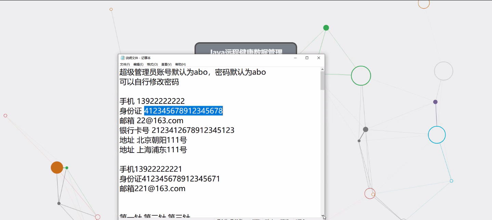

****本项目包含程序+源码+数据库+LW+调试部署环境，文末可获取一份本项目的java源码和数据库参考。****

## ******开题报告******

研究背景：
随着现代社会的快速发展和人们生活水平的提高，健康管理逐渐成为人们关注的焦点。然而，传统的健康管理方式存在一些问题，如信息不准确、数据不及时、管理效率低下等。因此，远程健康数据管理系统的出现为解决这些问题提供了新的思路和方法。

研究意义：
远程健康数据管理系统是基于互联网技术和智能化设备的健康管理平台，通过收集、分析和管理个体的健康数据，为用户提供全面、个性化的健康评估和保健提示。该系统具有以下几个方面的重要意义：

  1. 提高健康管理的精准性：远程健康数据管理系统可以实时监测和记录个体的健康数据，包括心率、血压、血糖等指标，有效提高健康管理的精准性，为用户提供更加准确的健康评估和保健建议。

  2. 促进健康行为的改变：通过远程健康数据管理系统，用户可以随时查看自己的健康数据，并得到相应的健康评估和保健提示。这将激励用户积极参与到健康管理中，改变不良的生活习惯，提高自身的健康水平。

  3. 优化医疗资源的分配：远程健康数据管理系统可以实现医疗资源的智能化调配，根据个体的健康数据和需求，合理安排医疗服务，提高医疗资源的利用效率，减轻医疗负担。

研究目的： 本研究旨在设计和开发一种远程健康数据管理系统，通过收集、分析和管理个体的健康数据，为用户提供全面、个性化的健康评估和保健提示。具体目标包括：

  1. 构建一个可靠、安全的远程健康数据管理平台，实现健康数据的实时采集和存储。

  2. 开发相应的算法和模型，对个体的健康数据进行分析和评估，为用户提供准确的健康状态判断和风险预警。

  3. 设计个性化的保健提示机制，根据用户的健康数据和需求，提供相应的保健建议和行为指导。

  4. 探索远程健康数据管理系统在健康管理领域的应用前景，为促进健康管理的发展提供理论和实践支持。

研究内容： 本研究将围绕远程健康数据管理系统的功能展开，主要包括以下几个方面：

  1. 员工管理：设计员工信息录入、权限管理等功能，确保系统的安全性和可控性。

  2. 健康数据采集：通过智能化设备和传感器，实时采集个体的健康数据，如心率、血压、血糖等指标。

  3. 健康评估：基于收集到的健康数据，利用相关算法和模型对个体的健康状态进行评估和分析，提供准确的健康评估报告。

  4. 保健提示：根据个体的健康数据和需求，设计个性化的保健提示机制，为用户提供相应的保健建议和行为指导。

  5. 系统优化：不断优化远程健康数据管理系统的性能和用户体验，提高系统的稳定性和易用性。

拟解决的主要问题：
本研究旨在解决传统健康管理方式存在的信息不准确、数据不及时、管理效率低下等问题。通过远程健康数据管理系统，可以实现健康数据的实时采集和管理，提供个性化的健康评估和保健提示，促进用户健康行为的改变，优化医疗资源的分配，从而提高健康管理的效果和效率。

研究方案和预期成果：
本研究将采用综合性的研究方法，包括文献调研、系统设计与开发、算法模型构建等。预期成果包括设计开发一套完整的远程健康数据管理系统，并在实际应用中验证其效果和可行性。同时，本研究还将撰写相关学术论文，推动远程健康数据管理系统在健康管理领域的应用和推广。

进度安排：

2022年9月至10月：需求分析和规划，进行用户需求调研和分析，确定系统功能和目标。

2022年11月至2023年1月：系统设计和开发，完成系统架构设计和技术选型，并开始编写代码。

2023年2月至3月：测试和优化，进行单元测试和集成测试，修复问题并优化系统性能。

2023年4月至5月：文档编写和培训，编写用户手册和系统文档，并进行相关人员的培训。

2023年5月：上线部署和维护，将系统部署到生产环境中，并定期进行维护和升级。

参考文献：

[1]王振华.SpringBoot在教学效果评估系统中的应用[J].电子技术,2023,(05):67-69.

[2]王明泉.基于SpringBoot远程热部署的探索和应用[J].信息与电脑(理论版),2023,(07):1-4.

[3]王亚东,李晓霞,陈强强,剡美娜.基于SpringBoot的需求发布平台设计[J].信息与电脑(理论版),2023,(01):105-107.

[4]陈新府豪.基于SpringBoot和Vue框架的创新方法推理系统的设计与实现[D].导师：黄静.浙江理工大学,2022.

[5]霍福华,韩慧.基于SpringBoot微服务架构下前后端分离的MVVM模型[J].电子技术与软件工程,2022,(01):73-76.

[6]韩策,张娜,王松亭,张凯,何方,袁峰.SpringBoot OPC客户端设计与研究[J].电子世界,2021,(19):25-26.

****以上是本项目程序开发之前开题报告内容，最终成品以下面界面为准，大家可以酌情参考使用。要源码参考请在文末进行获取！！****

## ******本项目的界面展示******

