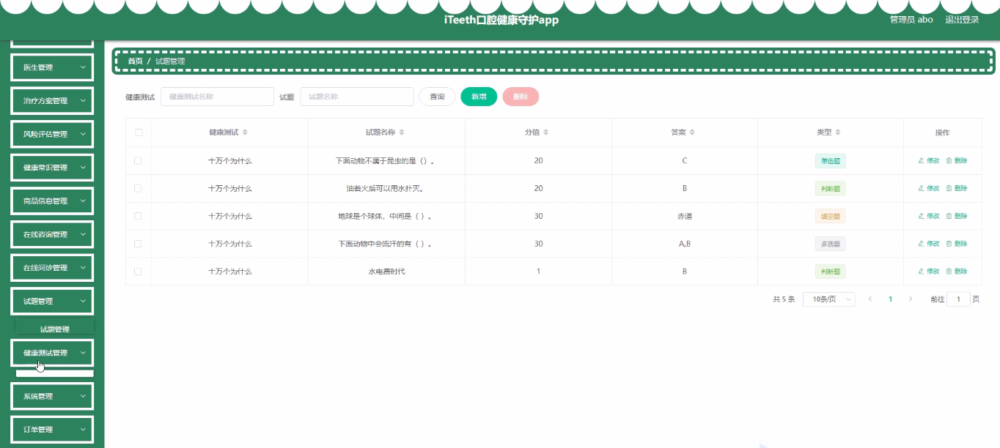

****本项目包含程序+源码+数据库+LW+调试部署环境，文末可获取一份本项目的java源码和数据库参考。****

## ******开题报告******

研究背景：
随着现代生活方式的改变，口腔健康问题日益突出。牙齿龋齿、牙周病等口腔疾病的发病率逐年增加，给人们的生活质量和健康带来了严重影响。此外，口腔疾病还与全身健康密切相关，如心血管疾病、糖尿病等。因此，保护口腔健康对于个体和社会的健康都具有重要意义。

研究意义：
口腔健康守护系统的建立和应用将为口腔健康管理提供一种全新的解决方案。通过整合用户、治疗方案、风险评估、医生、在线咨询、在线问诊、健康常识、商品信息、医院信息等系统功能，可以实现个性化的口腔健康管理和服务，提高人们对口腔健康的认知和关注度，减少口腔疾病的发生和发展，改善人们的生活质量。

研究目的：
本研究旨在开发一个口腔健康守护系统，通过整合多个系统功能，提供全方位的口腔健康管理和服务。具体目标包括：提供个性化的治疗方案和风险评估，为用户提供在线咨询和问诊服务，提供口腔健康常识和相关商品信息，以及提供医院信息和预约挂号等功能。通过这些功能的整合和应用，帮助人们更好地保护口腔健康，预防口腔疾病的发生和发展。

研究内容： 口腔健康守护系统的研究内容主要包括以下几个方面：

  1. 用户管理：建立用户档案，记录用户的口腔健康信息、治疗记录和健康需求，为用户提供个性化的口腔健康管理和服务。

  2. 治疗方案和风险评估：根据用户的口腔健康状况和需求，制定个性化的治疗方案，并进行风险评估，帮助用户选择最适合的治疗方案。

  3. 医生咨询和问诊：提供在线咨询和问诊服务，用户可以通过系统与专业口腔医生进行实时交流，获取专业的口腔健康建议和治疗方案。

  4. 健康常识和教育：提供口腔健康常识和教育内容，帮助用户了解口腔健康知识，掌握正确的口腔护理方法，预防口腔疾病的发生。

  5. 商品信息和医院信息：提供口腔健康相关商品的信息和购买渠道，同时提供医院的信息和预约挂号服务，方便用户获取口腔健康产品和就医服务。

拟解决的主要问题： 通过口腔健康守护系统的建立和应用，主要解决以下问题：

  1. 个性化管理和服务不足：传统的口腔健康管理和服务往往缺乏个性化，无法满足用户的特殊需求。口腔健康守护系统可以根据用户的口腔健康状况和需求，提供个性化的治疗方案和服务，更好地满足用户的需求。

  2. 口腔健康知识缺乏：许多人对口腔健康知识了解不足，缺乏正确的口腔护理方法。口腔健康守护系统通过提供口腔健康常识和教育内容，帮助用户了解口腔健康知识，掌握正确的口腔护理方法，预防口腔疾病的发生。

  3. 医疗资源分配不均衡：口腔医疗资源在一些地区分布不均衡，导致就医困难。口腔健康守护系统通过提供在线咨询和问诊服务，可以解决部分地区就医困难的问题，让用户更便捷地获取专业的口腔医疗服务。

研究方案和预期成果： 本研究将采用综合性研究方法，包括文献调研、需求分析、系统设计与开发等。预期成果包括：

  1. 口腔健康守护系统的建立：设计和开发一个功能完善的口腔健康守护系统，实现用户管理、治疗方案和风险评估、医生咨询和问诊、健康常识和教育、商品信息和医院信息等系统功能。

  2. 个性化口腔健康管理和服务：通过口腔健康守护系统，实现个性化的口腔健康管理和服务，提供用户特定的治疗方案、风险评估、在线咨询和问诊等功能，满足用户的个性化需求。

  3. 口腔健康知识普及：通过口腔健康守护系统，提供口腔健康常识和教育内容，帮助用户了解口腔健康知识，掌握正确的口腔护理方法，提高口腔健康意识。

  4. 医疗资源优化利用：通过口腔健康守护系统，提供在线咨询和问诊服务，解决部分地区就医困难的问题，优化医疗资源的利用。

  5. 口腔健康状况改善：通过口腔健康守护系统的应用，预期能够减少口腔疾病的发生和发展，改善人们的口腔健康状况，提高生活质量。

进度安排：

2022年9月至10月：需求分析和规划，明确系统功能和目标，制定项目计划。

2022年11月至2023年1月：系统设计和编码，完成详细的系统设计并开始编写代码。

2023年2月至3月：用户界面开发和数据库开发，开发用户友好的界面和设计数据库结构。

2023年4月至5月：功能测试、文档编写和上线部署，对系统进行全面的功能测试并编写用户手册。

2023年5月：维护和升级，定期对系统进行维护和升级，修复bug和添加新功能。

参考文献：

[1]邱小群,邓丽艳,陈海潮.基于B/S的信息管理系统设计和实现[J].信息与电脑(理论版),2022,(20):146-148.

[2]谢霜.基于Java技术的网络管理体系结构的应用[J].网络安全技术与应用,2022,(10):14-15.

[3]宋锦华.高职院校Java程序设计课程改革研究[J].科技视界,2022,(20):133-135.

[4]曹嵩彭,王鹏宇.浅析Java语言在软件开发中的应用[J].信息记录材料,2022,(03):114-116.

[5]朱澈,余俊达.武汉东湖学院.基于Java的软硬件信息管理系统V1.0[Z].项目立项编号.鉴定单位.鉴定日期:

****以上是本项目程序开发之前开题报告内容，最终成品以下面界面为准，大家可以酌情参考使用。要源码参考请在文末进行获取！！****

## ******本项目的界面展示******

