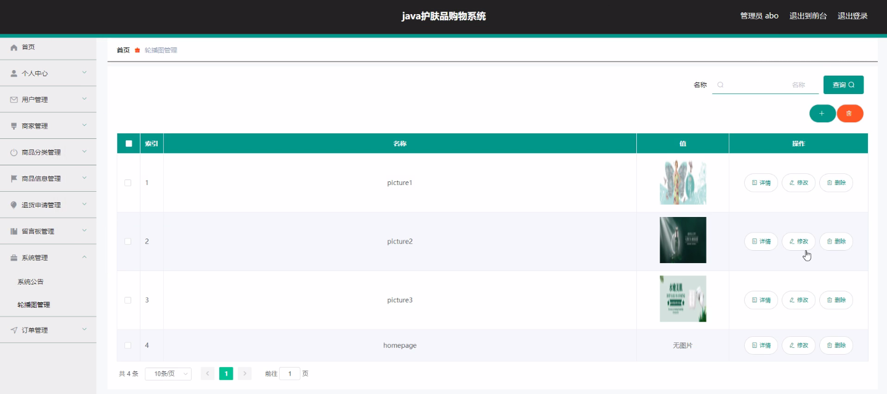
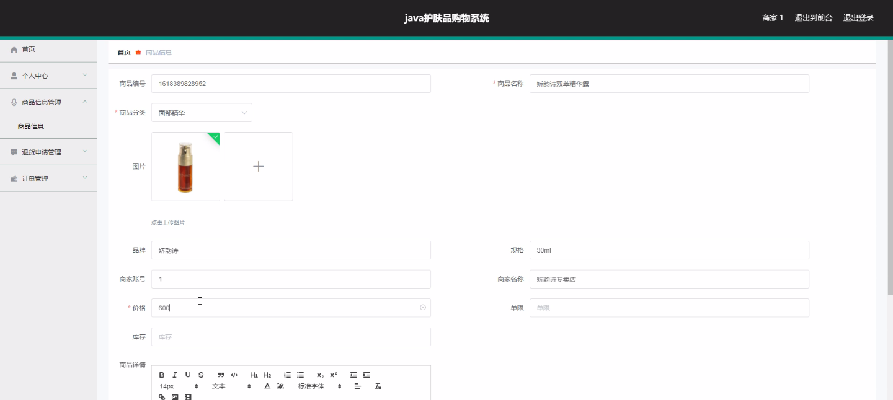
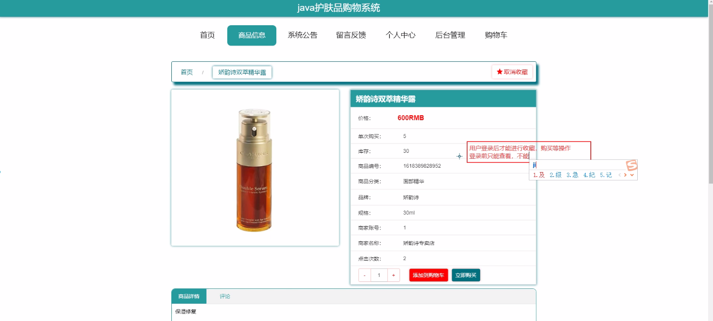
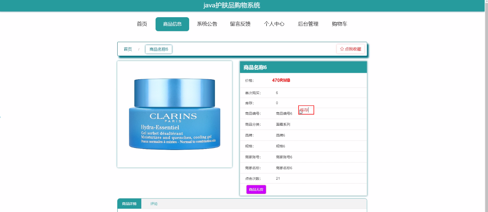
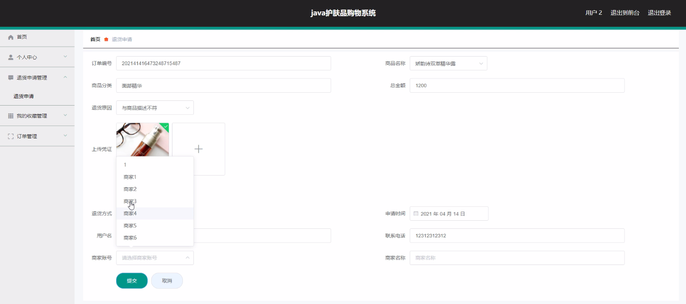

****本项目包含程序+源码+数据库+LW+调试部署环境，文末可获取一份本项目的java源码和数据库参考。****

## ******开题报告******

研究背景：
随着社会经济的发展和人们生活水平的提高，人们对于护肤品的需求也越来越大。然而，在众多的护肤品品牌和产品中，消费者往往面临选择困难和信息不对称的问题。同时，传统的线下购物方式存在时间成本高、商品选择有限等问题，使得消费者无法充分满足自己的需求。因此，建立一个便捷、高效的护肤品购物系统具有重要的现实意义。

研究意义：
护肤品购物系统的建立将为消费者提供一个方便快捷的购物平台，使得消费者能够更好地了解和选择适合自己的护肤品产品。同时，对于商家来说，该系统将提供一个良好的销售渠道，帮助商家拓展市场并增加销售额。此外，通过对用户行为数据的分析，可以为商家提供精准的营销策略，提高市场竞争力。

研究目的：
本研究旨在设计和开发一套完整的护肤品购物系统，以满足消费者的个性化需求，并提供全方位的服务。具体目标包括但不限于：提供丰富的护肤品分类和商品信息，实现用户注册、登录和个人信息管理功能，支持用户浏览、搜索和购买商品，提供退货申请和售后服务等。

研究内容： 根据系统功能需求，本研究将主要涉及以下几个方面的内容：

  1. 用户管理：设计用户注册、登录和个人信息管理模块，确保用户能够方便地使用系统，并保护用户的隐私信息安全。

  2. 商家管理：建立商家入驻和认证机制，确保商家合法经营，并提供商家店铺管理功能，使得商家能够方便地发布和管理商品信息。

  3. 商品分类与信息管理：设计商品分类体系，使得消费者能够快速准确地找到所需商品；同时，建立商品信息管理模块，确保商品信息的准确性和完整性。

  4. 购物流程：实现用户浏览、搜索和购买商品的功能，提供购物车和订单管理功能，以及多种支付方式的支持，保证购物流程的顺畅和安全。

  5. 售后服务与退货申请：建立售后服务模块，提供退货申请和处理功能，确保消费者在购物过程中的权益得到保障。

拟解决的主要问题：
本研究旨在解决护肤品购物过程中存在的信息不对称、选择困难、时间成本高等问题。通过建立一个全面的护肤品购物系统，消费者能够更加方便地了解和选择适合自己的产品，同时商家也能够提供更好的服务和营销策略，实现双赢的局面。

研究方案和预期成果：
本研究将采用软件工程的方法，结合用户需求分析和系统设计原则，进行系统的开发和测试。预期成果包括一个完整的护肤品购物系统，具备用户管理、商家管理、商品分类与信息管理、购物流程、售后服务与退货申请等功能模块，并能够满足用户个性化需求。同时，预计该系统能够提高消费者的购物体验，促进商家的销售增长，为护肤品行业的发展做出积极贡献。

进度安排：

2022年9月至10月：需求分析和规划，进行用户需求调研和分析，确定系统功能和目标。

2022年11月至2023年1月：系统设计和开发，完成系统架构设计和技术选型，并开始编写代码。

2023年2月至3月：测试和优化，进行单元测试和集成测试，修复问题并优化系统性能。

2023年4月至5月：文档编写和培训，编写用户手册和系统文档，并进行相关人员的培训。

2023年5月：上线部署和维护，将系统部署到生产环境中，并定期进行维护和升级。

参考文献：

[1]王振华.SpringBoot在教学效果评估系统中的应用[J].电子技术,2023,(05):67-69.

[2]王明泉.基于SpringBoot远程热部署的探索和应用[J].信息与电脑(理论版),2023,(07):1-4.

[3]王亚东,李晓霞,陈强强,剡美娜.基于SpringBoot的需求发布平台设计[J].信息与电脑(理论版),2023,(01):105-107.

[4]陈新府豪.基于SpringBoot和Vue框架的创新方法推理系统的设计与实现[D].导师：黄静.浙江理工大学,2022.

[5]霍福华,韩慧.基于SpringBoot微服务架构下前后端分离的MVVM模型[J].电子技术与软件工程,2022,(01):73-76.

[6]韩策,张娜,王松亭,张凯,何方,袁峰.SpringBoot OPC客户端设计与研究[J].电子世界,2021,(19):25-26.

****以上是本项目程序开发之前开题报告内容，最终成品以下面界面为准，大家可以酌情参考使用。要源码参考请在文末进行获取！！****

## ******本项目的界面展示******

