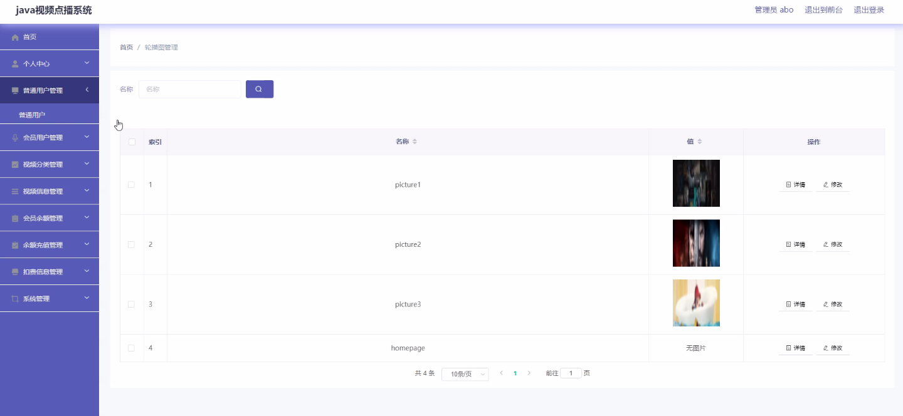
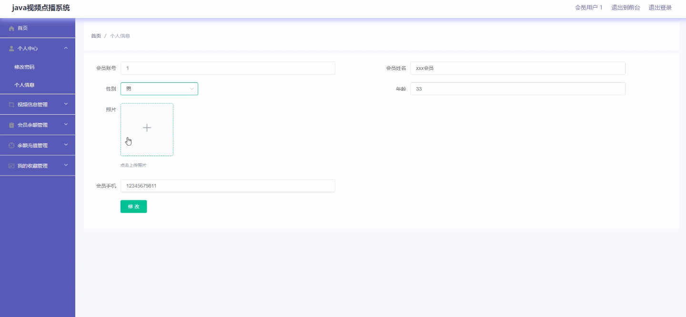
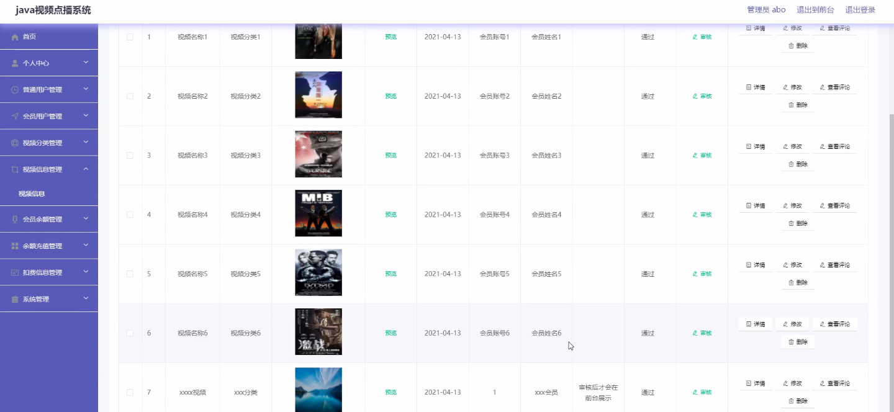
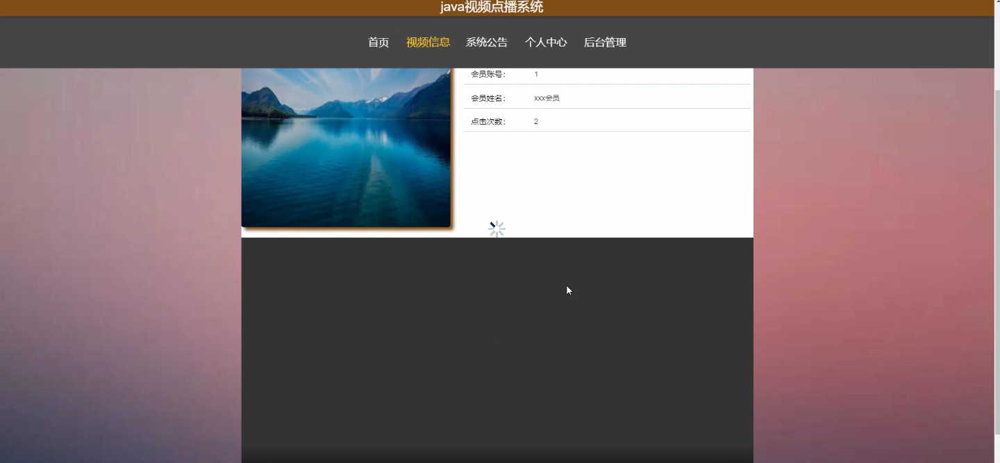
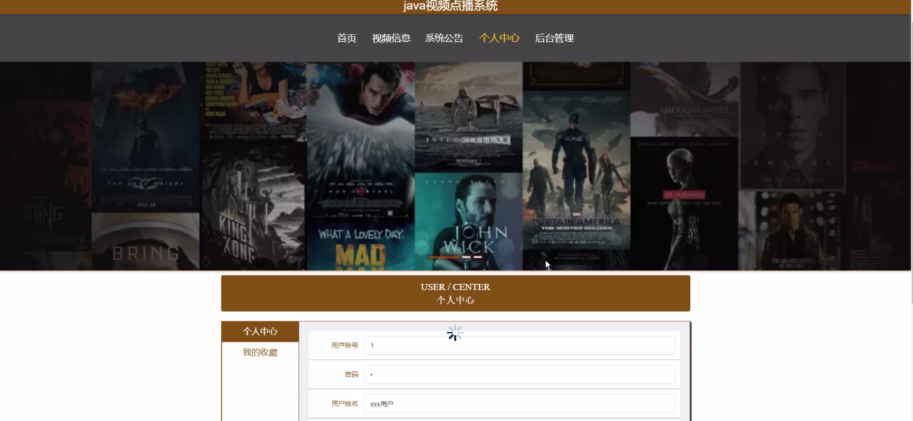

****本项目包含程序+源码+数据库+LW+调试部署环境，文末可获取一份本项目的java源码和数据库参考。****

## ******开题报告******

研究背景：
随着互联网的快速发展和智能手机的普及，视频点播系统成为了人们获取信息和娱乐的重要途径之一。传统的电视节目和电影观看方式已经无法满足人们个性化、多样化的需求。因此，设计一个高效、便捷、个性化的视频点播系统具有重要意义。

研究意义：
视频点播系统的出现为用户提供了更加灵活自由的观看体验，用户可以根据自己的兴趣和时间安排选择观看内容。同时，对于商家来说，视频点播系统也提供了更广阔的市场和推广渠道。因此，研究视频点播系统的功能和优化方案对于提升用户体验、拓展商家业务具有重要意义。

研究目的：
本研究旨在设计和开发一个功能完善、操作简便的视频点播系统，以满足用户个性化观看需求，并提供便捷的商家管理功能。通过深入研究用户、商家、美食分类、美食信息、订单信息、美食评价、发货信息、收货信息、公告栏、销售统计等系统功能，我们将探索如何优化系统的性能和用户体验，提高系统的稳定性和可用性。

研究内容： 本研究将重点关注以下系统功能：

  1. 用户管理：包括用户注册、登录、个人信息管理等功能，以提供个性化服务。
  2. 商家管理：包括商家入驻、商品发布、订单管理等功能，以满足商家的需求。
  3. 美食分类和美食信息：通过对美食进行分类和详细描述，提供用户浏览和选择的便利。
  4. 订单信息：实现用户下单、支付、取消订单等功能，保证订单的准确性和及时性。
  5. 美食评价：用户可以对所购买的美食进行评价和分享，为其他用户提供参考。
  6. 发货信息和收货信息：确保商品的准时发货和用户的及时收货。
  7. 公告栏：发布系统公告和活动信息，提醒用户和商家最新动态。
  8. 销售统计：对商家的销售情况进行统计和分析，为商家提供经营决策支持。

拟解决的主要问题： 在设计和开发视频点播系统的过程中，我们将重点解决以下问题：

  1. 如何提高系统的响应速度和稳定性，以确保用户流畅的观看体验。
  2. 如何设计合理的用户界面和交互方式，提供简单易用的操作体验。
  3. 如何保证用户信息和交易数据的安全性，防止信息泄露和欺诈行为。
  4. 如何优化系统的推荐算法，提供个性化的内容推荐服务。
  5. 如何实现商家管理功能的灵活性和便捷性，满足商家的不同需求。

研究方案和预期成果：
本研究将采用软件工程的方法和技术，结合用户需求和市场趋势，设计和开发一个高效、稳定、易用的视频点播系统。通过系统测试和用户反馈，不断改进和优化系统的功能和性能。预期成果包括：一个完善的视频点播系统，具备用户管理、商家管理、美食分类、美食信息、订单信息、美食评价、发货信息、收货信息、公告栏、销售统计等功能，并能够提供个性化的观看体验和便捷的商家管理功能。

进度安排：

2022年9月至10月：需求分析和规划，进行用户需求调研和分析，确定系统功能和目标。

2022年11月至2023年1月：系统设计和开发，完成系统架构设计和技术选型，并开始编写代码。

2023年2月至3月：测试和优化，进行单元测试和集成测试，修复问题并优化系统性能。

2023年4月至5月：文档编写和培训，编写用户手册和系统文档，并进行相关人员的培训。

2023年5月：上线部署和维护，将系统部署到生产环境中，并定期进行维护和升级。

参考文献：

[1]王振华.SpringBoot在教学效果评估系统中的应用[J].电子技术,2023,(05):67-69.

[2]王明泉.基于SpringBoot远程热部署的探索和应用[J].信息与电脑(理论版),2023,(07):1-4.

[3]王亚东,李晓霞,陈强强,剡美娜.基于SpringBoot的需求发布平台设计[J].信息与电脑(理论版),2023,(01):105-107.

[4]陈新府豪.基于SpringBoot和Vue框架的创新方法推理系统的设计与实现[D].导师：黄静.浙江理工大学,2022.

[5]霍福华,韩慧.基于SpringBoot微服务架构下前后端分离的MVVM模型[J].电子技术与软件工程,2022,(01):73-76.

[6]韩策,张娜,王松亭,张凯,何方,袁峰.SpringBoot OPC客户端设计与研究[J].电子世界,2021,(19):25-26.

****以上是本项目程序开发之前开题报告内容，最终成品以下面界面为准，大家可以酌情参考使用。要源码参考请在文末进行获取！！****

## ******本项目的界面展示******

