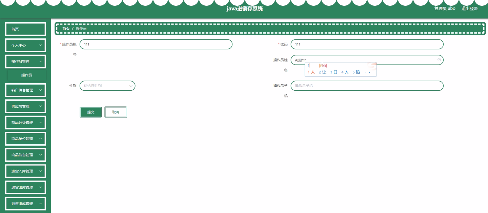
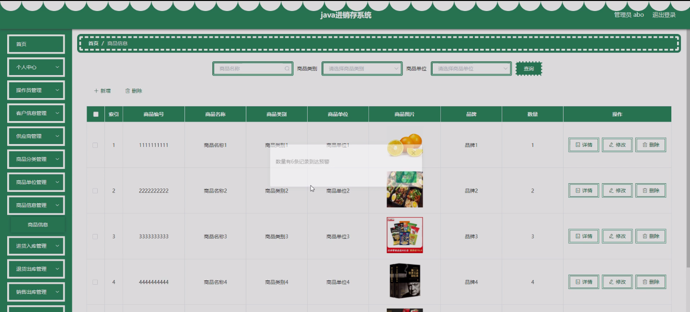
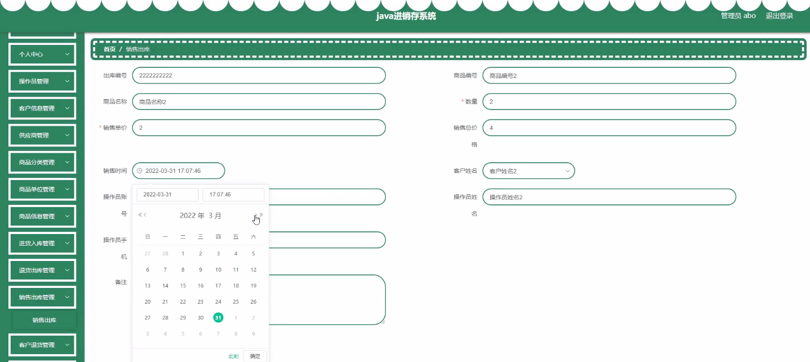
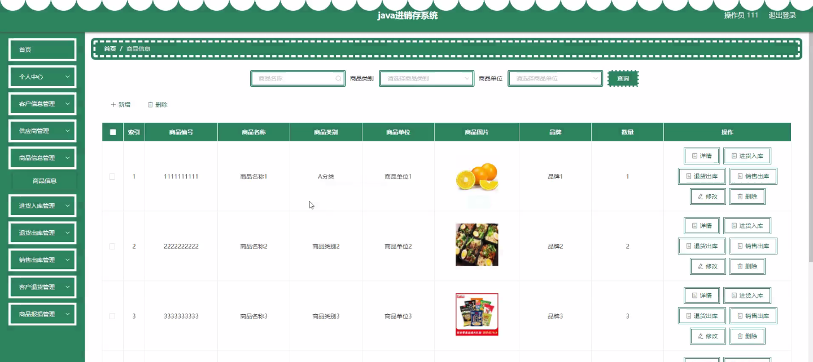
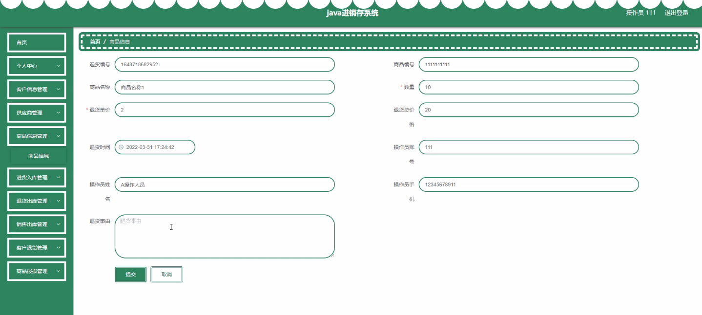
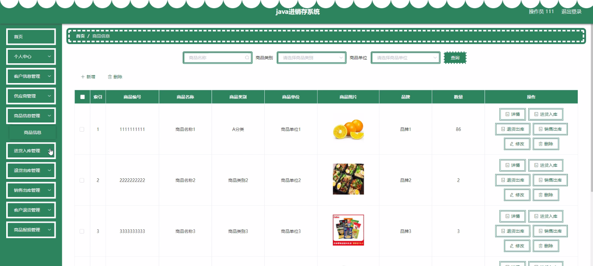
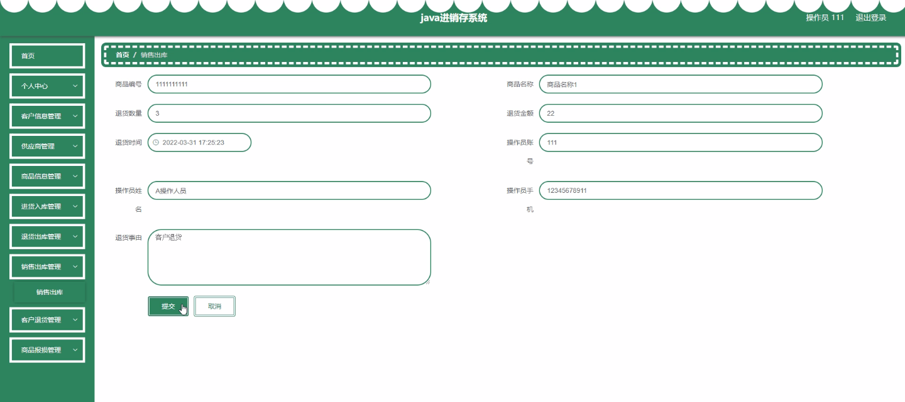

****本项目包含程序+源码+数据库+LW+调试部署环境，文末可获取一份本项目的java源码和数据库参考。****

## ******开题报告******

研究背景：
随着信息技术的快速发展和企业规模的不断扩大，传统的手工记录和管理方式已经无法满足企业日益复杂的进销存需求。为了提高企业的运营效率、降低成本、增强竞争力，许多企业开始引入进销存系统来管理和控制物流、库存和销售等关键业务流程。然而，目前市场上的进销存系统存在一些问题，如功能不完善、操作复杂、数据不准确等，因此有必要进行研究，以开发出更加高效、稳定和可靠的进销存系统。

研究意义：
研究和开发一套功能完备、易用性强的进销存系统对于企业的发展具有重要意义。首先，通过引入进销存系统，企业可以实现对物流、库存和销售等关键业务流程的精细化管理，提高业务处理的效率和准确性。其次，进销存系统可以帮助企业实时监控库存情况，避免库存积压或缺货的情况发生，从而提高客户满意度和销售额。此外，进销存系统还可以为企业提供详尽的数据分析和报表功能，帮助企业进行决策和制定战略，提升企业的竞争力。

研究目的：
本研究旨在开发一套高效、稳定和可靠的进销存系统，以满足企业日益复杂的进销存需求。具体目标包括：提供全面且易用的操作界面，使用户能够方便地进行进货入库、退货出库、销售出库等操作；建立完善的客户信息、供应商信息、商品分类、商品单位和商品信息等数据库，实现对关键数据的准确记录和管理；实现库存的实时监控和预警功能，避免库存积压或缺货的情况发生；提供强大的数据分析和报表功能，帮助企业进行决策和制定战略。

研究内容： 本研究的主要内容将围绕进销存系统的各项功能展开，包括但不限于以下方面：

  1. 操作员管理：设计和实现用户权限管理模块，确保不同角色的操作员有不同的权限和操作范围。
  2. 客户信息管理：建立客户信息数据库，包括客户基本信息、联系方式、购买记录等，方便企业与客户进行沟通和管理。
  3. 供应商管理：建立供应商信息数据库，包括供应商基本信息、联系方式、供货记录等，方便企业与供应商进行合作和采购管理。
  4. 商品分类和单位管理：设计和实现商品分类和单位管理模块，方便企业对商品进行分类和计量单位的统一管理。
  5. 商品信息管理：建立商品信息数据库，包括商品基本信息、进货价格、销售价格、库存数量等，方便企业对商品进行准确的记录和管理。
  6. 进货入库和退货出库：设计和实现进货入库和退货出库模块，方便企业进行进货和退货操作，并及时更新库存数量。
  7. 销售出库和客户退货：设计和实现销售出库和客户退货模块，方便企业进行销售和退货操作，并及时更新库存数量。
  8. 商品报损管理：设计和实现商品报损管理模块，方便企业对商品报损情况进行记录和处理。

拟解决的主要问题： 在开发进销存系统的过程中，我们将重点解决以下问题：

  1. 系统功能不完善：通过细致的需求分析和功能设计，确保系统能够满足企业的各项进销存需求。
  2. 操作复杂性：通过优化界面设计和交互方式，使系统操作更加简单、直观和易用。
  3. 数据准确性：通过建立完善的数据管理机制和校验规则，确保系统中的数据准确无误。
  4. 系统稳定性：通过合理的架构设计和技术选型，确保系统能够稳定运行，并具备一定的容错和恢复能力。

研究方案和预期成果：
本研究将采用软件开发的常用方法和技术，包括需求分析、系统设计、编码实现、测试验证等环节。预期成果包括一套功能完备、易用性强的进销存系统原型，并进行实际案例验证。通过该系统的应用，预期能够提高企业的运营效率、降低成本、增强竞争力，为企业的发展提供有力支持。

进度安排：

2022年9月至10月：开题报告编写和提交，完成开题报告的撰写并提交给指导教师进行审核。

2022年11月至2023年1月：系统设计和开发，根据开题报告的要求，进行系统设计和编码工作。

2023年2月至3月：论文撰写和初稿完成，开始撰写论文，并在这个阶段完成论文的初稿。

2023年4月至5月：论文修改和最终定稿，根据指导教师的意见对论文进行修改，并完成最终的定稿。

2023年5月：论文答辩和提交，参加论文答辩并根据答辩结果进行修改，最后将论文提交给学院或学校。

参考文献：

[1]喻佳,吴丹新.基于SpringBoot的Web快速开发框架[J].电脑编程技巧与维护,2021,(09):31-33.

[2]李鹏.基于SpringBoot快速开发平台的实现[J].电子技术与软件工程,2021,(12):36-37.

[3]叶开平,蔡维晟,陈家敏,邓斯妮.基于SpringBoot的综测可视化管理系统的研究与设计[J].电脑知识与技术,2021,(12):100-104.

[4]江健锋,徐振平.Springboot最小系统的设计与实现[J].电脑知识与技术,2021,(04):62-63.

[5]赵炯,司圣杰,周奇才,熊肖磊.通用信息获取系统设计与实现[J].起重运输机械,2020,(16):89-97.

[6]吴英宾.一种内外网数据交互系统的设计与实现[J].软件工程,2020,(08):25-27.

****以上是本项目程序开发之前开题报告内容，最终成品以下面界面为准，大家可以酌情参考使用。要源码参考请在文末进行获取！！****

## ******本项目的界面展示******

