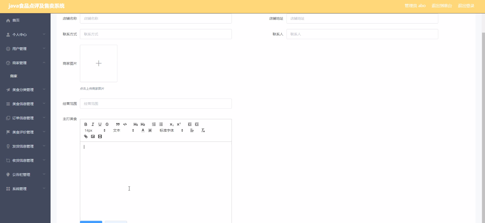
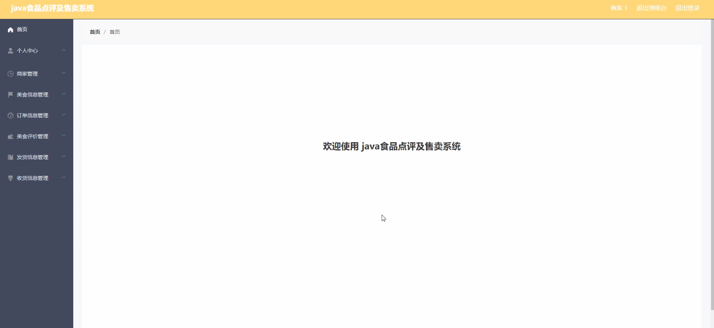
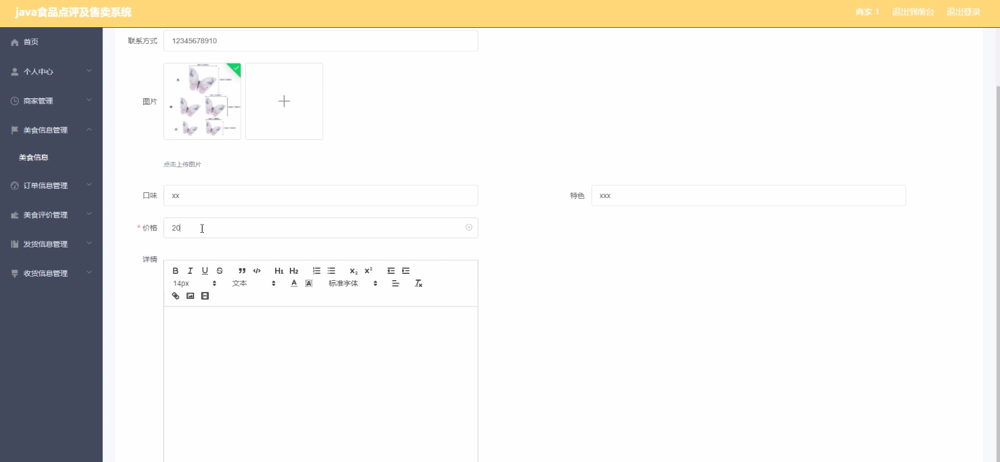
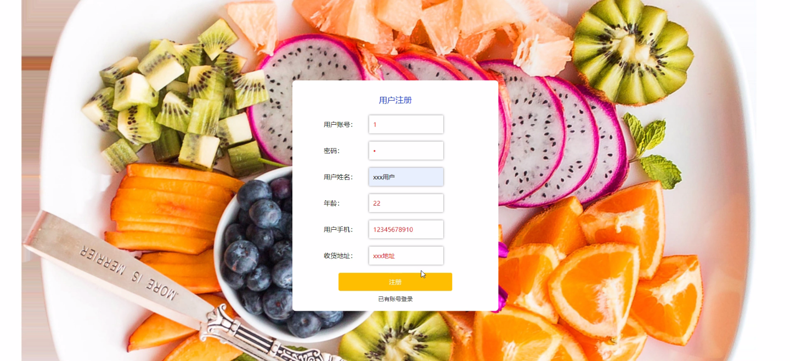
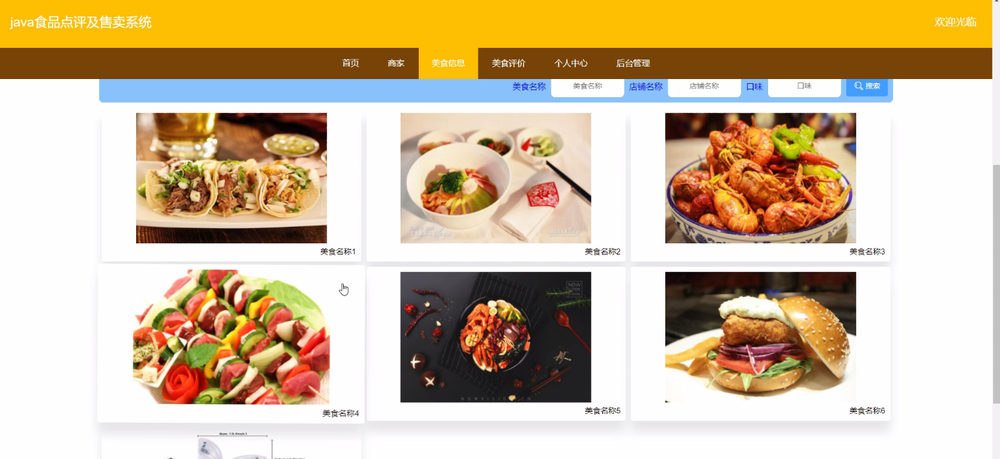
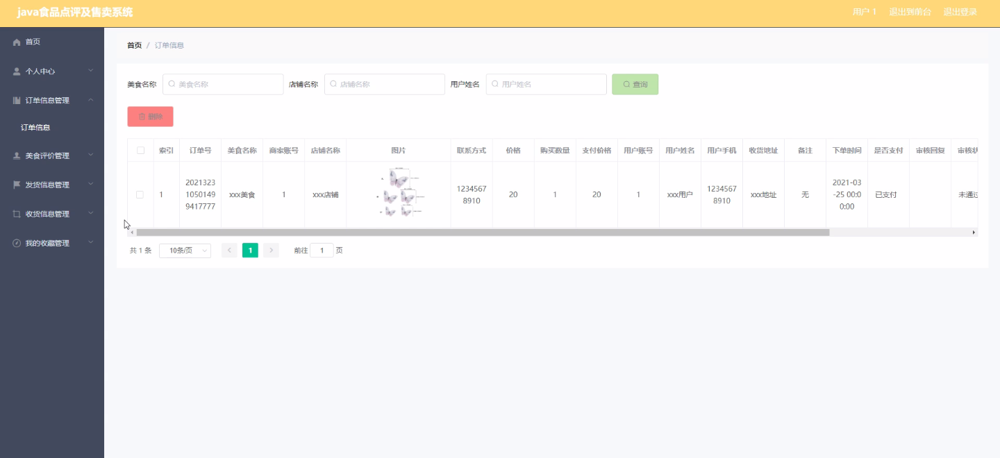
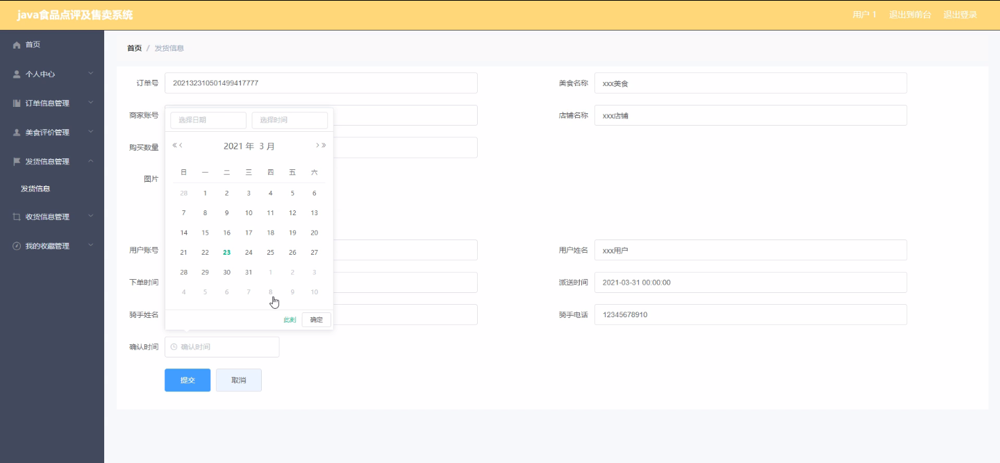

****本项目包含程序+源码+数据库+LW+调试部署环境，文末可获取一份本项目的java源码和数据库参考。****

## ******开题报告******

研究背景：
随着互联网的快速发展和移动互联网的普及，食品点评及售卖系统在现代社会中扮演着重要的角色。传统的食品点评和售卖方式已经无法满足人们对于便捷、高效、个性化服务的需求。因此，开发一种全新的食品点评及售卖系统具有重要的研究意义和应用价值。

研究意义：
食品点评及售卖系统的出现，可以为用户提供更加方便快捷的美食选择和购买渠道，同时也能够帮助商家实现线上销售和推广，提升其市场竞争力。此外，通过系统收集和分析用户的点评和评价，可以为其他用户提供参考，提高用户体验和满意度。因此，研究食品点评及售卖系统对于促进食品行业的发展和提升用户消费体验具有重要的意义。

研究目的：
本研究旨在设计和开发一种功能完善、操作简便的食品点评及售卖系统，以满足用户对于美食选择和购买的需求，并提供准确、可靠的美食信息和点评。同时，通过系统的销售统计和数据分析，帮助商家了解市场需求和用户喜好，提高销售效率和盈利能力。通过研究食品点评及售卖系统，旨在推动食品行业的数字化转型，提升整个行业的竞争力和发展水平。

研究内容： 本研究将围绕食品点评及售卖系统的功能展开，主要包括以下内容：

  1. 用户管理：设计用户注册、登录、个人信息管理等功能，实现用户身份识别和个性化服务。
  2. 商家管理：建立商家入驻机制，管理商家信息、商品发布、订单处理等功能，促进商家线上销售和推广。
  3. 美食分类与信息管理：构建美食分类体系，收集并管理美食信息，为用户提供准确、丰富的美食选择。
  4. 订单信息管理：设计订单生成、支付、物流跟踪等功能，保障用户购买体验和商家订单处理效率。
  5. 美食评价与点评：搭建用户点评平台，收集用户对美食的评价和意见，为其他用户提供参考。
  6. 发货信息与收货信息管理：管理商家发货和用户收货信息，确保商品准时送达和用户满意度。
  7. 公告栏管理：发布系统公告、促销活动等信息，提升用户参与度和商家宣传效果。
  8. 销售统计与数据分析：通过对系统数据的收集和分析，为商家提供销售统计和市场需求预测，帮助其制定营销策略。

拟解决的主要问题：
本研究旨在解决传统食品点评和售卖方式存在的诸多问题，包括信息不准确、购买流程繁琐、美食选择有限、用户体验差等。通过设计和开发一种全新的食品点评及售卖系统，可以提供准确、便捷的美食选择和购买渠道，改善用户体验，同时也能够帮助商家实现线上销售和推广，提高其市场竞争力。

研究方案和预期成果：
本研究将采用软件工程的方法，结合用户需求调研和技术实现，设计和开发一种功能完善、操作简便的食品点评及售卖系统。预期成果包括系统原型设计、功能模块实现、用户界面优化等方面。通过系统的测试和验证，预计可以提供用户满意的美食选择和购买体验，帮助商家实现线上销售和推广，提高整个食品行业的竞争力和发展水平。

进度安排：

2022年9月至10月：需求分析和规划，明确系统功能和目标，制定项目计划。

2022年11月至2023年1月：系统设计和编码，完成详细的系统设计并开始编写代码。

2023年2月至3月：用户界面开发和数据库开发，开发用户友好的界面和设计数据库结构。

2023年4月至5月：功能测试、文档编写和上线部署，对系统进行全面的功能测试并编写用户手册。

2023年5月：维护和升级，定期对系统进行维护和升级，修复bug和添加新功能。

参考文献：

[1]邱小群,邓丽艳,陈海潮.基于B/S的信息管理系统设计和实现[J].信息与电脑(理论版),2022,(20):146-148.

[2]谢霜.基于Java技术的网络管理体系结构的应用[J].网络安全技术与应用,2022,(10):14-15.

[3]宋锦华.高职院校Java程序设计课程改革研究[J].科技视界,2022,(20):133-135.

[4]曹嵩彭,王鹏宇.浅析Java语言在软件开发中的应用[J].信息记录材料,2022,(03):114-116.

[5]朱澈,余俊达.武汉东湖学院.基于Java的软硬件信息管理系统V1.0[Z].项目立项编号.鉴定单位.鉴定日期:

****以上是本项目程序开发之前开题报告内容，最终成品以下面界面为准，大家可以酌情参考使用。要源码参考请在文末进行获取！！****

## ******本项目的界面展示******

