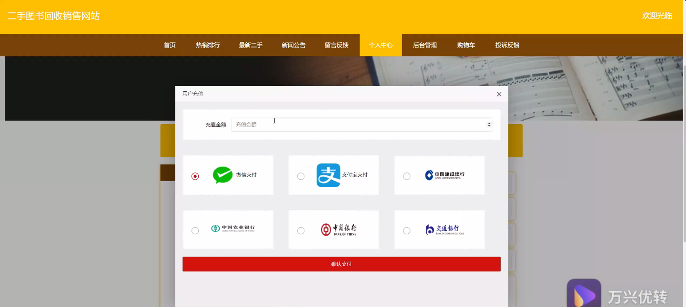
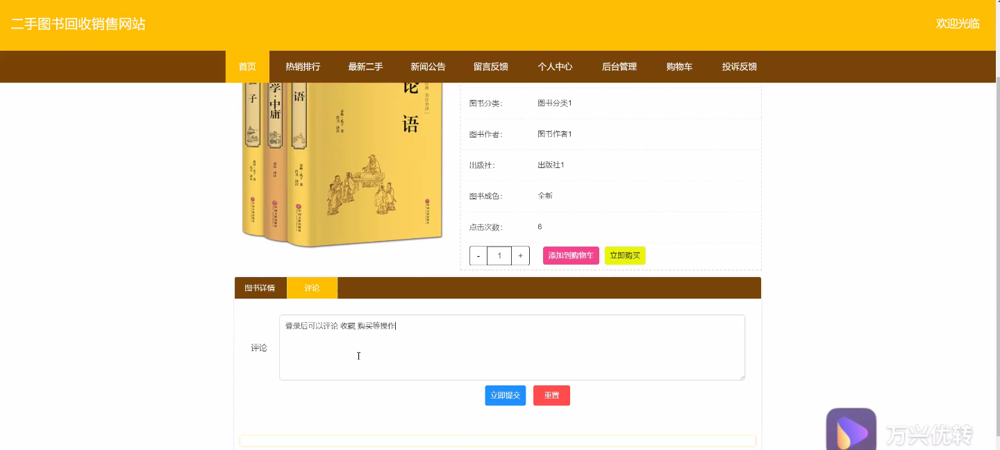
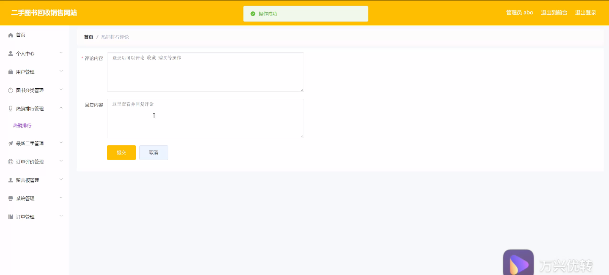
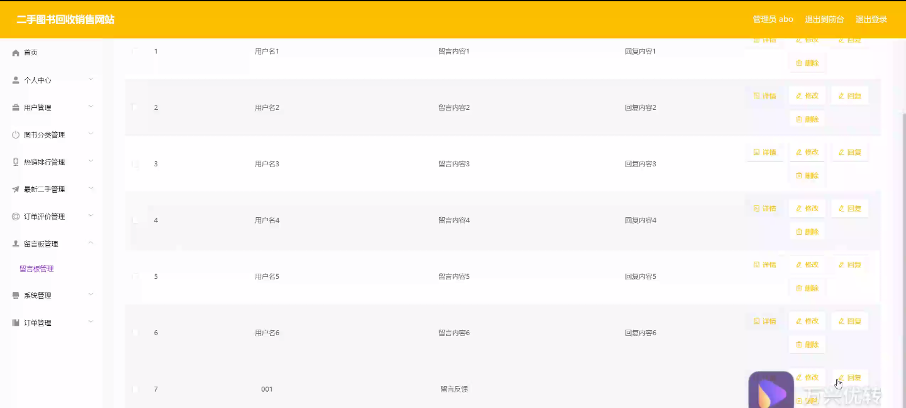
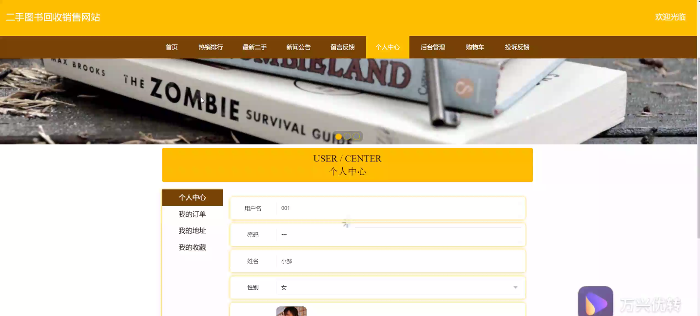

****本项目包含程序+源码+数据库+LW+调试部署环境，文末可获取一份本项目的java源码和数据库参考。****

## ******开题报告******

研究背景：
随着互联网的快速发展，二手交易平台逐渐成为人们购买和销售商品的主要方式之一。在这个背景下，二手图书回收销售网站应运而生。这些网站通过提供一个集中的平台，方便用户将自己不再需要的二手图书出售给有需求的人，从而实现资源的再利用和循环利用。然而，目前市场上的二手图书回收销售网站存在一些问题，如信息不对称、信任度低、交易风险大等，因此有必要进行相关研究，以改进现有的二手图书回收销售网站。

研究意义：
二手图书回收销售网站的研究具有重要的理论和实践意义。首先，通过深入研究和分析二手图书回收销售网站的运营模式和用户行为，可以帮助了解二手图书市场的特点和规律，为相关政策的制定提供参考。其次，通过改进二手图书回收销售网站的功能和服务，可以提高用户的满意度和信任度，促进二手图书市场的健康发展。最后，二手图书回收销售网站的研究还可以为其他类似的二手交易平台提供借鉴和参考，推动共享经济的发展。

研究目的：
本研究旨在通过对二手图书回收销售网站进行深入研究，分析其运营模式、用户行为和市场特点，以及存在的问题和挑战。基于此，我们将探索如何改进现有的二手图书回收销售网站，提高用户体验和交易效率，降低交易风险，促进二手图书市场的良性循环和可持续发展。

研究内容： 本研究的主要内容包括以下几个方面：

  1. 用户：研究用户在二手图书回收销售网站上的行为特点、需求和偏好，分析用户参与二手图书交易的动机和障碍，探索如何提高用户的参与度和满意度。

  2. 图书分类：研究如何设计合理的图书分类系统，使用户能够快速找到自己需要的图书，并提供个性化的推荐服务，增加用户的购买欲望和信任度。

  3. 热销排行：研究如何根据用户的购买行为和评价数据，实时更新和展示热销图书排行榜，帮助用户了解市场趋势和热门图书，提高购买决策的准确性。

  4. 最新二手：研究如何及时获取和展示最新上架的二手图书信息，提供给用户一个快速浏览和筛选的界面，方便用户找到自己感兴趣的图书。

  5. 订单评价：研究如何建立一个有效的订单评价系统，鼓励用户对交易进行评价和反馈，增加交易的透明度和可信度，为其他用户提供参考。

拟解决的主要问题： 在二手图书回收销售网站中，存在信息不对称、信任度低、交易风险大等问题。本研究将重点解决以下几个主要问题：

  1. 如何提高用户对二手图书回收销售网站的信任度？

  2. 如何降低用户参与二手图书交易的风险？

  3. 如何改进图书分类系统，提高用户的搜索和筛选效果？

  4. 如何设计有效的推荐算法，提高用户的购买欲望和满意度？

  5. 如何建立一个可靠的订单评价系统，增加交易的透明度和可信度？

研究方案和预期成果：
本研究将采用综合性的研究方法，包括文献调研、数据分析、用户调查等。通过对二手图书回收销售网站的运营模式和用户行为进行深入研究，提出相应的改进方案，并设计和实现相应的系统功能和服务。预期的研究成果包括优化的图书分类系统、个性化的推荐算法、可靠的订单评价系统等，以及相关的理论研究成果和实践经验。这些成果将为二手图书回收销售网站的发展和其他类似平台的研究提供参考和借鉴。

进度安排：

2022年9月至10月：需求分析和规划，进行用户需求调研和分析，确定系统功能和目标。

2022年11月至2023年1月：系统设计和开发，完成系统架构设计和技术选型，并开始编写代码。

2023年2月至3月：测试和优化，进行单元测试和集成测试，修复问题并优化系统性能。

2023年4月至5月：文档编写和培训，编写用户手册和系统文档，并进行相关人员的培训。

2023年5月：上线部署和维护，将系统部署到生产环境中，并定期进行维护和升级。

参考文献：

[1]王振华.SpringBoot在教学效果评估系统中的应用[J].电子技术,2023,(05):67-69.

[2]王明泉.基于SpringBoot远程热部署的探索和应用[J].信息与电脑(理论版),2023,(07):1-4.

[3]王亚东,李晓霞,陈强强,剡美娜.基于SpringBoot的需求发布平台设计[J].信息与电脑(理论版),2023,(01):105-107.

[4]陈新府豪.基于SpringBoot和Vue框架的创新方法推理系统的设计与实现[D].导师：黄静.浙江理工大学,2022.

[5]霍福华,韩慧.基于SpringBoot微服务架构下前后端分离的MVVM模型[J].电子技术与软件工程,2022,(01):73-76.

[6]韩策,张娜,王松亭,张凯,何方,袁峰.SpringBoot OPC客户端设计与研究[J].电子世界,2021,(19):25-26.

****以上是本项目程序开发之前开题报告内容，最终成品以下面界面为准，大家可以酌情参考使用。要源码参考请在文末进行获取！！****

## ******本项目的界面展示******

