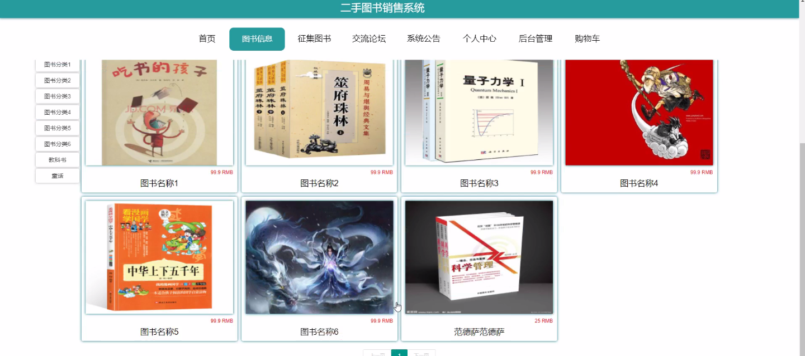
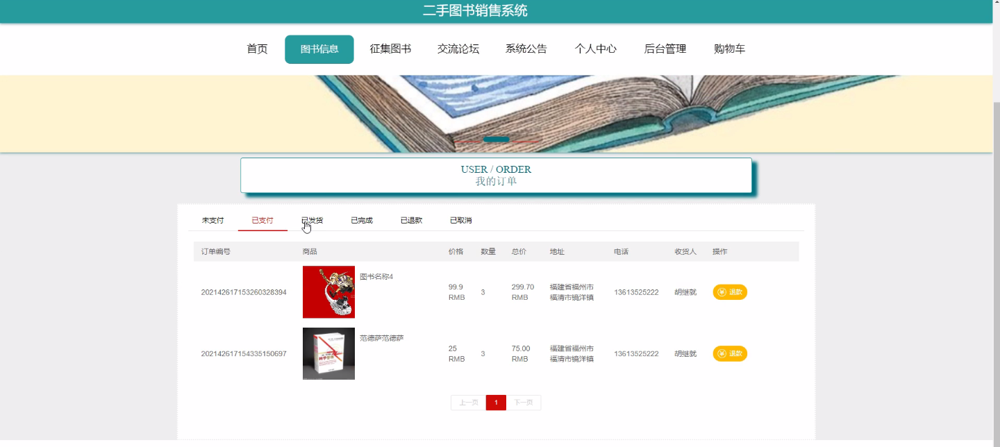
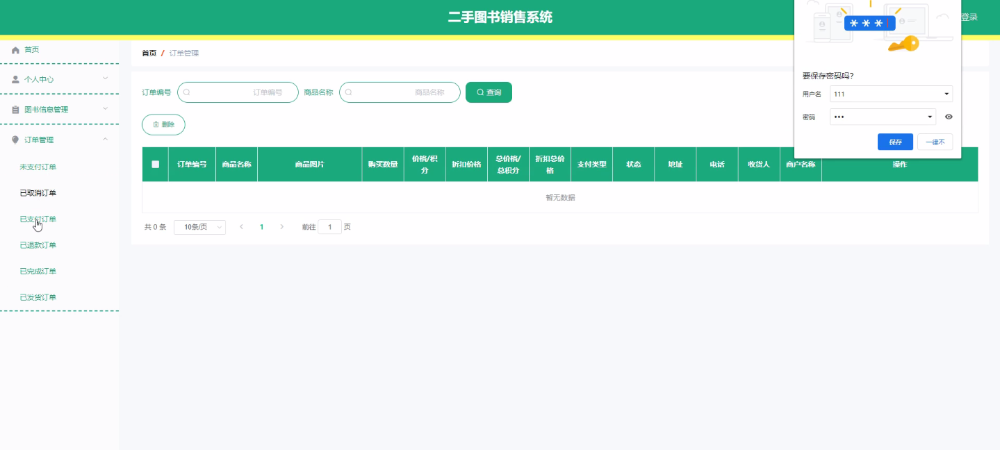
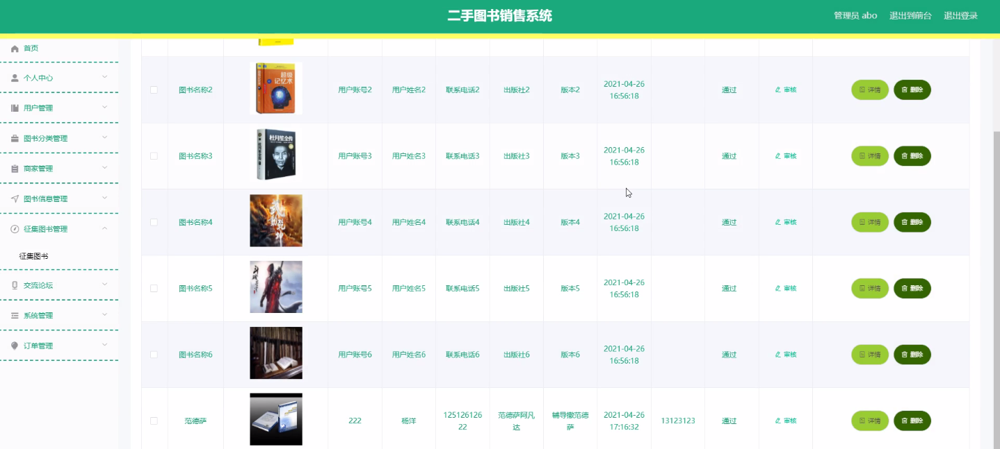

****本项目包含程序+源码+数据库+LW+调试部署环境，文末可获取一份本项目的java源码和数据库参考。****

## ******开题报告******

研究背景：
随着互联网的快速发展和普及，二手图书市场逐渐兴起并迅速扩大。越来越多的人选择购买二手图书，不仅可以节省开支，还能够享受到更广泛的阅读资源。然而，当前的二手图书销售系统存在一些问题，如信息不对称、信任度低、交易风险等，这给用户带来了一定的困扰。

研究意义：
针对当前二手图书销售系统存在的问题，开发一个高效、安全、可信赖的二手图书销售系统具有重要的实际意义。通过构建一个完善的系统，可以提供给用户一个便捷的平台，使他们能够方便地浏览、购买和出售二手图书。同时，这也有助于促进二手图书市场的健康发展，提升整个行业的服务质量和用户体验。

研究目的：
本研究旨在设计和开发一个二手图书销售系统，以解决当前系统存在的问题，并提供更好的用户体验。具体目标包括但不限于：提供准确、全面的图书信息；增加用户之间的互动和信任度；降低交易风险；提供便捷的图书分类和搜索功能等。

研究内容： 本研究将围绕二手图书销售系统的功能展开，主要包括以下几个方面：

  1. 用户管理：设计用户注册、登录、个人信息管理等功能，以确保用户身份的真实性和安全性。

  2. 图书分类：建立一套完善的图书分类体系，使用户能够快速准确地找到自己所需的图书。

  3. 商家管理：为商家提供一个简单高效的入驻平台，管理商家信息和店铺，增加商家之间的竞争和选择空间。

  4. 图书信息管理：构建一个可靠的图书信息数据库，包括图书名称、作者、出版社、价格等信息，确保信息的准确性和完整性。

  5. 征集图书功能：允许用户发布征集图书的信息，吸引其他用户出售自己所需的图书。

拟解决的主要问题：
在当前的二手图书销售系统中，存在信息不对称、信任度低、交易风险等问题。本研究旨在通过设计和开发一个高效、安全、可信赖的二手图书销售系统，解决这些问题。具体而言，我们将通过提供准确、全面的图书信息、增加用户之间的互动和信任度、降低交易风险等方式来解决这些问题。

研究方案和预期成果：
本研究将采用系统开发的方法，包括需求分析、系统设计、编码实现和系统测试等步骤。通过调研市场需求和用户反馈，结合技术手段和实际情况，设计和开发一个功能完善、易于使用的二手图书销售系统。

预期成果包括但不限于：提供一个用户友好的界面，方便用户进行图书浏览、购买和出售；提供准确、全面的图书信息，满足用户的各种需求；增加用户之间的互动和信任度，促进二手图书市场的良性发展；降低交易风险，保障用户的权益和利益。

进度安排：

2022年9月至10月：开题报告编写和提交，完成开题报告的撰写并提交给指导教师进行审核。

2022年11月至2023年1月：系统设计和开发，根据开题报告的要求，进行系统设计和编码工作。

2023年2月至3月：论文撰写和初稿完成，开始撰写论文，并在这个阶段完成论文的初稿。

2023年4月至5月：论文修改和最终定稿，根据指导教师的意见对论文进行修改，并完成最终的定稿。

2023年5月：论文答辩和提交，参加论文答辩并根据答辩结果进行修改，最后将论文提交给学院或学校。

参考文献：

[1]喻佳,吴丹新.基于SpringBoot的Web快速开发框架[J].电脑编程技巧与维护,2021,(09):31-33.

[2]李鹏.基于SpringBoot快速开发平台的实现[J].电子技术与软件工程,2021,(12):36-37.

[3]叶开平,蔡维晟,陈家敏,邓斯妮.基于SpringBoot的综测可视化管理系统的研究与设计[J].电脑知识与技术,2021,(12):100-104.

[4]江健锋,徐振平.Springboot最小系统的设计与实现[J].电脑知识与技术,2021,(04):62-63.

[5]赵炯,司圣杰,周奇才,熊肖磊.通用信息获取系统设计与实现[J].起重运输机械,2020,(16):89-97.

[6]吴英宾.一种内外网数据交互系统的设计与实现[J].软件工程,2020,(08):25-27.

****以上是本项目程序开发之前开题报告内容，最终成品以下面界面为准，大家可以酌情参考使用。要源码参考请在文末进行获取！！****

## ******本项目的界面展示******

