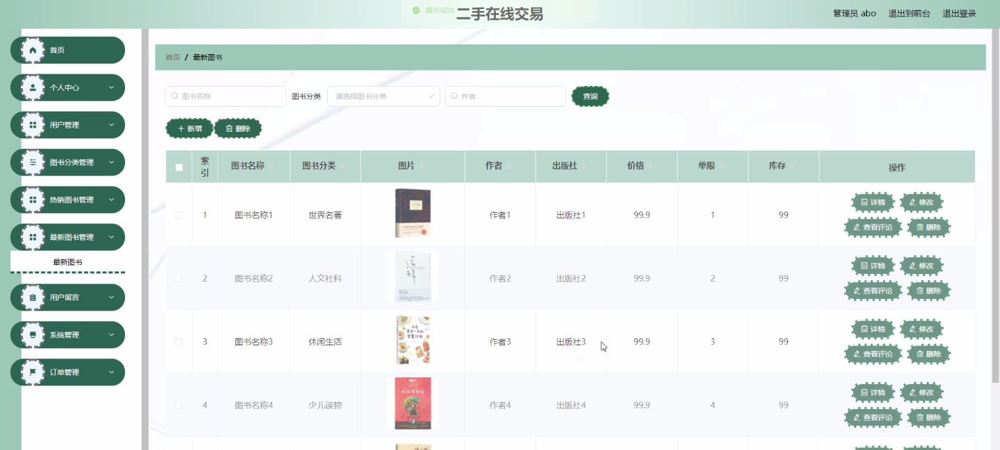

****本项目包含程序+源码+数据库+LW+调试部署环境，文末可获取一份本项目的java源码和数据库参考。****

## ******开题报告******

研究背景：
随着互联网的快速发展和普及，二手在线交易平台逐渐成为人们购买和出售二手物品的主要渠道之一。这种交易方式不仅方便了买卖双方，还有效地促进了资源的再利用和循环利用，对于推动可持续发展具有积极意义。然而，目前存在着一些问题，如信息不对称、交易风险高等，因此有必要对二手在线交易进行深入研究，以提升其效率和安全性。

研究意义：
二手在线交易作为一种新兴的商业模式，对于促进消费升级、拓宽就业岗位、促进经济增长等方面都具有重要意义。通过研究二手在线交易平台的运行机制和用户行为，可以更好地了解消费者需求和市场趋势，为相关企业提供决策参考。同时，优化二手在线交易平台的功能和服务，能够提高用户体验，增加用户粘性，促进平台的可持续发展。

研究目的：
本研究旨在探索二手在线交易平台的运行机制和用户行为，分析其存在的问题和挑战，并提出相应的解决方案，以提升平台的效率和安全性。具体目标包括：1.深入了解二手在线交易平台的发展现状和特点；2.分析用户在平台上的行为特征和需求；3.识别二手在线交易中存在的问题和风险；4.提出针对性的改进措施和策略。

研究内容： 本研究将围绕二手在线交易平台的功能展开，主要包括以下几个方面：

  1. 用户研究：通过调查问卷、访谈等方式，了解用户在二手在线交易平台上的行为特征、购买偏好、信任度等因素，为平台优化提供数据支持。

  2. 图书分类研究：针对图书类别进行深入分析，探索用户对不同类型图书的需求和偏好，为平台提供更精准的推荐服务。

  3. 热销图书研究：通过数据挖掘和分析，识别出当前市场上最受欢迎和热销的图书，为用户提供参考和选择。

  4. 最新图书研究：跟踪图书市场的动态，及时更新平台上的最新图书信息，提供给用户最新的购买选择。

拟解决的主要问题：
在二手在线交易平台中存在着信息不对称、交易风险高等问题。本研究将通过深入分析用户行为和需求，提出相应的改进措施和策略，以解决以下主要问题：1.如何提高用户对平台的信任度；2.如何减少信息不对称，提高交易效率；3.如何降低交易风险，保障用户权益。

研究方案和预期成果：
本研究将采用定量和定性相结合的方法，包括问卷调查、数据分析、实地访谈等。预计通过对二手在线交易平台的深入研究，能够得出一些有针对性的改进建议和策略，提高平台的运营效率和用户满意度。同时，研究成果还可以为相关企业提供参考，促进二手在线交易行业的健康发展。

进度安排：

2022年9月至10月：开题报告编写和提交，完成开题报告的撰写并提交给指导教师进行审核。

2022年11月至2023年1月：系统设计和开发，根据开题报告的要求，进行系统设计和编码工作。

2023年2月至3月：论文撰写和初稿完成，开始撰写论文，并在这个阶段完成论文的初稿。

2023年4月至5月：论文修改和最终定稿，根据指导教师的意见对论文进行修改，并完成最终的定稿。

2023年5月：论文答辩和提交，参加论文答辩并根据答辩结果进行修改，最后将论文提交给学院或学校。

参考文献：

[1]喻佳,吴丹新.基于SpringBoot的Web快速开发框架[J].电脑编程技巧与维护,2021,(09):31-33.

[2]李鹏.基于SpringBoot快速开发平台的实现[J].电子技术与软件工程,2021,(12):36-37.

[3]叶开平,蔡维晟,陈家敏,邓斯妮.基于SpringBoot的综测可视化管理系统的研究与设计[J].电脑知识与技术,2021,(12):100-104.

[4]江健锋,徐振平.Springboot最小系统的设计与实现[J].电脑知识与技术,2021,(04):62-63.

[5]赵炯,司圣杰,周奇才,熊肖磊.通用信息获取系统设计与实现[J].起重运输机械,2020,(16):89-97.

[6]吴英宾.一种内外网数据交互系统的设计与实现[J].软件工程,2020,(08):25-27.

****以上是本项目程序开发之前开题报告内容，最终成品以下面界面为准，大家可以酌情参考使用。要源码参考请在文末进行获取！！****

## ******本项目的界面展示******

