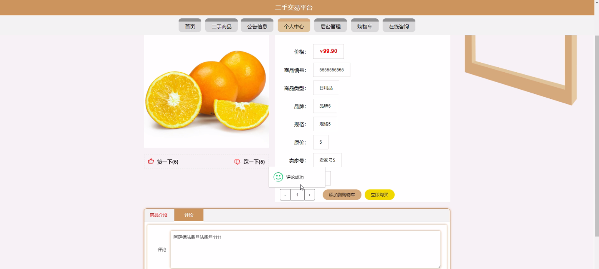

****本项目包含程序+源码+数据库+LW+调试部署环境，文末可获取一份本项目的java源码和数据库参考。****

## ******开题报告******

研究背景：
随着社会的发展和科技的进步，二手交易在校园中变得越来越普遍。许多学生在完成学业后，需要处理一些不再使用的物品，而其他学生则有兴趣购买这些二手商品。然而，在校园内进行二手交易存在一些问题，如信息不对称、安全性不高等。因此，建立一个专门的二手校园交易平台可以有效解决这些问题。

研究意义：
二手校园交易平台的建立具有重要的意义。首先，它可以提供一个便捷的渠道，使学生们能够方便地买卖二手商品，节省时间和精力。其次，通过平台上的交流和评价系统，可以增加交易的透明度和可信度，减少信息不对称带来的风险。此外，通过平台的管理和监管，可以提高交易的安全性，保护用户的权益。最后，二手校园交易平台还可以促进资源的循环利用，减少浪费，对环境保护具有积极作用。

研究目的：
本研究旨在设计和开发一个功能完善、安全可靠的二手校园交易平台，以满足学生们在校园内进行二手交易的需求。通过该平台，学生们可以方便地发布和浏览二手商品信息，与卖家进行沟通，并完成交易过程。同时，研究还将探索如何提高交易的可信度和安全性，以及如何促进资源的循环利用。

研究内容：
本研究的主要内容包括以下系统功能：用户管理、卖家管理、商品类型管理、二手商品管理等。首先，用户管理模块将负责处理用户的注册、登录、个人信息管理等功能。其次，卖家管理模块将管理卖家的认证、信誉评价等事务。商品类型管理模块将提供对商品分类的管理和维护。最后，二手商品管理模块将实现对二手商品的发布、搜索、购买等功能。

拟解决的主要问题：
本研究旨在解决校园二手交易中存在的信息不对称、安全性低等问题。通过建立一个专门的二手校园交易平台，可以提供信息透明、可信度高的交易环境，减少交易风险。此外，通过平台的管理和监管，可以提高交易的安全性，保护用户的权益。

研究方案和预期成果：
本研究将采用软件开发的方法，设计和开发一个二手校园交易平台原型。在系统开发过程中，将充分考虑用户需求和安全性要求，并进行功能测试和性能优化。预期成果是一个功能完善、安全可靠的二手校园交易平台原型，能够满足学生们在校园内进行二手交易的需求，并提高交易的透明度和安全性。

进度安排：

2022年9月至10月：需求分析和规划，进行用户需求调研和分析，确定系统功能和目标。

2022年11月至2023年1月：系统设计和开发，完成系统架构设计和技术选型，并开始编写代码。

2023年2月至3月：测试和优化，进行单元测试和集成测试，修复问题并优化系统性能。

2023年4月至5月：文档编写和培训，编写用户手册和系统文档，并进行相关人员的培训。

2023年5月：上线部署和维护，将系统部署到生产环境中，并定期进行维护和升级。

参考文献：

[1]王振华.SpringBoot在教学效果评估系统中的应用[J].电子技术,2023,(05):67-69.

[2]王明泉.基于SpringBoot远程热部署的探索和应用[J].信息与电脑(理论版),2023,(07):1-4.

[3]王亚东,李晓霞,陈强强,剡美娜.基于SpringBoot的需求发布平台设计[J].信息与电脑(理论版),2023,(01):105-107.

[4]陈新府豪.基于SpringBoot和Vue框架的创新方法推理系统的设计与实现[D].导师：黄静.浙江理工大学,2022.

[5]霍福华,韩慧.基于SpringBoot微服务架构下前后端分离的MVVM模型[J].电子技术与软件工程,2022,(01):73-76.

[6]韩策,张娜,王松亭,张凯,何方,袁峰.SpringBoot OPC客户端设计与研究[J].电子世界,2021,(19):25-26.

****以上是本项目程序开发之前开题报告内容，最终成品以下面界面为准，大家可以酌情参考使用。要源码参考请在文末进行获取！！****

## ******本项目的界面展示******

