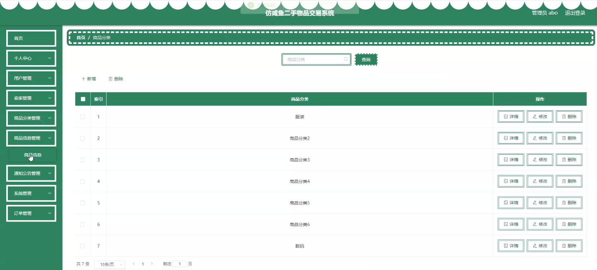
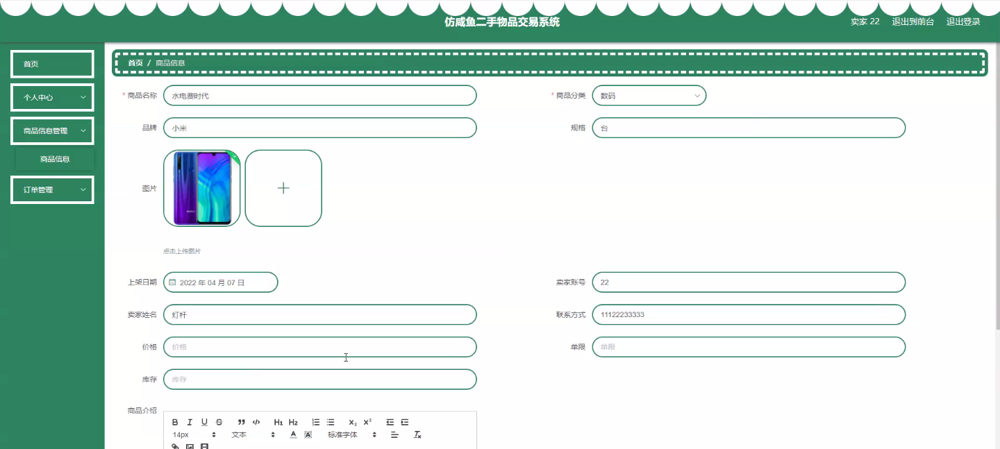
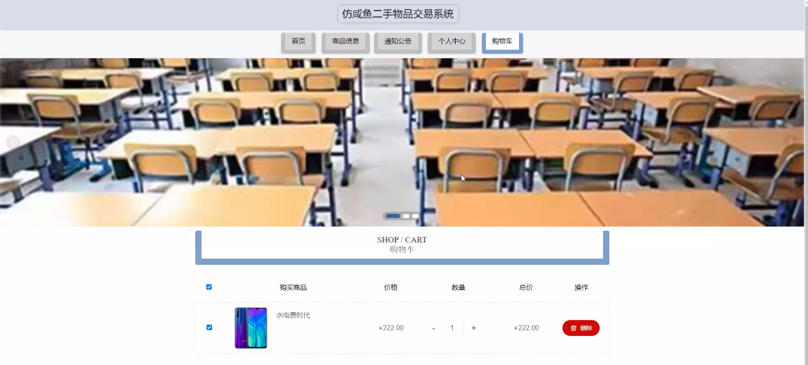
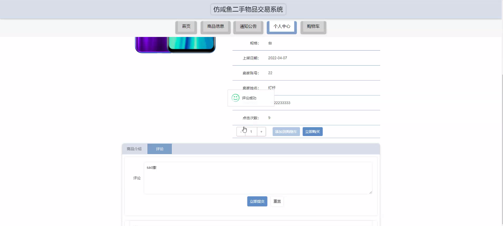
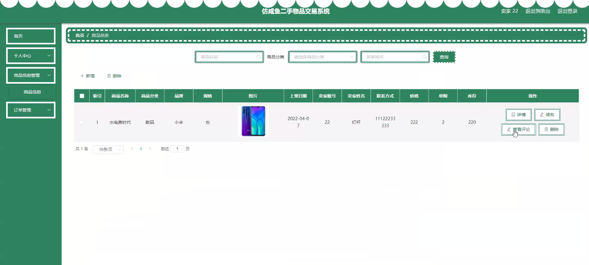

****本项目包含程序+源码+数据库+LW+调试部署环境，文末可获取一份本项目的java源码和数据库参考。****

## ******开题报告******

研究背景：
随着互联网的快速发展和普及，二手物品交易成为了一种常见的消费行为。人们通过在线平台买卖二手物品已经成为一种便捷、经济且环保的选择。然而，在当前的二手物品交易市场中，存在着一些问题和挑战。首先，信息不对称导致买家和卖家之间的信任问题，买家很难判断商品的真实情况，而卖家也难以确定买家的诚信程度。其次，商品分类和信息整理不规范，给用户带来了困扰和不便。此外，通知公告的发布和传达方式也需要进一步改进。因此，开发一个高效、安全、可靠的二手物品交易系统是非常必要的。

研究意义：
本研究旨在设计和开发一个二手物品交易系统，以解决当前二手物品交易市场中存在的问题和挑战。该系统将提供更准确、全面的商品信息，提高买家和卖家之间的信任度，并改善通知公告的发布和传达方式。通过构建一个高效、安全、可靠的二手物品交易平台，可以促进二手物品的流通，提高资源利用效率，同时也为用户提供了一个更便捷、可靠的购物渠道。

研究目的： 本研究的目的是开发一个功能完善的二手物品交易系统，以提供更好的用户体验和服务。具体目标包括：1.
提供准确、全面的商品信息，帮助买家更好地选择和购买二手物品；2. 建立信任机制，提高买家和卖家之间的信任度，降低交易风险；3.
设计合理的商品分类和信息整理方式，方便用户快速找到所需商品；4. 改进通知公告的发布和传达方式，确保用户及时获取相关信息。

研究内容： 根据系统功能，本研究的主要内容包括以下几个方面：

  1. 用户管理：设计用户注册、登录、个人信息管理等功能，确保用户身份的真实性和安全性。
  2. 卖家管理：建立卖家认证机制，确保卖家信息的真实性和可信度。
  3. 商品分类：设计合理的商品分类体系，方便用户按照自己的需求进行搜索和筛选。
  4. 商品信息管理：提供完善的商品信息录入和展示功能，确保商品信息的准确性和全面性。
  5. 通知公告：设计通知公告的发布和传达方式，确保用户能够及时获取重要信息。

拟解决的主要问题：
本研究旨在解决当前二手物品交易市场中存在的信息不对称、信任问题以及分类和通知公告方面的不便之处。通过提供准确、全面的商品信息，建立买家和卖家之间的信任机制，改进商品分类和信息整理方式，以及优化通知公告的发布和传达方式，可以有效地解决这些问题，提高二手物品交易的效率和质量。

研究方案和预期成果： 本研究将采用需求分析、系统设计和开发等方法，结合用户反馈和市场需求，设计和开发一个功能完善的二手物品交易系统。预期成果包括：1.
一个高效、安全、可靠的二手物品交易平台；2. 提供准确、全面的商品信息，提高买家和卖家之间的信任度；3.
设计合理的商品分类和信息整理方式，方便用户快速找到所需商品；4.
改进通知公告的发布和传达方式，确保用户及时获取相关信息。通过实施以上方案，预计可以提高二手物品交易的效率和质量，为用户提供更好的购物体验。

进度安排：

2022年9月至10月：需求分析和规划，明确系统功能和目标，制定项目计划。

2022年11月至2023年1月：系统设计和编码，完成详细的系统设计并开始编写代码。

2023年2月至3月：用户界面开发和数据库开发，开发用户友好的界面和设计数据库结构。

2023年4月至5月：功能测试、文档编写和上线部署，对系统进行全面的功能测试并编写用户手册。

2023年5月：维护和升级，定期对系统进行维护和升级，修复bug和添加新功能。

参考文献：

[1]邱小群,邓丽艳,陈海潮.基于B/S的信息管理系统设计和实现[J].信息与电脑(理论版),2022,(20):146-148.

[2]谢霜.基于Java技术的网络管理体系结构的应用[J].网络安全技术与应用,2022,(10):14-15.

[3]宋锦华.高职院校Java程序设计课程改革研究[J].科技视界,2022,(20):133-135.

[4]曹嵩彭,王鹏宇.浅析Java语言在软件开发中的应用[J].信息记录材料,2022,(03):114-116.

[5]朱澈,余俊达.武汉东湖学院.基于Java的软硬件信息管理系统V1.0[Z].项目立项编号.鉴定单位.鉴定日期:

****以上是本项目程序开发之前开题报告内容，最终成品以下面界面为准，大家可以酌情参考使用。要源码参考请在文末进行获取！！****

## ******本项目的界面展示******

