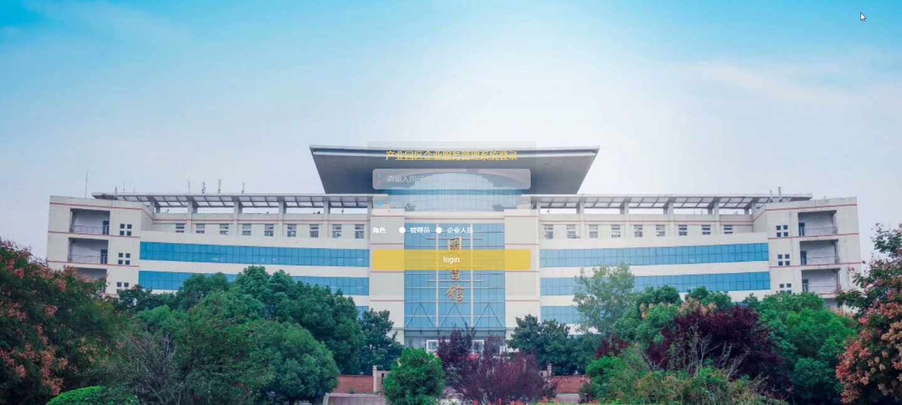
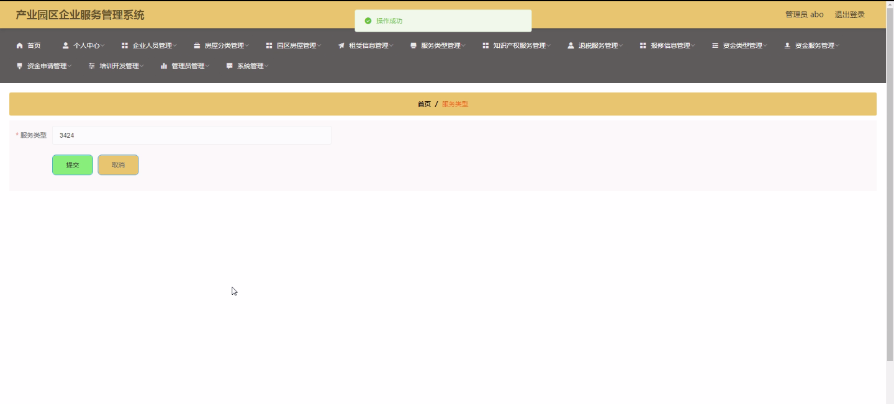
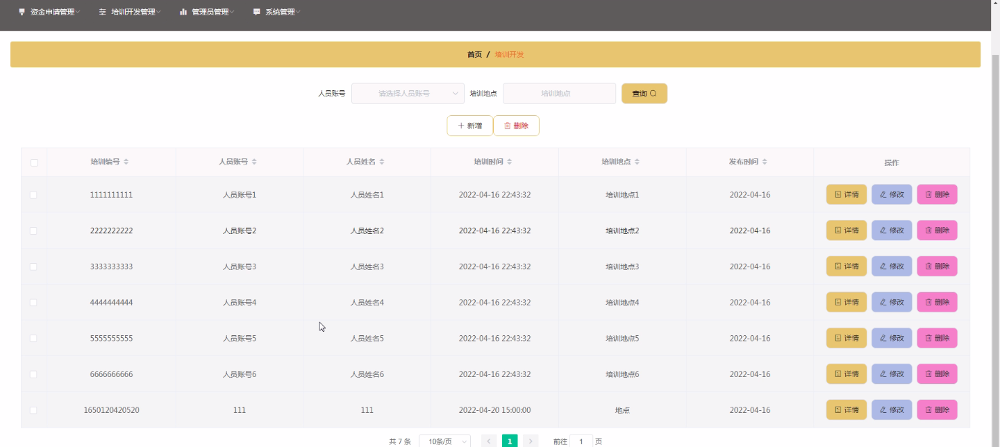
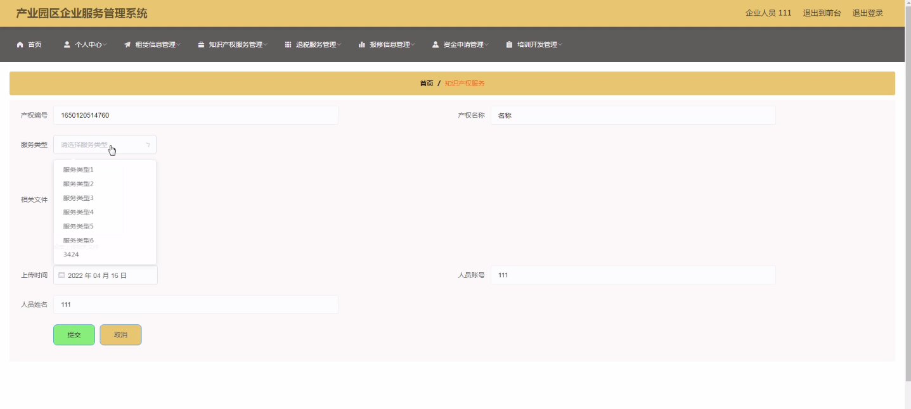
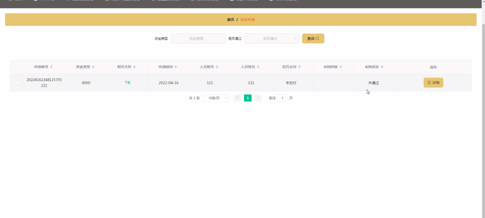
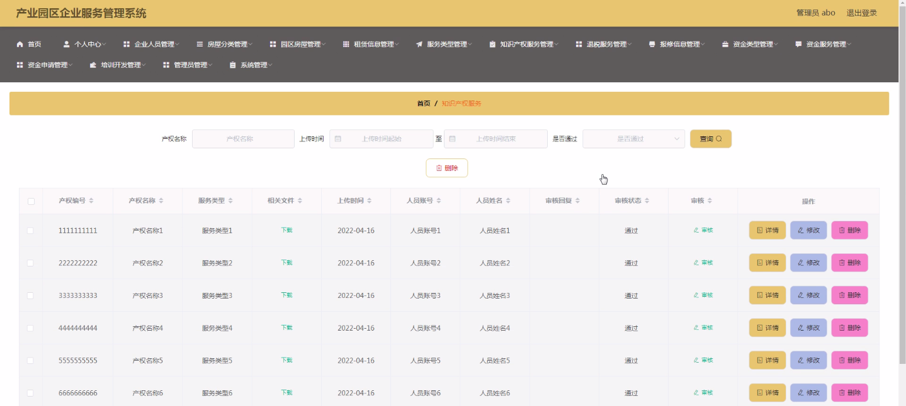

****本项目包含程序+源码+数据库+LW+调试部署环境，文末可获取一份本项目的java源码和数据库参考。****

## ******开题报告******

研究背景：
随着经济的快速发展和产业结构的调整，产业园区在推动地方经济发展、促进创新创业、吸引投资等方面发挥着重要作用。然而，当前的产业园区企业服务管理存在一些问题，如信息不对称、服务质量不稳定、流程繁琐等，制约了企业在园区内的发展和创新能力。因此，建立一个高效、便捷的产业园区企业服务管理系统具有重要意义。

研究意义：
通过建立产业园区企业服务管理系统，可以实现企业与园区之间的信息共享、资源整合和服务协同，提升园区内企业的竞争力和创新能力。同时，该系统还可以提供更加精准和个性化的服务，满足企业多样化的需求，促进园区内企业的良性互动和合作，推动产业集聚和创新驱动发展。

研究目的：
本研究旨在设计和开发一套适应产业园区特点的企业服务管理系统，以解决当前园区企业服务管理中存在的问题。通过优化服务流程、提升服务质量和效率，促进企业的创新创业活动，推动园区经济的发展和转型升级。

研究内容： 本研究将主要围绕以下系统功能展开研究：

  1. 企业人员管理：包括企业人员信息的录入、查询和统计分析等功能，以便园区管理部门更好地了解企业人员情况，为企业提供人力资源支持。

  2. 园区房屋租赁信息管理：通过建立房屋租赁信息数据库，实现房屋租赁的在线发布、查询和管理，方便企业租赁房屋，并提供租金支付、合同管理等服务。

  3. 服务类型管理：根据企业需求和园区资源，将服务分类并进行管理，以便企业快速找到所需服务，并提供相应的服务指导和支持。

  4. 知识产权服务管理：建立知识产权服务平台，提供知识产权申请、咨询和保护等服务，帮助企业保护自身的知识产权，并提升企业的创新能力。

  5. 资金服务管理：包括资金类型管理、资金申请、资金审批和资金使用情况的监控等功能，为企业提供资金支持和管理服务，促进企业的发展和扩大规模。

拟解决的主要问题： 通过研究和设计产业园区企业服务管理系统，旨在解决以下问题：

  1. 信息不对称：园区内企业与园区管理部门之间信息传递不畅，导致企业无法及时获取所需信息。

  2. 服务质量不稳定：当前的服务质量存在差异，有些企业获得的服务较好，而有些企业则面临服务不足的问题。

  3. 流程繁琐：目前的服务流程较为复杂，需要企业花费较多时间和精力来完成各项手续和申请。

研究方案和预期成果： 本研究将采用系统分析和设计的方法，结合现代信息技术和管理理论，设计和开发一套适应产业园区特点的企业服务管理系统。预期实现以下成果：

  1. 建立高效、便捷的企业服务管理平台，实现企业与园区之间的信息共享和服务协同。

  2. 提供个性化、精准的服务，满足企业多样化的需求，提升园区内企业的竞争力和创新能力。

  3. 优化服务流程，简化企业办事手续，提高服务效率和质量。

  4. 促进企业之间的合作与交流，推动产业集聚和创新驱动发展。

进度安排：

2022年9月至10月：需求分析和规划，明确系统功能和目标，制定项目计划。

2022年11月至2023年1月：系统设计和编码，完成详细的系统设计并开始编写代码。

2023年2月至3月：用户界面开发和数据库开发，开发用户友好的界面和设计数据库结构。

2023年4月至5月：功能测试、文档编写和上线部署，对系统进行全面的功能测试并编写用户手册。

2023年5月：维护和升级，定期对系统进行维护和升级，修复bug和添加新功能。

参考文献：

[1]邱小群,邓丽艳,陈海潮.基于B/S的信息管理系统设计和实现[J].信息与电脑(理论版),2022,(20):146-148.

[2]谢霜.基于Java技术的网络管理体系结构的应用[J].网络安全技术与应用,2022,(10):14-15.

[3]宋锦华.高职院校Java程序设计课程改革研究[J].科技视界,2022,(20):133-135.

[4]曹嵩彭,王鹏宇.浅析Java语言在软件开发中的应用[J].信息记录材料,2022,(03):114-116.

[5]朱澈,余俊达.武汉东湖学院.基于Java的软硬件信息管理系统V1.0[Z].项目立项编号.鉴定单位.鉴定日期:

****以上是本项目程序开发之前开题报告内容，最终成品以下面界面为准，大家可以酌情参考使用。要源码参考请在文末进行获取！！****

## ******本项目的界面展示******

