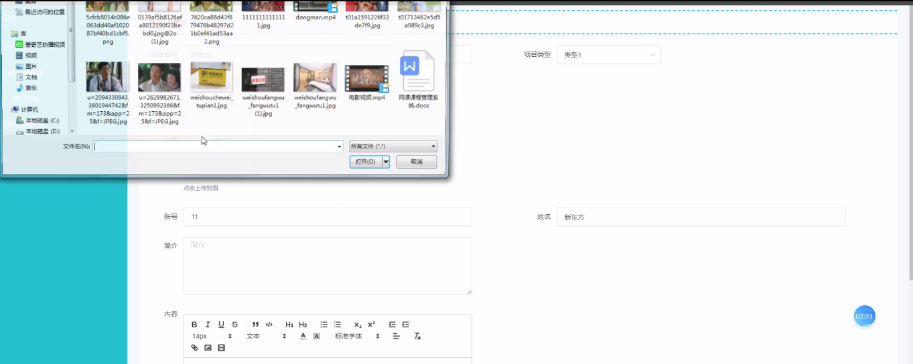

****本项目包含程序+源码+数据库+LW+调试部署环境，文末可获取一份本项目的java源码和数据库参考。****

## ******开题报告******

研究背景：
在当前快速发展的社会经济环境下，产学研项目的申报与管理成为了推动科技创新和产业升级的重要手段。然而，传统的申报流程存在着诸多问题，如信息不对称、流程繁琐、效率低下等，制约了项目的顺利开展和成果的转化应用。因此，建立一个高效、便捷的产学研项目申报平台系统势在必行。

研究意义：
该平台系统的建设具有重要的现实意义和长远影响。首先，通过集成各方资源和信息，提供全面、准确的项目申报指南和政策解读，能够帮助申请者更好地理解和掌握申报要求，提高申报质量和成功率。其次，通过优化申报流程，简化操作步骤，加快审批进度，可以节省大量的时间和人力成本，提高工作效率和资源利用效益。最后，该平台系统还能够促进产学研合作的深入发展，搭建起企业、高校和科研机构之间的桥梁，推动科技成果的转化和产业的升级。

研究目的：
本研究旨在设计和开发一套完善的产学研项目申报平台系统，以解决传统申报流程中存在的问题和不足。具体目标包括：提供全面、准确的申报指南和政策解读，提高申报质量和成功率；优化申报流程，简化操作步骤，加快审批进度；促进产学研合作，推动科技成果的转化和产业的升级。

研究内容： 根据系统功能，本研究将主要围绕以下方面展开：

  1. 用户管理：设计用户注册、登录、权限管理等功能，确保用户信息的安全性和可靠性。

  2. 项目申报：搭建完善的项目申报模块，包括填写申报表单、上传相关材料、选择适用的项目类型等，实现便捷的申报过程。

  3. 项目类型管理：建立项目类型分类体系，包括产学研合作项目、科技创新项目等，为申请者提供准确的项目分类和申报要求。

  4. 企业管理：建立企业信息库，包括企业基本信息、研发能力、科技成果等，为申请者提供参考和合作选择。

  5. 项目评审：设计科学、公正的项目评审机制，包括专家评审、评分标准等，确保项目申报和评审的公平性和可靠性。

  6. 数据库维护：建立完善的数据库管理系统，包括数据采集、存储、更新等功能，确保数据的安全性和可用性。

  7. 企业类型管理：设计企业类型分类体系，包括国有企业、民营企业、外资企业等，为申请者提供准确的企业分类和申报要求。

预期成果： 通过本研究，预期可以实现以下成果：

  1. 建立一个高效、便捷的产学研项目申报平台系统，提供全面、准确的申报指南和政策解读。

  2. 优化申报流程，简化操作步骤，加快审批进度，节省时间和人力成本。

  3. 促进产学研合作，搭建起企业、高校和科研机构之间的桥梁，推动科技成果的转化和产业的升级。

  4. 提高项目申报质量和成功率，推动科技创新和产业发展。

  5. 建立完善的数据库管理系统，为产学研项目的管理和决策提供数据支持。

进度安排：

2022年9月至10月：开题报告编写和提交，完成开题报告的撰写并提交给指导教师进行审核。

2022年11月至2023年1月：系统设计和开发，根据开题报告的要求，进行系统设计和编码工作。

2023年2月至3月：论文撰写和初稿完成，开始撰写论文，并在这个阶段完成论文的初稿。

2023年4月至5月：论文修改和最终定稿，根据指导教师的意见对论文进行修改，并完成最终的定稿。

2023年5月：论文答辩和提交，参加论文答辩并根据答辩结果进行修改，最后将论文提交给学院或学校。

参考文献：

[1]喻佳,吴丹新.基于SpringBoot的Web快速开发框架[J].电脑编程技巧与维护,2021,(09):31-33.

[2]李鹏.基于SpringBoot快速开发平台的实现[J].电子技术与软件工程,2021,(12):36-37.

[3]叶开平,蔡维晟,陈家敏,邓斯妮.基于SpringBoot的综测可视化管理系统的研究与设计[J].电脑知识与技术,2021,(12):100-104.

[4]江健锋,徐振平.Springboot最小系统的设计与实现[J].电脑知识与技术,2021,(04):62-63.

[5]赵炯,司圣杰,周奇才,熊肖磊.通用信息获取系统设计与实现[J].起重运输机械,2020,(16):89-97.

[6]吴英宾.一种内外网数据交互系统的设计与实现[J].软件工程,2020,(08):25-27.

****以上是本项目程序开发之前开题报告内容，最终成品以下面界面为准，大家可以酌情参考使用。要源码参考请在文末进行获取！！****

## ******本项目的界面展示******

