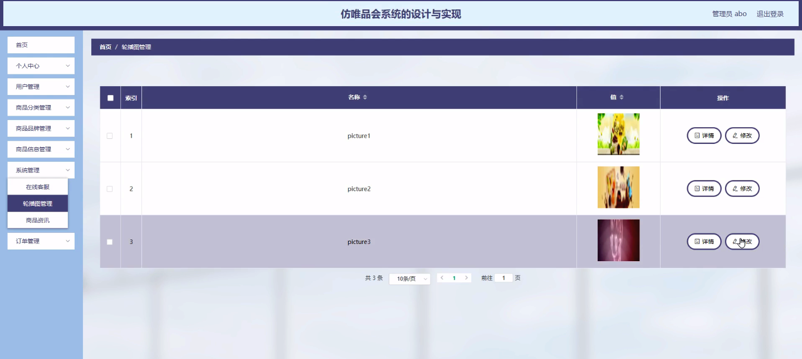
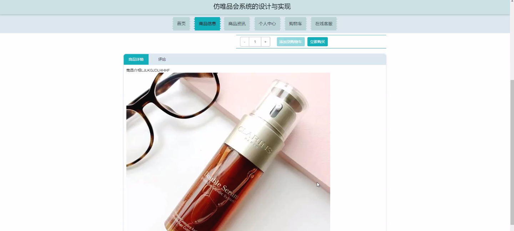
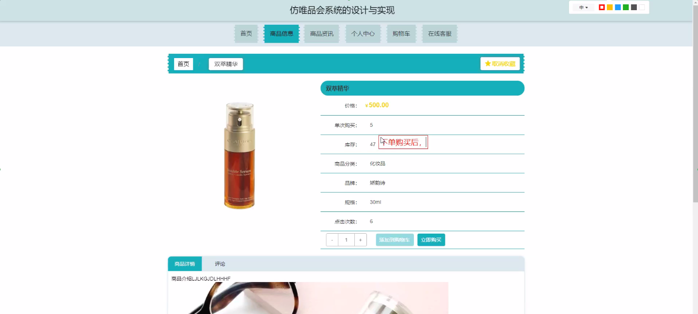
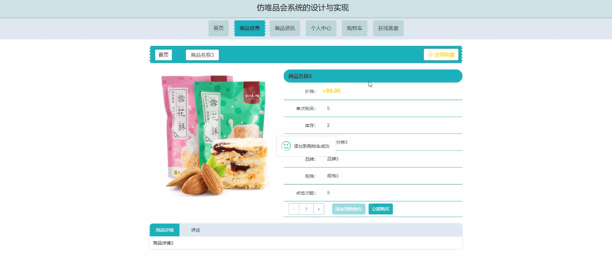

****本项目包含程序+源码+数据库+LW+调试部署环境，文末可获取一份本项目的java源码和数据库参考。****

## ******开题报告******

研究背景：
随着互联网的快速发展和电子商务的兴起，越来越多的人开始选择在网上购物。然而，由于市场竞争激烈，用户对商品的需求也变得更加多样化和个性化。因此，为了满足用户的需求并提供更好的购物体验，仿唯品会系统的设计与实现变得尤为重要。

研究意义：
仿唯品会系统的设计与实现具有重要的实际意义。首先，它可以为用户提供一个方便、快捷的购物平台，使用户能够随时随地浏览和购买自己喜欢的商品。其次，通过对用户行为和偏好的分析，系统可以为用户推荐个性化的商品，提高用户的购物满意度和忠诚度。此外，仿唯品会系统还可以帮助商家更好地了解用户需求，优化商品供应链管理，提高销售效率和利润。

研究目的：
本研究旨在设计和实现一个仿唯品会系统，以满足用户个性化购物需求，并提高商家的销售效益。具体目标包括：1.构建一个用户友好的界面，使用户能够方便地浏览和购买商品；2.通过对用户行为和偏好的分析，为用户推荐个性化的商品；3.优化商品分类和品牌管理，提高商品搜索和展示的效果；4.改进商品信息管理系统，提高商品信息的准确性和完整性。

研究内容：
本研究的主要内容包括以下系统功能：用户管理、商品分类管理、商品品牌管理和商品信息管理。在用户管理方面，研究将设计一个用户注册和登录系统，以及用户个人信息管理功能，使用户能够方便地进行账号管理和个人信息修改。在商品分类管理方面，研究将构建一个灵活的商品分类体系，使用户能够根据自己的需求进行商品筛选和搜索。在商品品牌管理方面，研究将建立一个品牌管理系统，帮助商家更好地管理和推广自己的品牌。在商品信息管理方面，研究将设计一个商品信息录入和展示系统，确保商品信息的准确性和完整性。

拟解决的主要问题：
本研究将重点解决以下问题：1.如何设计一个用户友好的界面，提高用户的购物体验；2.如何通过对用户行为和偏好的分析，为用户推荐个性化的商品；3.如何优化商品分类和品牌管理，提高商品搜索和展示的效果；4.如何改进商品信息管理系统，提高商品信息的准确性和完整性。

研究方案和预期成果：
本研究将采用面向对象的软件开发方法，结合数据库技术和数据挖掘算法，设计和实现仿唯品会系统。预期成果包括：1.一个用户友好的界面，提供便捷的购物功能；2.一个个性化推荐系统，为用户推荐符合其需求的商品；3.一个优化的商品分类和品牌管理系统，提高商品搜索和展示的效果；4.一个改进的商品信息管理系统，提高商品信息的准确性和完整性。

进度安排：

2022年9月至10月：开题报告编写和提交，完成开题报告的撰写并提交给指导教师进行审核。

2022年11月至2023年1月：系统设计和开发，根据开题报告的要求，进行系统设计和编码工作。

2023年2月至3月：论文撰写和初稿完成，开始撰写论文，并在这个阶段完成论文的初稿。

2023年4月至5月：论文修改和最终定稿，根据指导教师的意见对论文进行修改，并完成最终的定稿。

2023年5月：论文答辩和提交，参加论文答辩并根据答辩结果进行修改，最后将论文提交给学院或学校。

参考文献：

[1]喻佳,吴丹新.基于SpringBoot的Web快速开发框架[J].电脑编程技巧与维护,2021,(09):31-33.

[2]李鹏.基于SpringBoot快速开发平台的实现[J].电子技术与软件工程,2021,(12):36-37.

[3]叶开平,蔡维晟,陈家敏,邓斯妮.基于SpringBoot的综测可视化管理系统的研究与设计[J].电脑知识与技术,2021,(12):100-104.

[4]江健锋,徐振平.Springboot最小系统的设计与实现[J].电脑知识与技术,2021,(04):62-63.

[5]赵炯,司圣杰,周奇才,熊肖磊.通用信息获取系统设计与实现[J].起重运输机械,2020,(16):89-97.

[6]吴英宾.一种内外网数据交互系统的设计与实现[J].软件工程,2020,(08):25-27.

****以上是本项目程序开发之前开题报告内容，最终成品以下面界面为准，大家可以酌情参考使用。要源码参考请在文末进行获取！！****

## ******本项目的界面展示******

