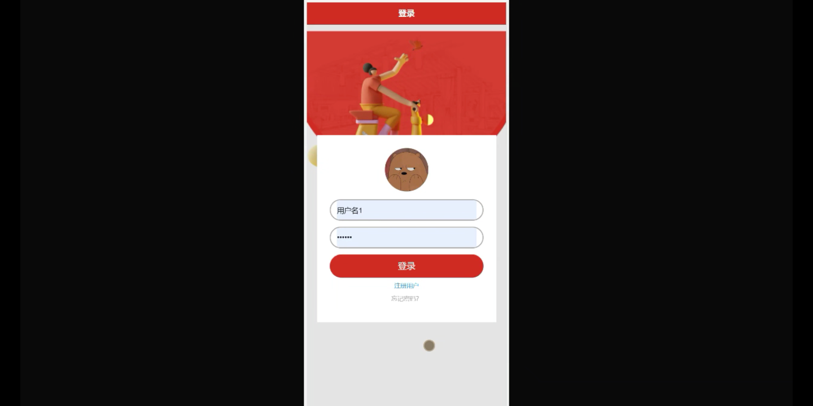
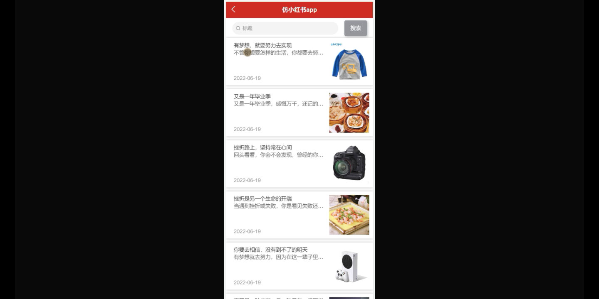
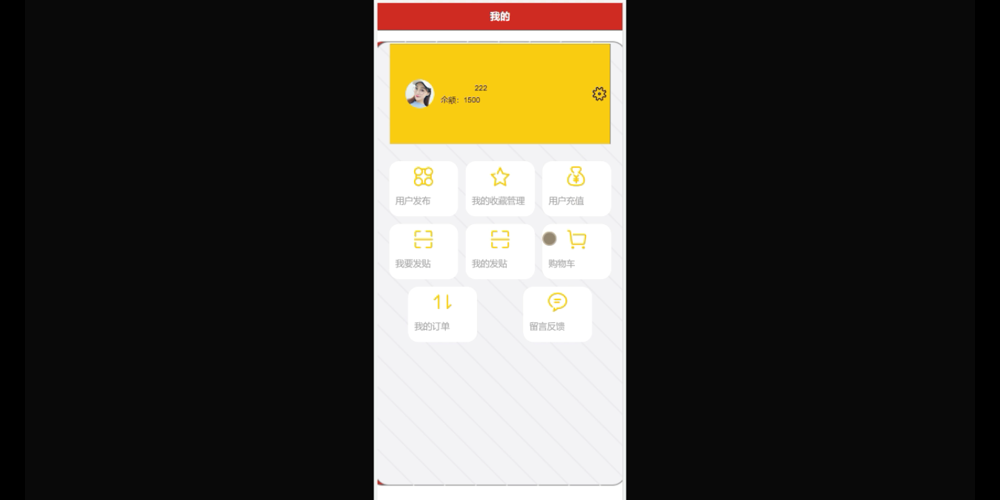
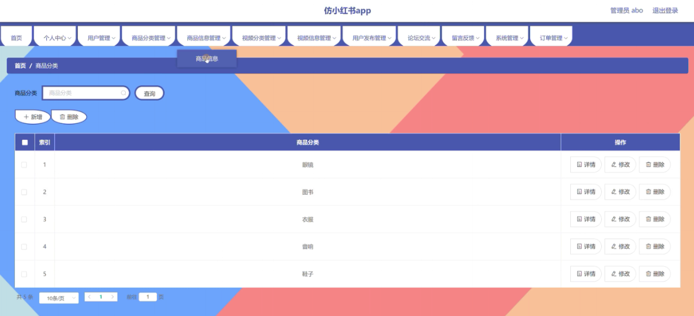
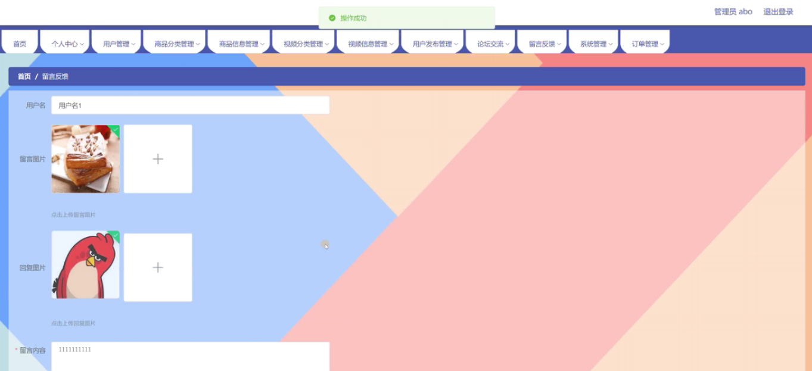

****本项目包含程序+源码+数据库+LW+调试部署环境，文末可获取一份本项目的java源码和数据库参考。****

## ******开题报告******

研究背景：
随着社交媒体和电子商务的快速发展，人们对于获取商品信息和分享购物心得的需求日益增长。在这个背景下，仿小红书应运而生，成为了一个备受欢迎的社交电商平台。仿小红书以用户为中心，提供了丰富的商品分类、商品信息、视频分类、视频信息等功能，使用户能够方便地浏览、搜索和分享自己的购物经验。然而，目前尚缺乏对仿小红书系统的深入研究，因此有必要对其进行进一步的探索和分析。

研究意义：
本研究的意义在于通过对仿小红书系统的研究，深入了解该系统的特点、优势和不足之处，为相关领域的学术研究和实践工作提供参考和借鉴。同时，通过对用户、商品分类、商品信息、视频分类、视频信息、用户发布等系统功能的分析，可以帮助平台运营者更好地理解用户需求，改进系统设计，提升用户体验，推动社交电商行业的发展。

研究目的：
本研究的目的是全面了解仿小红书系统的功能和特点，分析其在社交电商领域中的应用价值，并提出相应的改进策略。具体来说，我们将通过研究用户、商品分类、商品信息、视频分类、视频信息、用户发布等系统功能，探索以下问题：系统功能的设计与实现是否满足用户需求？系统中存在哪些问题和挑战？如何优化系统设计以提升用户体验和平台运营效果？

研究内容：
本研究将重点关注仿小红书系统的用户、商品分类、商品信息、视频分类、视频信息、用户发布等功能，对其进行深入分析和研究。具体研究内容包括但不限于以下几个方面：

  1. 用户功能：分析用户注册、登录、个人资料设置、关注好友、发布动态等功能的设计与实现，探讨用户在系统中的角色和行为特点。

  2. 商品分类和商品信息功能：研究商品分类的设计与实现，分析商品信息的展示方式、标签系统、评价机制等，探讨如何提高商品搜索和推荐的准确性和个性化程度。

  3. 视频分类和视频信息功能：探讨视频分类的设计与实现，分析视频信息的展示方式、用户互动机制等，研究如何提升视频内容的质量和用户参与度。

  4. 用户发布功能：研究用户发布动态的方式、权限管理机制等，分析用户发布行为对系统运营的影响，并提出相应的改进策略。

拟解决的主要问题：
在研究过程中，我们将重点关注以下问题：仿小红书系统中的用户需求是否得到满足？系统中存在哪些问题和挑战？如何优化系统设计以提升用户体验和平台运营效果？

研究方案和预期成果：
本研究将采用文献综述、实地调研、数据分析等方法，结合相关理论和实践经验，对仿小红书系统进行全面深入的研究。预期成果包括对系统功能的分析和评价报告，针对性的改进策略和建议，以及对社交电商领域的学术贡献和实践指导。

进度安排：

2022年9月至10月：需求分析和规划，明确系统功能和目标，制定项目计划。

2022年11月至2023年1月：系统设计和编码，完成详细的系统设计并开始编写代码。

2023年2月至3月：用户界面开发和数据库开发，开发用户友好的界面和设计数据库结构。

2023年4月至5月：功能测试、文档编写和上线部署，对系统进行全面的功能测试并编写用户手册。

2023年5月：维护和升级，定期对系统进行维护和升级，修复bug和添加新功能。

参考文献：

[1]邱小群,邓丽艳,陈海潮.基于B/S的信息管理系统设计和实现[J].信息与电脑(理论版),2022,(20):146-148.

[2]谢霜.基于Java技术的网络管理体系结构的应用[J].网络安全技术与应用,2022,(10):14-15.

[3]宋锦华.高职院校Java程序设计课程改革研究[J].科技视界,2022,(20):133-135.

[4]曹嵩彭,王鹏宇.浅析Java语言在软件开发中的应用[J].信息记录材料,2022,(03):114-116.

[5]朱澈,余俊达.武汉东湖学院.基于Java的软硬件信息管理系统V1.0[Z].项目立项编号.鉴定单位.鉴定日期:

****以上是本项目程序开发之前开题报告内容，最终成品以下面界面为准，大家可以酌情参考使用。要源码参考请在文末进行获取！！****

## ******本项目的界面展示******

