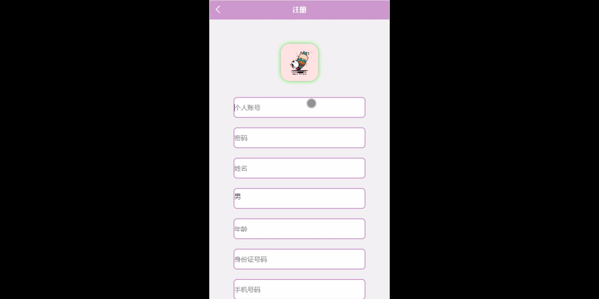
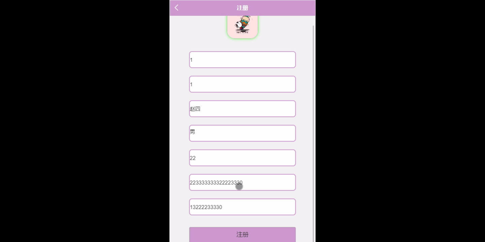
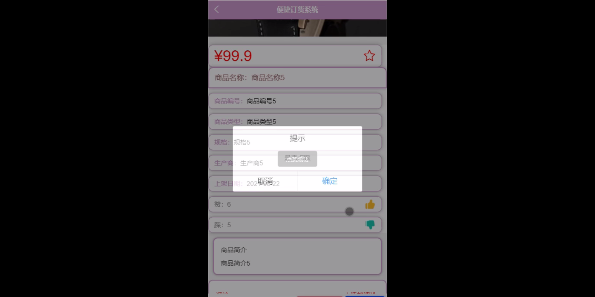
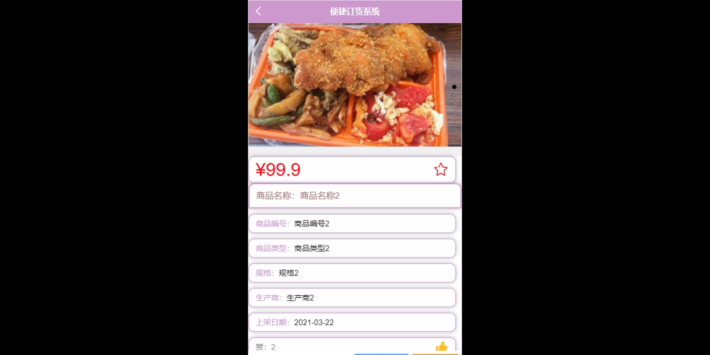
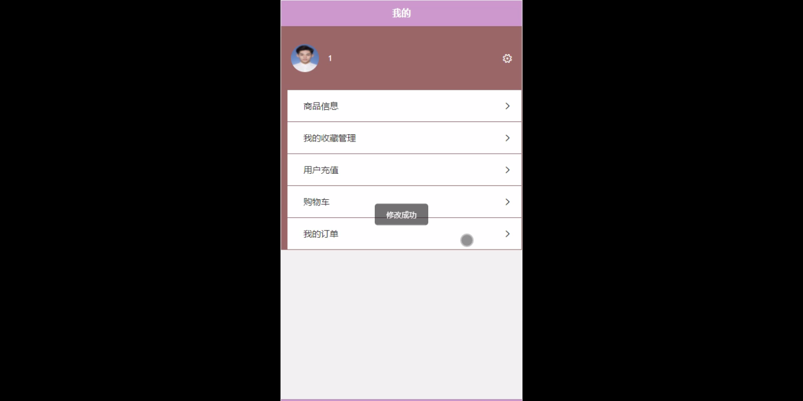
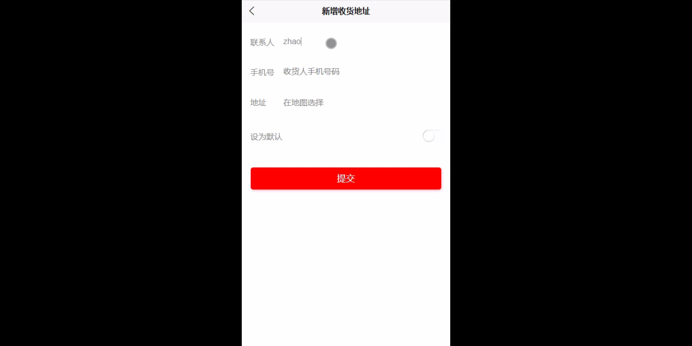
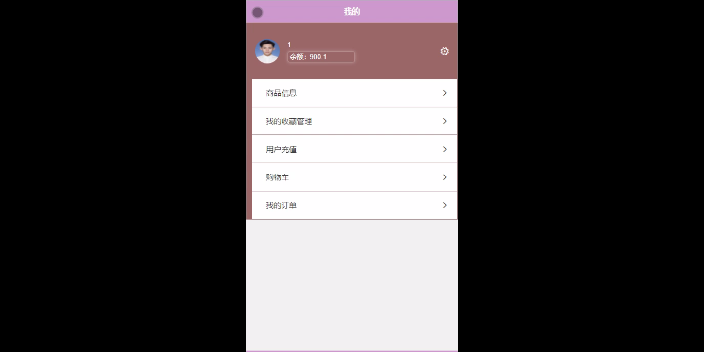

****本项目包含程序+源码+数据库+LW+调试部署环境，文末可获取一份本项目的java源码和数据库参考。****

## ******开题报告******

研究背景：
随着互联网的快速发展和电子商务的兴起，订货系统在商业领域中扮演着越来越重要的角色。传统的订货方式存在着许多问题，如订单处理速度慢、信息传递不及时、人工操作容易出错等。为了提高订货效率和准确性，便捷订货系统应运而生。

研究意义：
便捷订货系统的研究对于商家和供应商来说具有重要意义。通过引入先进的信息技术和管理方法，可以实现订单自动化处理、库存管理优化、供应链协同等功能，从而提高企业的竞争力和盈利能力。同时，便捷订货系统还可以提升用户体验，简化订货流程，节省时间和精力。

研究目的：
本研究旨在设计和开发一种高效、可靠的便捷订货系统，以满足商家和供应商的需求。通过深入分析现有订货系统的问题和痛点，结合最新的技术和管理理念，我们希望能够提出一套切实可行的解决方案，实现订货过程的自动化、智能化和便捷化。

研究内容：
本研究的主要内容包括以下系统功能：用户管理、商品信息管理、商品类型管理等。在用户管理方面，我们将设计一个完善的用户注册、登录和权限管理系统，确保只有授权用户才能访问和操作系统。在商品信息管理方面，我们将建立一个全面、准确的商品数据库，包括商品名称、价格、库存等信息，并提供快速检索和更新功能。在商品类型管理方面，我们将设计一套灵活的分类体系，方便商家对商品进行分类和管理。

拟解决的主要问题：

  1. 订单处理效率低下：传统的订货方式往往需要人工逐一处理订单，耗时且容易出错。我们希望通过自动化处理订单，提高订单处理效率。
  2. 信息传递不及时：传统的订货方式中，商家和供应商之间的信息传递通常是通过电话、传真等方式进行，存在着信息传递不及时的问题。我们希望通过系统实现实时信息共享，提高信息传递的准确性和及时性。
  3. 库存管理不精确：传统的订货方式中，商家往往难以准确把握库存情况，容易出现库存过剩或缺货的情况。我们希望通过系统实现库存管理的自动化和优化，提高库存管理的精确性。

研究方案：

  1. 系统需求分析：深入了解商家和供应商的需求，明确系统功能和性能要求。
  2. 技术选型：选择适合的技术和工具进行系统开发，如数据库管理系统、前端开发框架等。
  3. 系统设计与开发：根据需求分析结果，进行系统架构设计和模块划分，并进行系统开发和测试。
  4. 系统部署与运维：将开发完成的系统部署到服务器上，并进行系统运行监控和故障排除。

预期成果：
通过本研究，我们期望能够开发出一套功能完善、性能稳定的便捷订货系统，为商家和供应商提供高效、可靠的订货服务。该系统将实现订单自动化处理、信息实时共享、库存管理优化等功能，提高订货效率和准确性，降低商家和供应商的经营成本，提升用户体验。同时，本研究还将为相关领域的研究者提供借鉴和参考，推动订货系统的进一步发展和应用。

进度安排：

2022年9月至10月：需求分析和规划，明确系统功能和目标，制定项目计划。

2022年11月至2023年1月：系统设计和编码，完成详细的系统设计并开始编写代码。

2023年2月至3月：用户界面开发和数据库开发，开发用户友好的界面和设计数据库结构。

2023年4月至5月：功能测试、文档编写和上线部署，对系统进行全面的功能测试并编写用户手册。

2023年5月：维护和升级，定期对系统进行维护和升级，修复bug和添加新功能。

参考文献：

[1]邱小群,邓丽艳,陈海潮.基于B/S的信息管理系统设计和实现[J].信息与电脑(理论版),2022,(20):146-148.

[2]谢霜.基于Java技术的网络管理体系结构的应用[J].网络安全技术与应用,2022,(10):14-15.

[3]宋锦华.高职院校Java程序设计课程改革研究[J].科技视界,2022,(20):133-135.

[4]曹嵩彭,王鹏宇.浅析Java语言在软件开发中的应用[J].信息记录材料,2022,(03):114-116.

[5]朱澈,余俊达.武汉东湖学院.基于Java的软硬件信息管理系统V1.0[Z].项目立项编号.鉴定单位.鉴定日期:

****以上是本项目程序开发之前开题报告内容，最终成品以下面界面为准，大家可以酌情参考使用。要源码参考请在文末进行获取！！****

## ******本项目的界面展示******

