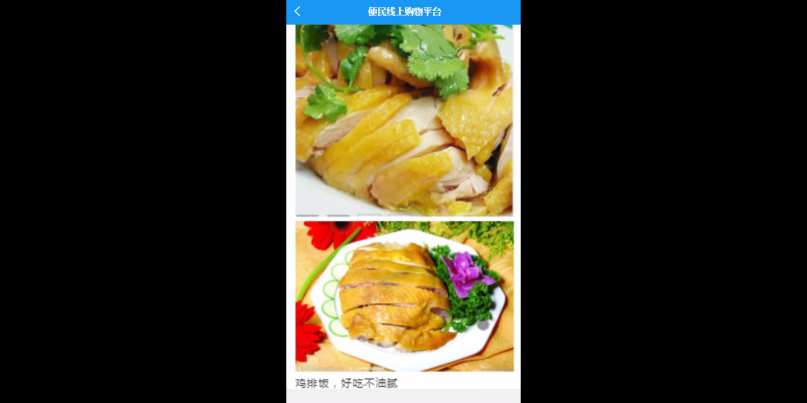

****本项目包含程序+源码+数据库+LW+调试部署环境，文末可获取一份本项目的java源码和数据库参考。****

## ******开题报告******

研究背景：
随着互联网的快速发展和智能手机的普及，线上购物平台逐渐成为人们购物的主要方式之一。线上购物平台的兴起不仅给消费者带来了便利，也为商家提供了更广阔的销售渠道。然而，随着线上购物平台的不断增多和竞争的加剧，如何提高用户体验、增加商家参与度以及优化物流配送等问题亟待解决。

研究意义：
本研究旨在通过对线上购物平台的功能进行深入研究，探索如何进一步提升用户满意度、促进商家发展，并改善物流配送效率。通过解决这些问题，可以推动线上购物平台的健康发展，促进经济的持续增长，提升消费者的购物体验。

研究目的： 本研究的目的是通过分析线上购物平台的系统功能，找出其中存在的问题，并提出相应的解决方案，以实现以下目标：

  1. 提高用户体验：通过优化用户界面设计、增加个性化推荐功能等手段，提升用户的购物体验，增加用户的粘性和忠诚度。
  2. 促进商家发展：通过提供更多的营销工具、增加商家认证机制等措施，吸引更多的商家参与线上购物平台，提升平台的商品种类和质量。
  3. 改善物流配送效率：通过优化物流配送系统、提高配送速度和准确性，缩短用户等待时间，提高用户满意度。

研究内容： 本研究将围绕线上购物平台的以下系统功能展开研究：

  1. 用户：研究用户注册、登录、个人信息管理等功能，分析用户行为和需求，提出个性化推荐策略。
  2. 商家：研究商家入驻、店铺管理、商品发布等功能，提出商家激励机制和营销策略，增加商家参与度。
  3. 车主：研究顺风车预定、接单信息等功能，优化车主的服务体验，提高顺风车的可用性和安全性。
  4. 商品类型和商品信息：研究商品分类、标签、描述等功能，提出商品推荐算法和搜索引擎优化策略。
  5. 订单信息：研究订单生成、支付、退款等功能，优化订单处理流程，提高订单处理效率。
  6. 关注信息和推送信息：研究用户关注和推送通知的功能，提供个性化的关注和推送服务，增加用户参与度。
  7. 商家证明：研究商家认证机制和信用评价体系，提高商家的可信度和用户对商家的信任度。

拟解决的主要问题：

  1. 如何提高用户的购物体验和满意度？
  2. 如何吸引更多的商家参与线上购物平台？
  3. 如何优化物流配送系统，提高配送效率？
  4. 如何提供个性化的商品推荐和搜索服务？
  5. 如何建立有效的商家认证机制和信用评价体系？

研究方案和预期成果： 本研究将采用综合分析、实地调研和案例研究等方法，通过对线上购物平台的功能进行深入研究，提出相应的解决方案。预期成果包括但不限于：

  1. 设计出更符合用户需求的界面和功能，提升用户的购物体验和满意度。
  2. 提出有效的商家激励机制和营销策略，吸引更多的商家参与线上购物平台。
  3. 优化物流配送系统，提高配送效率，缩短用户等待时间。
  4. 提供个性化的商品推荐和搜索服务，提高用户的购物效率和满意度。
  5. 建立有效的商家认证机制和信用评价体系，提高商家的可信度和用户对商家的信任度

进度安排：

2022年9月至10月：需求分析和规划，进行用户需求调研和分析，确定系统功能和目标。

2022年11月至2023年1月：系统设计和开发，完成系统架构设计和技术选型，并开始编写代码。

2023年2月至3月：测试和优化，进行单元测试和集成测试，修复问题并优化系统性能。

2023年4月至5月：文档编写和培训，编写用户手册和系统文档，并进行相关人员的培训。

2023年5月：上线部署和维护，将系统部署到生产环境中，并定期进行维护和升级。

参考文献：

[1]王振华.SpringBoot在教学效果评估系统中的应用[J].电子技术,2023,(05):67-69.

[2]王明泉.基于SpringBoot远程热部署的探索和应用[J].信息与电脑(理论版),2023,(07):1-4.

[3]王亚东,李晓霞,陈强强,剡美娜.基于SpringBoot的需求发布平台设计[J].信息与电脑(理论版),2023,(01):105-107.

[4]陈新府豪.基于SpringBoot和Vue框架的创新方法推理系统的设计与实现[D].导师：黄静.浙江理工大学,2022.

[5]霍福华,韩慧.基于SpringBoot微服务架构下前后端分离的MVVM模型[J].电子技术与软件工程,2022,(01):73-76.

[6]韩策,张娜,王松亭,张凯,何方,袁峰.SpringBoot OPC客户端设计与研究[J].电子世界,2021,(19):25-26.

****以上是本项目程序开发之前开题报告内容，最终成品以下面界面为准，大家可以酌情参考使用。要源码参考请在文末进行获取！！****

## ******本项目的界面展示******

